# Authentication Session Sync Issue - Root Cause Analysis

**Analysis Date:** 2026-01-16
**Branch:** 009-auth-personalization
**Issue:** Users remain locked out after successful login - buttons stay disabled despite authentication

---

## Executive Summary

The authentication session sync issue has **THREE CRITICAL ROOT CAUSES** that compound to create the lockout behavior:

1. **Data Structure Mismatch** - Login response doesn't match what AuthProvider expects
2. **Missing Profile Data** - Better Auth doesn't return user profile on login
3. **State Sync Race Condition** - Page reload happens before localStorage writes complete

---

## Root Cause #1: Data Structure Mismatch

### The Problem

**Login page (`login.tsx`)** stores data like this:

```typescript
// Lines 84-98 in login.tsx
if (data.token) {
  localStorage.setItem('auth_token', data.token);
} else if (data.session?.token) {
  localStorage.setItem('auth_token', data.session.token);
}

// Store user data
if (data.user) {
  localStorage.setItem('user_profile', JSON.stringify(data.user));  // ❌ WRONG KEY
  console.log('[Login] ✅ User profile stored');
}
```

**AuthProvider (`AuthProvider.tsx`)** expects data like this:

```typescript
// Lines 52-70 in AuthProvider.tsx
useEffect(() => {
  const token = localStorage.getItem('auth_token');
  const storedUser = localStorage.getItem('user');        // ❌ Expects 'user'
  const storedProfile = localStorage.getItem('profile');  // ❌ Expects 'profile'

  if (token && storedUser && storedProfile) {
    try {
      setUser(JSON.parse(storedUser));
      setProfile(JSON.parse(storedProfile));
    } catch (error) {
      console.error('Failed to parse stored auth data:', error);
    }
  }
  setIsLoading(false);
}, []);
```

### Impact

- `login.tsx` saves to `user_profile` key
- `AuthProvider.tsx` reads from `user` and `profile` keys
- **Result:** AuthProvider never finds the data, stays unauthenticated

### Evidence

**File:** `/mnt/d/Q4_hackathon1/physical_ai_textbook/textbook/src/pages/login.tsx`
**Lines:** 96

**File:** `/mnt/d/Q4_hackathon1/physical_ai_textbook/textbook/src/contexts/AuthProvider.tsx`
**Lines:** 54-55

---

## Root Cause #2: Missing Profile Data in Login Response

### The Problem

Better Auth's `/api/auth/sign-in/email` endpoint **ONLY** returns basic user data:

```json
{
  "token": "jwt-token-here",
  "user": {
    "id": "user-uuid",
    "email": "user@example.com",
    "name": "username"
  }
}
```

But our app needs **profile data** for personalization:

```typescript
// Lines 107-128 in AuthProvider.tsx (login function)
const login = async (email: string, password: string, rememberMe = false) => {
  const response = await fetch(`${API_BASE_URL}/api/auth/signin`, {
    method: 'POST',
    headers: { 'Content-Type': 'application/json' },
    body: JSON.stringify({ email, password, rememberMe }),
  });

  const data = await response.json();

  // Store token and user data
  localStorage.setItem('auth_token', data.token);
  localStorage.setItem('user', JSON.stringify(data.user));
  localStorage.setItem('profile', JSON.stringify(data.profile));  // ❌ data.profile is undefined!

  setUser(data.user);
  setProfile(data.profile);  // ❌ Sets profile to undefined!
};
```

### Why This Happens

Better Auth's built-in sign-in endpoint (`/api/auth/sign-in/email`) is generic and doesn't know about our custom `user_profiles` table. The profile data lives in a separate table that requires a JOIN query or separate fetch.

### Impact

- `profile` state variable is set to `undefined` or `null`
- `isAuthenticated` check passes (user exists), but profile-dependent features fail
- Buttons checking profile data stay locked

### Evidence

**File:** `/mnt/d/Q4_hackathon1/physical_ai_textbook/backend/src/auth/routes.ts`
**Lines:** 365-402 (GET /api/auth/profile endpoint exists but is never called after login)

**File:** `/mnt/d/Q4_hackathon1/physical_ai_textbook/textbook/src/contexts/AuthProvider.tsx`
**Lines:** 107-128 (login function)

---

## Root Cause #3: State Sync Race Condition

### The Problem

The login page triggers a **full page reload** before state syncs:

```typescript
// Lines 108-116 in login.tsx
setTimeout(() => {
  console.log('[Login] Redirecting to:', baseUrl);
  history.push(baseUrl);

  // Reload to refresh auth state across the entire app
  setTimeout(() => {
    window.location.reload();  // ❌ RACE CONDITION
  }, 100);
}, 2000);
```

### The Race Condition Timeline

1. **T+0ms:** User submits login form
2. **T+500ms:** Backend returns response with token
3. **T+505ms:** `localStorage.setItem('auth_token', ...)` executes
4. **T+506ms:** `localStorage.setItem('user_profile', ...)` executes ❌ Wrong key
5. **T+2000ms:** Redirect to home page
6. **T+2100ms:** **`window.location.reload()` FIRES**
7. **T+2101ms:** Browser reloads page, reads localStorage
8. **T+2102ms:** AuthProvider reads `user` and `profile` keys (which don't exist)
9. **T+2103ms:** `isAuthenticated` remains `false` because profile is missing

### Why This Breaks

Even though the token might be saved correctly, the reload happens so quickly that:
- Wrong localStorage keys are used (`user_profile` vs `user`/`profile`)
- AuthProvider's `useEffect` runs on fresh page load and can't find data
- No mechanism to re-sync state after reload completes

### Evidence

**File:** `/mnt/d/Q4_hackathon1/physical_ai_textbook/textbook/src/pages/login.tsx`
**Lines:** 108-116

---

## How It Breaks User Flows

### Signup Flow (Works Correctly)

```mermaid
sequenceDiagram
    participant U as User
    participant S as signup.tsx
    participant A as AuthProvider
    participant B as Backend

    U->>S: Fill form & submit
    S->>B: POST /api/auth/signup
    B-->>S: {user: {...}, session: {token}, profile: {...}}
    S->>A: signup(email, password, profile)
    Note over A: Lines 99-104 in AuthProvider.tsx
    A->>A: localStorage.setItem('auth_token', data.session.token)
    A->>A: localStorage.setItem('user', JSON.stringify(data.user))
    A->>A: localStorage.setItem('profile', JSON.stringify(data.user.profile))
    A->>A: setUser(data.user)
    A->>A: setProfile(data.user.profile)
    Note over A: ✅ All data saved correctly
```



### Login Flow (Broken - Three Failure Points)

```mermaid
sequenceDiagram
    participant U as User
    participant L as login.tsx
    participant A as AuthProvider
    participant B as Backend

    U->>L: Enter credentials
    L->>B: POST /api/auth/sign-in/email
    B-->>L: {token, user: {id, email, name}}
    Note over L,B: ❌ FAILURE #1: No profile in response

    L->>L: localStorage.setItem('auth_token', data.token)
    L->>L: localStorage.setItem('user_profile', JSON.stringify(data.user))
    Note over L: ❌ FAILURE #2: Wrong key (user_profile vs user)

    L->>L: setTimeout → window.location.reload()
    Note over L: ❌ FAILURE #3: Race condition

    Note over A: Page reloads, AuthProvider useEffect runs
    A->>A: token = localStorage.getItem('auth_token') ✅
    A->>A: user = localStorage.getItem('user') ❌ (null)
    A->>A: profile = localStorage.getItem('profile') ❌ (null)

    Note over A: Condition fails: if (token && user && profile)
    A->>A: setIsLoading(false)
    A->>A: user = null, profile = null
    Note over A: isAuthenticated = false
    Note over U: 🔒 User stays locked out
```



---

## Where The Checks Fail

### Homepage Buttons (`index.tsx`)

```typescript
// Lines 14-32 in index.tsx
const handleProtectedFeature = (e: React.MouseEvent, featureName: string, ...) => {
  // Check Better Auth session
  const token = typeof window !== 'undefined' ? localStorage.getItem('auth_token') : null;
  const storedUser = typeof window !== 'undefined' ? localStorage.getItem('user') : null;

  if (!isAuthenticated || !token || !storedUser) {  // ❌ storedUser is null
    e.preventDefault();
    alert(`Login required to access ${featureName}...`);
    setTimeout(() => {
      window.location.href = `${baseUrl}login`;
    }, 500);
    return false;
  }
  return true;
};
```

**Why it fails:**
- `localStorage.getItem('user')` returns `null` (data was saved to `user_profile`)
- `isAuthenticated` is `false` (AuthProvider couldn't load user/profile)
- **Result:** Alert shown, redirect to login

### Chapter Action Buttons (`ChapterActions.tsx`)

```typescript
// Lines 91-106 in ChapterActions.tsx
const handlePersonalize = async () => {
  // CRITICAL AUTH GUARD: Check authentication with Better Auth session
  const token = typeof window !== 'undefined' ? localStorage.getItem('auth_token') : null;
  const storedUser = typeof window !== 'undefined' ? localStorage.getItem('user') : null;

  if (!isAuthenticated || !token || !storedUser) {  // ❌ Same check fails
    if (typeof window !== 'undefined') {
      alert('Login required to access AI features. Redirecting to login page...');
      setTimeout(() => {
        window.location.href = '/physical_ai_textbook/login';
      }, 500);
    }
    return;
  }
  // ... personalization logic never runs
};
```

**Why it fails:**
- Same localStorage key mismatch
- Same `isAuthenticated` false state
- **Result:** User redirected back to login even though they JUST logged in

---

## Files Affected

### Critical Files

| File | Issue | Lines |
|------|-------|-------|
| `src/pages/login.tsx` | Wrong localStorage keys (`user_profile`) | 96 |
| `src/contexts/AuthProvider.tsx` | Expects different keys (`user`, `profile`) | 54-55 |
| `src/contexts/AuthProvider.tsx` | Login function doesn't fetch profile | 107-128 |
| `src/contexts/AuthProvider.tsx` | Signup function uses correct keys | 99-104 |
| `src/pages/index.tsx` | Auth check reads wrong keys | 16-17 |
| `src/components/personalization/ChapterActions.tsx` | Auth check reads wrong keys | 93-94 |

### Supporting Files

| File | Role |
|------|------|
| `src/hooks/useAuth.ts` | Simple context hook (no issues) |
| `src/theme/Root.tsx` | Provides AuthProvider wrapper (no issues) |
| `backend/src/auth/routes.ts` | Has GET /api/auth/profile endpoint (not called) |

---

## Comparison: Why Signup Works But Login Doesn't

### Signup (Working)

**Backend Response:**
```json
{
  "user": {
    "id": "uuid",
    "email": "user@example.com",
    "profile": {
      "software_background": "Beginner",
      "hardware_experience": "None",
      ...
    }
  },
  "session": {
    "token": "jwt-token"
  }
}
```

**AuthProvider.signup (Lines 72-105):**
```typescript
const data = await response.json();

// Store token and user data (backend returns session.token, not top-level token)
localStorage.setItem('auth_token', data.session?.token || data.token);  // ✅
localStorage.setItem('user', JSON.stringify(data.user));                // ✅
localStorage.setItem('profile', JSON.stringify(data.user.profile));     // ✅

setUser(data.user);
setProfile(data.user.profile);
```

**Result:** ✅ All data stored correctly, auth state syncs

---

### Login (Broken)

**Backend Response (Better Auth built-in):**
```json
{
  "token": "jwt-token",
  "user": {
    "id": "uuid",
    "email": "user@example.com",
    "name": "username"
  }
}
```
❌ **No `profile` field in response**

**login.tsx (Lines 84-98):**
```typescript
if (data.token) {
  localStorage.setItem('auth_token', data.token);              // ✅
}

if (data.user) {
  localStorage.setItem('user_profile', JSON.stringify(data.user));  // ❌ Wrong key
}
```

**AuthProvider.login (Lines 107-128):**
```typescript
const data = await response.json();

localStorage.setItem('auth_token', data.token);            // ✅
localStorage.setItem('user', JSON.stringify(data.user));   // ✅
localStorage.setItem('profile', JSON.stringify(data.profile));  // ❌ data.profile is undefined!

setUser(data.user);
setProfile(data.profile);  // ❌ profile set to undefined
```

**Result:** ❌ Profile data missing, auth state incomplete

---

## The Full Failure Chain

```
User logs in successfully
    ↓
Better Auth validates credentials ✅
    ↓
Backend returns token + user (no profile) ⚠️
    ↓
login.tsx saves to 'user_profile' key ❌
    ↓
Page reload triggered immediately ⏱️
    ↓
AuthProvider.useEffect runs on fresh page
    ↓
Reads 'user' and 'profile' keys (both null) ❌
    ↓
isAuthenticated stays false ❌
    ↓
User clicks feature button
    ↓
localStorage.getItem('user') returns null ❌
    ↓
Alert: "Login required" 🔒
    ↓
User redirected back to login page 😵
```

---

## Solution Requirements

To fix this issue completely, we need to:

1. **Fix localStorage Key Consistency**
   - Standardize on either `user`/`profile` or `user_profile`
   - Ensure login.tsx and AuthProvider use same keys

2. **Fetch Profile Data After Login**
   - Call `GET /api/auth/profile` after successful login
   - Store profile data before page reload

3. **Fix State Sync Race Condition**
   - Either remove `window.location.reload()`
   - OR ensure all localStorage writes complete before reload
   - OR use AuthProvider's login function instead of direct localStorage

4. **Unified Login Handler**
   - login.tsx should call `AuthProvider.login()` instead of direct API calls
   - This ensures consistent data handling

---

## Recommended Fix Strategy

### Option A: Use AuthProvider Login (Preferred)

**Modify login.tsx to use AuthProvider:**

```typescript
// In LoginForm component
import { useAuth } from '@site/src/hooks/useAuth';

function LoginForm() {
  const { login } = useAuth();  // ✅ Use centralized login

  const handleSubmit = async (e: React.FormEvent) => {
    e.preventDefault();
    try {
      await login(email, password);  // ✅ No localStorage manipulation
      // ✅ AuthProvider handles everything
      history.push(baseUrl);  // Simple redirect, no reload needed
    } catch (err) {
      setError(err.message);
    }
  };
}
```

**Modify AuthProvider.login to fetch profile:**

```typescript
const login = async (email: string, password: string, rememberMe = false) => {
  // Step 1: Sign in
  const response = await fetch(`${API_BASE_URL}/api/auth/sign-in/email`, {
    method: 'POST',
    headers: { 'Content-Type': 'application/json' },
    body: JSON.stringify({ email, password }),
  });

  const data = await response.json();

  // Step 2: Fetch profile immediately
  const profileResponse = await fetch(`${API_BASE_URL}/api/auth/profile`, {
    headers: { Authorization: `Bearer ${data.token}` },
  });

  const profileData = await profileResponse.json();

  // Step 3: Save everything with consistent keys
  localStorage.setItem('auth_token', data.token);
  localStorage.setItem('user', JSON.stringify(data.user));
  localStorage.setItem('profile', JSON.stringify(profileData.profile));

  // Step 4: Update state
  setUser(data.user);
  setProfile(profileData.profile);
};
```

### Option B: Quick Fix (localStorage Keys Only)

If we can't modify AuthProvider login flow immediately:

**In login.tsx, change:**
```typescript
// Line 96 - FROM:
localStorage.setItem('user_profile', JSON.stringify(data.user));

// TO:
localStorage.setItem('user', JSON.stringify(data.user));
localStorage.setItem('profile', JSON.stringify({ /* default profile */ }));
```

**But this is incomplete** - still missing actual profile data.

---

## Testing Checklist

After implementing fix:

- [ ] User can log in successfully
- [ ] No "Login required" alert after login
- [ ] Homepage feature buttons work immediately after login
- [ ] Chapter action buttons (Personalize/Translate) work after login
- [ ] Profile data is available in AuthContext
- [ ] Refresh page preserves authentication state
- [ ] Logout clears all localStorage keys
- [ ] Signup flow still works (regression test)

---

## Related Files for Reference

### Frontend Auth Flow
- `/mnt/d/Q4_hackathon1/physical_ai_textbook/textbook/src/contexts/AuthProvider.tsx`
- `/mnt/d/Q4_hackathon1/physical_ai_textbook/textbook/src/hooks/useAuth.ts`
- `/mnt/d/Q4_hackathon1/physical_ai_textbook/textbook/src/pages/login.tsx`
- `/mnt/d/Q4_hackathon1/physical_ai_textbook/textbook/src/pages/signup.tsx`
- `/mnt/d/Q4_hackathon1/physical_ai_textbook/textbook/src/components/auth/SignupForm.tsx`

### Backend Auth API
- `/mnt/d/Q4_hackathon1/physical_ai_textbook/backend/src/auth/config.ts`
- `/mnt/d/Q4_hackathon1/physical_ai_textbook/backend/src/auth/routes.ts`
- `/mnt/d/Q4_hackathon1/physical_ai_textbook/backend/src/index.ts`

### Protected Features
- `/mnt/d/Q4_hackathon1/physical_ai_textbook/textbook/src/pages/index.tsx`
- `/mnt/d/Q4_hackathon1/physical_ai_textbook/textbook/src/components/personalization/ChapterActions.tsx`
- `/mnt/d/Q4_hackathon1/physical_ai_textbook/textbook/src/theme/Root.tsx`

---

## Conclusion

The authentication lockout is caused by **three compounding issues**:

1. **localStorage key mismatch** between login.tsx and AuthProvider
2. **Missing profile data** in Better Auth login response
3. **Race condition** from immediate page reload

The recommended fix is **Option A** (use centralized AuthProvider.login with profile fetch), as it:
- Ensures data consistency
- Fetches complete profile data
- Eliminates race conditions
- Maintains single source of truth
- Makes code more maintainable

**Priority:** CRITICAL - blocks all authenticated features after login
**Effort:** Medium (2-3 hours with testing)
**Risk:** Low (well-isolated change)
