# Master Diagram 1: Hardware Ecosystem

> **Comprehensive visualization of the three-tier hardware architecture for physical AI development.**

## Diagram: Three-Tier Hardware Architecture

```mermaid
graph TB
    subgraph TIER1["🏆 TIER 1: Professional Workstation ($4k-8k)"]
        T1_GPU["NVIDIA RTX 4090<br/>24GB VRAM<br/>82.6 TFLOPS FP32<br/>1321 TOPs INT8"]
        T1_CPU["AMD Ryzen 9 7950X<br/>16 cores @ 5.7GHz<br/>64MB L3 cache"]
        T1_RAM["128GB DDR5<br/>6000MHz<br/>Dual-channel"]
        T1_STORAGE["2TB NVMe Gen4<br/>7000MB/s read"]
        T1_PSU["1000W 80+ Plat<br/>Modular"]

        T1_GPU -.->|PCIe 4.0 x16| T1_CPU
        T1_CPU -.->|Memory bus| T1_RAM
        T1_CPU -.->|NVMe M.2| T1_STORAGE
        T1_PSU -.->|Power| T1_GPU
        T1_PSU -.->|Power| T1_CPU
    end

    subgraph TIER2["🎓 TIER 2: Student/Hobbyist ($1.8k-2.5k)"]
        T2_GPU["NVIDIA RTX 4070 Ti<br/>12GB VRAM<br/>40.1 TFLOPS FP32<br/>642 TOPs INT8"]
        T2_CPU["AMD Ryzen 7 7700X<br/>8 cores @ 5.4GHz<br/>32MB L3 cache"]
        T2_RAM["32GB DDR5<br/>5600MHz"]
        T2_STORAGE["1TB NVMe Gen3<br/>3500MB/s read"]
        T2_PSU["850W 80+ Gold"]

        T2_GPU -.->|PCIe 4.0 x16| T2_CPU
        T2_CPU -.->|Memory bus| T2_RAM
        T2_CPU -.->|NVMe M.2| T2_STORAGE
        T2_PSU -.->|Power| T2_GPU
        T2_PSU -.->|Power| T2_CPU
    end

    subgraph TIER3["💰 TIER 3: Budget/Cloud ($600-1k or $50-75/mo)"]
        T3_CLOUD["AWS g5.xlarge<br/>NVIDIA A10G 24GB<br/>4 vCPU<br/>16GB RAM<br/>$1.00-1.50/hr"]
        T3_EGPU["Laptop + eGPU<br/>RTX 4060 8GB<br/>Razer Core X<br/>USB-C TB3/4"]

        T3_CLOUD -.->|Internet| T3_CLIENT["Local Laptop<br/>(any specs)"]
        T3_EGPU -.->|Thunderbolt| T3_LAPTOP["Modern Laptop<br/>(USB-C TB3/4)"]
    end

    subgraph SENSORS["📷 Perception Sensors"]
        CAM_RGB["Intel RealSense D435i<br/>1080p @ 90 FPS<br/>Depth + RGB + IMU<br/>$350"]
        CAM_WIDE["Luxonis OAK-D<br/>4K @ 60 FPS<br/>120° FOV<br/>On-device AI<br/>$300"]
        LIDAR_2D["RPLIDAR A1M8<br/>12m range<br/>360° @ 8k pts/s<br/>$100"]
        LIDAR_3D["Livox Mid-360<br/>40m range<br/>360° × 59°<br/>200k pts/s<br/>$500"]
        IMU["VectorNav VN-100<br/>9-axis AHRS<br/>800 Hz<br/>$600"]
    end

    subgraph EMBEDDED["🤖 Embedded Platforms"]
        JETSON_AGX["Jetson AGX Orin 32GB<br/>1792 CUDA cores<br/>8-core ARM A78AE<br/>15-40W<br/>$1,000"]
        JETSON_NANO["Jetson Orin Nano 8GB<br/>1024 CUDA cores<br/>6-core ARM A78AE<br/>7-15W<br/>$500"]
        RPI5["Raspberry Pi 5<br/>4-core A76<br/>VideoCore VII<br/>No CUDA<br/>$80"]
    end

    subgraph ROBOTS["🦾 Robot Platforms"]
        MOBILE["TurtleBot 4<br/>Differential drive<br/>20kg payload<br/>ROS 2 native<br/>$2,500"]
        MANIP["WidowX-250<br/>6 DOF arm<br/>650mm reach<br/>MoveIt2 support<br/>$2,500"]
        HUMANOID["Unitree H1<br/>1.8m height<br/>27 DOF<br/>Jetson AGX Orin<br/>$90,000"]
    end

    %% Development to Robot connections
    TIER1 -->|SSH/ROS 2 topics<br/>Ethernet 1Gbps| ROBOTS
    TIER2 -->|SSH/ROS 2 topics<br/>Wi-Fi 6| ROBOTS
    TIER3 -->|Cloud APIs<br/>VPN tunnel| ROBOTS

    %% Embedded to Sensors
    JETSON_AGX -->|USB 3.2 Gen 2<br/>10 Gbps| CAM_RGB
    JETSON_AGX -->|USB 3.2 Gen 2| CAM_WIDE
    JETSON_AGX -->|UART/SPI<br/>IMU data| IMU
    JETSON_NANO -->|USB 3.0<br/>5 Gbps| LIDAR_2D
    JETSON_NANO -->|Ethernet<br/>1 Gbps| LIDAR_3D

    %% Embedded deployed on robots
    JETSON_AGX -.->|Onboard compute| MOBILE
    JETSON_AGX -.->|Onboard compute| HUMANOID
    JETSON_NANO -.->|Onboard compute| MANIP
    RPI5 -.->|Low-level control| MOBILE

    %% Workload examples
    TIER1 -.->|Workloads| WL1["Isaac Sim 8k envs<br/>60 FPS ray tracing<br/>OpenVLA 7B @ 35ms<br/>Multi-robot Gazebo"]
    TIER2 -.->|Workloads| WL2["Isaac Sim 2k envs<br/>30 FPS reduced RT<br/>OpenVLA 7B @ 75ms<br/>3-5 robots Gazebo"]
    TIER3 -.->|Workloads| WL3["ROS 2 + Gazebo 2 robots<br/>Unity local<br/>Cloud Isaac Sim<br/>CPU-only TF Lite"]

    %% Embedded workloads
    JETSON_AGX -.->|Workloads| WL_AGX["Whisper 180ms<br/>LLM 2.5s<br/>VLA 80ms<br/>Nvblox 30 Hz<br/>Nav2 10 Hz"]
    JETSON_NANO -.->|Workloads| WL_NANO["Whisper 400ms<br/>VSLAM 30 Hz<br/>Object detection 15 Hz<br/>Nav2 5 Hz"]

    style TIER1 fill:#1a1a2e,stroke:#16213e,stroke-width:3px,color:#eee
    style TIER2 fill:#0f3460,stroke:#16213e,stroke-width:3px,color:#eee
    style TIER3 fill:#16213e,stroke:#16213e,stroke-width:3px,color:#eee
    style SENSORS fill:#e94560,stroke:#533483,stroke-width:2px,color:#fff
    style EMBEDDED fill:#f39c12,stroke:#d68910,stroke-width:2px,color:#000
    style ROBOTS fill:#27ae60,stroke:#1e8449,stroke-width:2px,color:#fff
```

---

## Hardware Selection Decision Tree

```mermaid
graph TD
    START[/"Choose Hardware Tier"/]

    START --> BUDGET{"What's your<br/>budget?"}

    BUDGET -->|"$4k-8k"| USE1{"Use case?"}
    BUDGET -->|"$2k-3k"| USE2{"Use case?"}
    BUDGET -->|"<$1k"| USE3{"Cloud or local?"}

    USE1 -->|"Multi-robot research"| T1A["✅ TIER 1<br/>RTX 4090<br/>128GB RAM<br/>Multi-GPU optional"]
    USE1 -->|"Large-scale RL"| T1B["✅ TIER 1<br/>RTX 4090<br/>Isaac Gym 8k envs<br/>Training speedup 66×"]
    USE1 -->|"Production deployment"| T1C["✅ TIER 1<br/>A6000 48GB<br/>ECC memory<br/>NVLink multi-GPU"]

    USE2 -->|"Coursework/learning"| T2A["✅ TIER 2<br/>RTX 4070 Ti<br/>32GB RAM<br/>All chapters work"]
    USE2 -->|"Prototyping"| T2B["✅ TIER 2<br/>RTX 4070 Ti<br/>Sufficient for demos<br/>Jetson Orin Nano"]
    USE2 -->|"Small research"| T2C["✅ TIER 2<br/>RTX 4080 Super<br/>Upgrade RAM to 64GB<br/>Faster iteration"]

    USE3 -->|"Cloud GPU"| T3A["✅ TIER 3 Cloud<br/>AWS g5.xlarge<br/>$50-75/month<br/>50 hrs compute"]
    USE3 -->|"Local eGPU"| T3B["✅ TIER 3 Local<br/>RTX 4060 eGPU<br/>$600 + laptop<br/>Portable setup"]
    USE3 -->|"CPU-only"| T3C["⚠️ Limited<br/>ROS 2 + Gazebo OK<br/>No GPU perception<br/>No Isaac Sim"]

    style START fill:#3498db,stroke:#2980b9,stroke-width:3px,color:#fff
    style BUDGET fill:#e74c3c,stroke:#c0392b,stroke-width:2px,color:#fff
    style USE1 fill:#9b59b6,stroke:#8e44ad,stroke-width:2px,color:#fff
    style USE2 fill:#9b59b6,stroke:#8e44ad,stroke-width:2px,color:#fff
    style USE3 fill:#9b59b6,stroke:#8e44ad,stroke-width:2px,color:#fff
    style T1A fill:#27ae60,stroke:#1e8449,stroke-width:2px,color:#fff
    style T1B fill:#27ae60,stroke:#1e8449,stroke-width:2px,color:#fff
    style T1C fill:#27ae60,stroke:#1e8449,stroke-width:2px,color:#fff
    style T2A fill:#f39c12,stroke:#d68910,stroke-width:2px,color:#000
    style T2B fill:#f39c12,stroke:#d68910,stroke-width:2px,color:#000
    style T2C fill:#f39c12,stroke:#d68910,stroke-width:2px,color:#000
    style T3A fill:#16a085,stroke:#138d75,stroke-width:2px,color:#fff
    style T3B fill:#16a085,stroke:#138d75,stroke-width:2px,color:#fff
    style T3C fill:#95a5a6,stroke:#7f8c8d,stroke-width:2px,color:#fff
```

---

## Pedagogical Notes

**Learning Progression**:
1. **Tier 2 Recommended**: Best balance for textbook learning (RTX 4070 Ti, 32GB RAM)
2. **Start Simple**: Chapter 1 (ROS 2) needs any hardware, no GPU required
3. **GPU Needed**: Chapter 2.3 (Unity), Chapter 3 (Isaac Sim), Chapter 4 (VLA)
4. **Embedded Optional**: Chapters can be completed in simulation only; Jetson deployment is bonus

**Common Questions**:
- **"Can I use MacBook M2 Pro?"** - No, requires NVIDIA CUDA for Isaac Sim/TensorRT
- **"Cloud vs Local?"** - Cloud cheaper initially, local better for iterative development
- **"When to upgrade?"** - Move Tier 3→2 when cloud costs exceed $200, Tier 2→1 when training large VLA models or multi-robot sims

**Hardware Lifespan**:
- **GPU**: 3-5 years before obsolete for cutting-edge research
- **Embedded**: Jetson Orin will be supported through 2028+ (JetPack updates)
- **Sensors**: 5-10 years (cameras/LiDAR mature technology)

---

**Diagram Usage**:
- **Students**: Choose tier based on budget, refer to decision tree
- **Instructors**: Plan lab equipment based on class size and tier targets
- **Self-Learners**: Start Tier 3, upgrade to Tier 2 if committing long-term

**See Appendix B for detailed hardware specifications and component selection guide.**
