# Master Diagram 2: Software Stack Architecture

> **Five-layer software stack from OS/drivers to voice-language-action applications.**

## Diagram: Complete Software Stack (L0-L5)

---

## Layer Responsibilities

### Layer 0: Operating System & Drivers
**Purpose**: Hardware abstraction and GPU acceleration
- **Ubuntu 22.04 LTS**: Provides kernel, systemd services, package manager (apt)
- **NVIDIA Driver 535+**: Enables GPU compute, Vulkan/OpenGL graphics
- **CUDA 12.2**: Parallel computing platform, foundation for all GPU workloads
- **Dependencies**: All layers above require functional L0

**Modules**: All chapters use L0 (hardware foundation)

---

### Layer 1: ROS 2 Middleware
**Purpose**: Inter-process communication, distributed systems
- **ROS 2 Humble**: Core framework (nodes, topics, services, actions, parameters)
- **DDS Middleware**: Reliable pub/sub over UDP/TCP (CycloneDDS recommended)
- **rmw Layer**: Vendor-neutral API for DDS implementations
- **QoS Policies**: Configure reliability, durability, deadline, liveliness

**Modules**: Module 1 (Chapters 1.1-1.4), foundation for all other modules

---

### Layer 2: Simulation & Digital Twins
**Purpose**: Virtual testing, parallel environments, photorealistic rendering
- **Gazebo Harmonic**: Open-source physics simulator, plugin architecture
- **Isaac Sim 4.5**: NVIDIA's GPU-accelerated simulator, RTX ray tracing, PhysX
- **Unity 2022.3 LTS**: Game engine for robotics, HDRP rendering, AR/VR

**Modules**: Module 2 (Chapters 2.1-2.4), used in Modules 3-4 for training

---

### Layer 3: Perception & AI
**Purpose**: GPU-accelerated sensing, deep learning inference
- **Isaac ROS**: GPU perception packages (Nvblox, VSLAM, DNN inference)
- **TensorRT**: Inference optimization (layer fusion, INT8 quantization, 2-5× speedup)
- **PyTorch**: Model training (supports CUDA), exports to ONNX for TensorRT
- **OpenVLA**: Vision-language-action model (7B params, 970k demos, action tokenization)

**Modules**: Module 3 (Chapters 3.1-3.2), Module 4 (Chapter 4.1)

---

### Layer 4: Navigation & Manipulation
**Purpose**: Motion planning, obstacle avoidance, reinforcement learning
- **Nav2**: Mobile robot navigation (global planner, local planner, behavior trees)
- **MoveIt2**: Manipulator motion planning (OMPL, collision checking, IK)
- **Isaac Lab**: RL training framework (PPO, domain randomization, 4k+ parallel envs)

**Modules**: Module 3 (Chapters 3.3-3.4)

---

### Layer 5: Voice & Language
**Purpose**: Natural language interaction, task planning, multimodal understanding
- **Whisper**: Speech-to-text (680k hours training, 98 languages, encoder-decoder)
- **Faster-Whisper**: Optimized Whisper (CTranslate2, INT8, 4× faster)
- **Claude 3.5 Sonnet API**: LLM for task planning (200k context, function calling)
- **GPT-4 Turbo API**: Alternative LLM (128k context, vision, tool use)
- **VAD**: Voice activity detection (Silero, 1.5M params, real-time)

**Modules**: Module 4 (Chapters 4.2-4.4)

---

## Data Flow Example: Voice-Controlled Navigation

```mermaid
sequenceDiagram
    participant User
    participant Mic as 🎤 Microphone (L0)
    participant VAD as Silero VAD (L5)
    participant Whisper as Whisper (L5)
    participant LLM as Claude API (L5)
    participant VLA as OpenVLA (L3)
    participant Nav2 as Nav2 Planner (L4)
    participant Robot as 🤖 Robot Base (L0)

    User->>Mic: "Go to the kitchen"
    Mic->>VAD: Audio stream (PCM 16kHz)
    VAD->>Whisper: Speech segment detected
    Whisper->>LLM: Text: "Go to the kitchen"
    LLM->>VLA: Goal: "navigate to kitchen"
    VLA->>Nav2: Waypoint: (x=5.0, y=3.2, θ=90°)
    Nav2->>Robot: /cmd_vel: linear=0.5, angular=0.1
    Robot-->>User: Arrives at kitchen
    User->>Mic: "Thank you"
    Mic->>VAD: Audio stream
    VAD->>Whisper: Speech segment
    Whisper->>LLM: Text: "Thank you"
    LLM->>Robot: Stop command (success detected)
```

**Latency Breakdown** (RTX 4070 Ti + Jetson AGX Orin):
- VAD detection: 2ms
- Whisper transcription: 180ms (base model)
- LLM reasoning (Claude API): 2.5s
- VLA goal parsing: 80ms
- Nav2 planning: 500ms
- Robot motion: 3-5s (distance-dependent)
- **Total**: ~6.3s (target <2s requires optimization)

**Optimization Strategies**:
1. Use faster LLM (Llama 3.1 8B INT4 on Jetson: 600ms)
2. Cache common commands (skip LLM for "go to X")
3. Streaming Whisper (partial transcripts, reduce latency to 50ms)
4. Parallel VLA + Nav2 (start planning before full LLM response)

---

## Version Dependencies

| Layer | Component | Minimum Version | Recommended | Notes |
|-------|-----------|----------------|-------------|-------|
| **L0** | Ubuntu | 22.04.0 | 22.04.3 | LTS only, no 24.04 yet |
| | NVIDIA Driver | 535.54 | 535.129 | Match CUDA version |
| | CUDA | 12.0 | 12.2 | Bundled with driver |
| **L1** | ROS 2 | Humble 0.25.0 | Humble 0.25.5 | LTS until 2027-05 |
| | CycloneDDS | 0.10.0 | 0.10.3 | Default middleware |
| **L2** | Gazebo | gz-harmonic (8.0) | gz-harmonic (8.5) | Classic EOL Jan 2025 |
| | Isaac Sim | 4.0.0 | 4.5.0 | Requires RTX GPU |
| | Unity | 2021.3 LTS | 2022.3 LTS | Stick to LTS versions |
| **L3** | Isaac ROS | 2.0 | 3.0 | GPU perception packages |
| | TensorRT | 8.5.0 | 8.6.1 | Bundled with JetPack/CUDA |
| | PyTorch | 2.0.0 | 2.1.2 | cu121 index for CUDA 12.1 |
| | OpenVLA | N/A | 7B (latest) | From GitHub, pre-trained weights |
| **L4** | Nav2 | (Humble) | (Humble) | Version matches ROS 2 |
| | MoveIt2 | (Humble) | (Humble) | Version matches ROS 2 |
| | Isaac Lab | 1.0.0 | 1.2.0 | Next-gen RL framework |
| **L5** | Whisper | N/A | base.en / small | Larger = slower, more accurate |
| | Faster-Whisper | 0.10.0 | 1.0.0 | CTranslate2 optimization |
| | Claude API | 3.0 (Opus) | 3.5 (Sonnet) | Latest model recommended |
| | GPT-4 API | GPT-4 (8k) | GPT-4 Turbo (128k) | Turbo faster + cheaper |

**Compatibility Rule**: Always match ROS 2 distribution (Humble) across all Layer 1-4 packages. Layer 5 (APIs) is independent.

---

## Pedagogical Notes

**Teaching Sequence**:
1. **Bottom-Up** (recommended for beginners):
   - Start Layer 1 (Module 1): ROS 2 fundamentals
   - Add Layer 2 (Module 2): Simulation
   - Add Layer 3 (Module 3, Ch 3.1-3.2): Perception
   - Add Layer 4 (Module 3, Ch 3.3-3.4): Navigation/RL
   - Add Layer 5 (Module 4): Voice/LLM
   - **Advantage**: Solid foundation, understand each layer deeply

2. **Top-Down** (for experienced programmers):
   - Start Layer 5 (Module 4, Ch 4.2): Voice control demo (motivating!)
   - Add Layer 4 (Module 3, Ch 3.3): Navigation backend
   - Add Layer 3 (Module 3, Ch 3.2): Perception
   - Add Layer 2 (Module 2): Simulation testing
   - Fill Layer 1 (Module 1): ROS 2 details
   - **Advantage**: Fast prototyping, see results immediately, fill gaps later

**Common Mistakes**:
- Mixing layer versions (e.g., ROS 2 Humble with Gazebo Classic)
- Skipping Layer 1 (ROS 2) and trying to use Isaac Sim directly
- Not sourcing ROS 2 setup files before Layer 1-4 commands
- Confusing Isaac Sim (L2) with Isaac ROS (L3)

---

**Diagram Usage**:
- **Students**: Understand dependencies, install layers sequentially
- **Instructors**: Map chapters to layers, explain abstraction levels
- **Developers**: Debug by isolating layer (e.g., L1 topic issue vs L3 TensorRT issue)

**See Appendix C for detailed software stack reference and installation order.**
