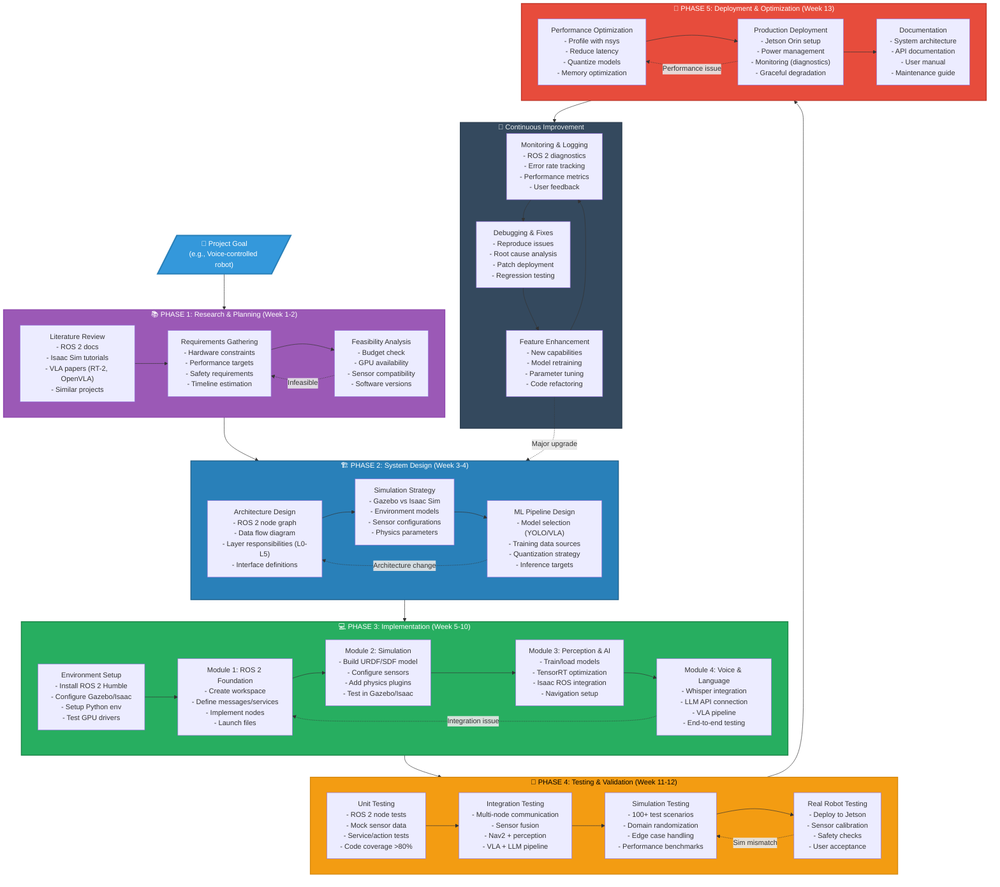
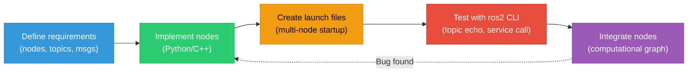
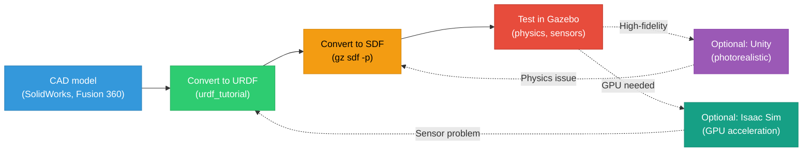
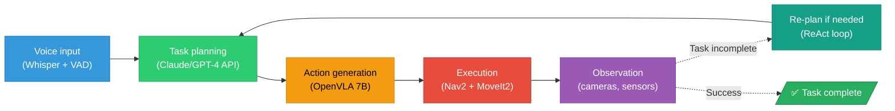

# Master Diagram 3: Development Workflow

> **Complete development cycle from research to deployment, following spec-driven methodology.**

## Diagram: Physical AI Development Workflow

---

## Workflow by Module

### Module 1: ROS 2 Development Workflow

**Timeline**: 2-3 weeks for complete ROS 2 foundation
**Deliverable**: Working multi-node ROS 2 system (pub/sub, services, actions)

---

### Module 2: Simulation-First Development

**Timeline**: 1-2 weeks for digital twin setup
**Deliverable**: Simulated robot in Gazebo/Isaac with ROS 2 integration

---

### Module 3: GPU AI Development Workflow

```mermaid
graph LR
    M3_DATASET["Collect/download dataset<br/>(COCO, Open X-Embodiment)"]
    M3_TRAIN["Train model<br/>(PyTorch, 80% train)"]
    M3_VALIDATE["Validate<br/>(20% val split)"]
    M3_ONNX["Export to ONNX<br/>(torch.onnx.export)"]
    M3_TRT["Build TensorRT engine<br/>(trtexec, INT8)"]
    M3_BENCHMARK["Benchmark<br/>(FPS, latency)"]
    M3_DEPLOY["Deploy to Jetson<br/>(Isaac ROS node)"]

    M3_DATASET --> M3_TRAIN
    M3_TRAIN --> M3_VALIDATE
    M3_VALIDATE -.->|Low accuracy| M3_TRAIN
    M3_VALIDATE --> M3_ONNX
    M3_ONNX --> M3_TRT
    M3_TRT --> M3_BENCHMARK
    M3_BENCHMARK -.->|Too slow| M3_TRT
    M3_BENCHMARK --> M3_DEPLOY

    style M3_DATASET fill:#3498db,stroke:#2980b9,color:#fff
    style M3_TRAIN fill:#2ecc71,stroke:#27ae60,color:#fff
    style M3_VALIDATE fill:#f39c12,stroke:#d68910,color:#000
    style M3_ONNX fill:#e74c3c,stroke:#c0392b,color:#fff
    style M3_TRT fill:#9b59b6,stroke:#8e44ad,color:#fff
    style M3_BENCHMARK fill:#16a085,stroke:#138d75,color:#fff
    style M3_DEPLOY fill:#34495e,stroke:#2c3e50,color:#ecf0f1
```

**Timeline**: 2-4 weeks (depends on dataset size, model complexity)
**Deliverable**: TensorRT-optimized model deployed on Jetson with ROS 2 interface

---

### Module 4: VLA Integration Workflow

**Timeline**: 2-3 weeks for end-to-end VLA pipeline
**Deliverable**: Voice-controlled robot with LLM reasoning and VLA execution

---

## Development Tools by Phase

| Phase | Tools | Purpose |
|-------|-------|---------|
| **Phase 1: Research** | Google Scholar, arXiv, GitHub | Find papers, code examples, SOTA methods |
| **Phase 2: Design** | Draw.io, Mermaid, PlantUML | Architecture diagrams, data flow |
| **Phase 3: Implementation** | VS Code, Git, colcon | Code editor, version control, build system |
| **Phase 4: Testing** | pytest, ros2 test, rqt_console | Unit tests, integration tests, debugging |
| **Phase 5: Deployment** | Docker, systemd, ansible | Containerization, service management, automation |
| **Iterate: Monitoring** | Foxglove, Grafana, Prometheus | Real-time visualization, metrics, alerts |

---

## Common Pitfalls & Solutions

### Pitfall 1: Skipping Simulation Testing
**Problem**: Deploy directly to robot, hardware breaks, slow iteration
**Solution**: Test in Gazebo/Isaac Sim first (100× faster iteration)
**Workflow**: Sim → Real (with sim-to-real techniques)

### Pitfall 2: No Version Control
**Problem**: Code breaks, can't rollback, collaboration difficult
**Solution**: Git from day 1, commit frequently, use branches
**Best Practice**: `main` (stable), `develop` (integration), `feature/X` (new work)

### Pitfall 3: Monolithic Architecture
**Problem**: One big node does everything, hard to debug/test
**Solution**: Modular ROS 2 nodes, single responsibility principle
**Example**: Separate `camera_driver`, `object_detector`, `planner`, `controller`

### Pitfall 4: Hardcoded Parameters
**Problem**: Must recompile to change values, no runtime tuning
**Solution**: ROS 2 parameters, YAML config files, dynamic reconfigure
**Example**: `camera_fps`, `detection_threshold`, `max_velocity`

### Pitfall 5: No Error Handling
**Problem**: Crashes on unexpected input, no recovery
**Solution**: Try-except blocks, ROS 2 lifecycle nodes, watchdog timers
**Example**: Handle camera disconnect, LLM API timeout, sensor noise

---

## Pedagogical Notes

**Teaching Progression** (matches textbook structure):
1. **Module 1** (Weeks 2-4): Learn ROS 2 workflow (node → launch → test)
2. **Module 2** (Weeks 5-6): Add simulation layer (URDF → Gazebo → test)
3. **Module 3** (Weeks 7-10): Add AI layer (train → TensorRT → Jetson)
4. **Module 4** (Weeks 11-13): Add voice/LLM layer (Whisper → Claude → VLA)

**Key Insight**: Each module builds on previous modules' workflows. Master each layer before adding next.

**Project-Based Learning**:
- **Small Project** (Modules 1-2): ROS 2 + Gazebo simulation (3 weeks)
- **Medium Project** (Modules 1-3): Add GPU perception + Nav2 (6 weeks)
- **Large Project** (Modules 1-4): Full VLA system (13 weeks)

**Iteration is Key**:
- First implementation: Slow, buggy, but works (60% of time)
- Second iteration: Refactor, optimize, test (30% of time)
- Third iteration: Polish, document, deploy (10% of time)

---

## Workflow Checklist

**Before Starting Implementation**:
- [ ] Hardware available (GPU, Jetson, sensors)
- [ ] Software installed (ROS 2, Gazebo/Isaac, Python env)
- [ ] Git repository initialized
- [ ] Architecture diagram drawn
- [ ] Timeline estimated (with buffer)

**During Development**:
- [ ] Commit code daily to Git
- [ ] Write unit tests for new nodes
- [ ] Test in simulation before real robot
- [ ] Document non-obvious design choices
- [ ] Profile performance bottlenecks

**Before Deployment**:
- [ ] All tests pass (unit + integration)
- [ ] Performance meets targets (latency, FPS)
- [ ] Error handling implemented
- [ ] Safety checks in place
- [ ] Documentation complete

---

**Diagram Usage**:
- **Students**: Follow workflow sequentially, don't skip phases
- **Instructors**: Map assignments to workflow phases, enforce checkpoints
- **Researchers**: Adapt workflow to custom needs, focus on Iterate loop

**The workflow is iterative—expect to cycle through phases multiple times!**
