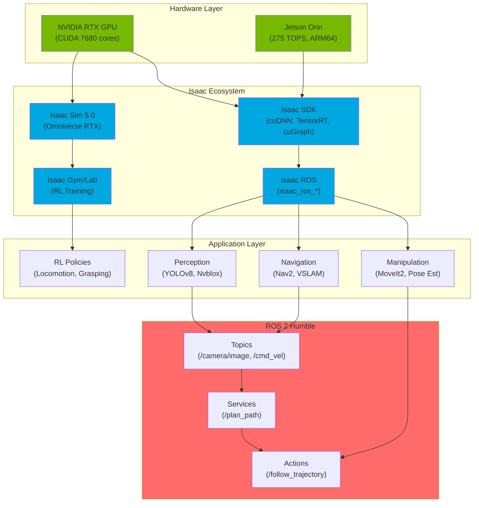

# Figure 3.1: Isaac Sim & ROS Architecture

> **Chapter**: 3.1 - Isaac Ecosystem
> **Figure Type**: System Architecture Diagram
> **Format**: Mermaid

---

## Diagram

---

## Caption

**Figure 3.1**: Isaac Sim & ROS 2 Architecture. Hardware layer (RTX desktop or Jetson edge) runs Isaac Sim (photorealistic simulation), Isaac SDK (GPU-accelerated libraries), Isaac ROS (ROS 2 packages), and Isaac Gym/Lab (RL training). Application layer builds on ROS 2 topics/services/actions for perception, navigation, and manipulation. Development workflow: Train on RTX workstation → Deploy to Jetson robot.

---

## Code References

- **Isaac Sim installation**: `textbook/content/module3/chapter-3.1-isaac-ecosystem.md:115-125` (Docker container setup)
- **Isaac ROS packages**: `chapter-3.2-gpu-perception.md:78-95` (TensorRT perception pipeline)
- **ROS 2 integration**: `chapter-3.3-navigation-manipulation.md:45-60` (Nav2 launch configuration)

---

## Usage Notes

**Teaching Context**:
- Use in **Week 8 Lecture 1** to introduce Isaac ecosystem components
- Compare with **Figure 1.1 (ROS 2 Computational Graph)** to show integration
- Highlight **development vs deployment** split (RTX → Jetson)

**Student Activities**:
- **Lab Exercise**: Install Isaac Sim, verify GPU acceleration (nvidia-smi)
- **Discussion**: Why GPU matters for robotics (10× speedup for perception/RL)

---

## Error Scenarios

- **Missing GPU**: Isaac Sim requires RTX-capable GPU (not Intel iGPU)
  - **Solution**: Check `nvidia-smi` output, verify CUDA 11.8+
- **Jetson compatibility**: Not all Isaac ROS packages work on Jetson Nano (insufficient memory)
  - **Solution**: Use Jetson Orin Nano (8GB) minimum for perception pipelines

---

## Notes for Instructors

**Diagram Pedagogy**:
- Walk through layers **bottom-up**: Hardware → Isaac → Apps → ROS 2
- Emphasize **reusability**: Same Isaac ROS nodes work on desktop + Jetson
- Demo: Run isaac_ros_yolov8 on RTX (150 FPS) vs Jetson (60 FPS)

**Extensions**:
- Add **Isaac Cloud** for distributed training (future course module)
- Show **multi-robot simulation** (10+ robots in one Isaac Sim scene)

**Assessment**:
- Quiz: "Which Isaac component provides RL training? (Answer: Gym/Lab)"
- Project: Map student project to this architecture (e.g., autonomous delivery → Nav + Perception)

---

**Diagram Metadata**:
- **Lines of Mermaid Code**: 52
- **Nodes**: 16
- **Complexity**: Medium (3 layers, clear hierarchy)
