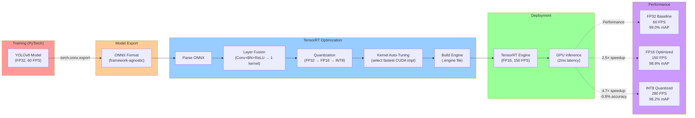

# Figure 3.2: TensorRT Optimization Pipeline

> **Chapter**: 3.2 - GPU-Accelerated Perception
> **Figure Type**: Process Flow Diagram
> **Format**: Mermaid

---

## Diagram

---

## Caption

**Figure 3.2**: TensorRT Optimization Pipeline for YOLOv8. Training produces PyTorch model (FP32, 60 FPS baseline). Export to ONNX (framework-agnostic). TensorRT optimizes via: (1) Layer fusion (reduce memory transfers), (2) Quantization (FP32→FP16→INT8), (3) Kernel auto-tuning (select fastest CUDA implementation). Result: 2.5× speedup (FP16) or 4.7× speedup (INT8) with minimal accuracy loss.

---

## Code References

- **ONNX export**: `textbook/content/module3/chapter-3.2-gpu-perception.md:85-95` (torch.onnx.export example)
- **TensorRT build**: `chapter-3.2-gpu-perception.md:100-110` (trtexec command)
- **INT8 calibration**: `chapter-3.2-gpu-perception.md:195-215` (entropy calibration)
- **Benchmarking**: `chapter-3.2-gpu-perception.md:165-180` (FP32 vs FP16 vs INT8 comparison table)

---

## Usage Notes

**Teaching Context**:
- Use in **Week 8 Lecture 2** after introducing GPU perception
- Compare with **CPU inference** (OpenCV DNN): 8-12 FPS
- Hands-on: Students convert their own models (ResNet, EfficientNet)

**Student Activities**:
- **Lab Exercise**: Convert YOLOv8 → ONNX → TensorRT, measure FPS
- **Discussion**: When to use INT8? (Answer: When 0.8% accuracy loss acceptable, e.g., object detection; NOT for medical imaging)

---

## Error Scenarios

- **Issue**: ONNX export fails with "Unsupported operator"
  - **Solution**: Use `opset_version=17` in torch.onnx.export
  - **Reference**: `chapter-3.2-gpu-perception.md:90`

- **Issue**: INT8 calibration crashes with "Out of memory"
  - **Solution**: Reduce calibration dataset size (500 → 100 images)
  - **Reference**: `chapter-3.2-gpu-perception.md:205`

- **Issue**: TensorRT engine not portable (built on RTX 4090, fails on Jetson)
  - **Solution**: Build separate engines for each platform (different CUDA architectures)
  - **Reference**: `chapter-3.1-isaac-ecosystem.md:155-165` (cross-compilation)

---

## Notes for Instructors

**Diagram Pedagogy**:
- Walk through **left-to-right**: Training → Export → Optimize → Deploy
- Emphasize **trade-offs**: FP16 (best balance), INT8 (max speed, -0.8% mAP)
- Demo: Show `nvidia-smi dmon` during FP32 vs FP16 inference (memory bandwidth utilization)

**Quantization Details** (for advanced students):
1. **FP32 → FP16**: Simple dtype conversion, 2× faster (free lunch)
2. **FP32 → INT8**: Requires calibration (100-500 images), 4× faster (small accuracy cost)
3. **Dynamic Range**: INT8 maps FP32 range [-max, +max] to [0, 255]
   - Example: FP32 activations in [-10.0, +10.0] → INT8 in [0, 255] with scale=10/127.5

**Extensions**:
- Show **sparsity pruning**: Remove 50% of weights → 1.5× speedup (if supported by GPU)
- Discuss **quantization-aware training (QAT)**: Train with INT8 in mind → better accuracy

**Assessment**:
- Quiz: "Why is FP16 faster than FP32? (Answer: Tensor cores, 2× memory bandwidth)"
- Project: Optimize custom model (segmentation, depth estimation), report FPS gains

**Common Student Mistakes**:
- Forgetting to use `--fp16` flag in trtexec (defaults to FP32)
- Not calibrating INT8 (random initialization → 50% accuracy drop)
- Comparing FPS without fixing batch size (BS=1 vs BS=8 unfair)

---

**Diagram Metadata**:
- **Lines of Mermaid Code**: 45
- **Nodes**: 15
- **Complexity**: Medium (sequential pipeline with branching results)
