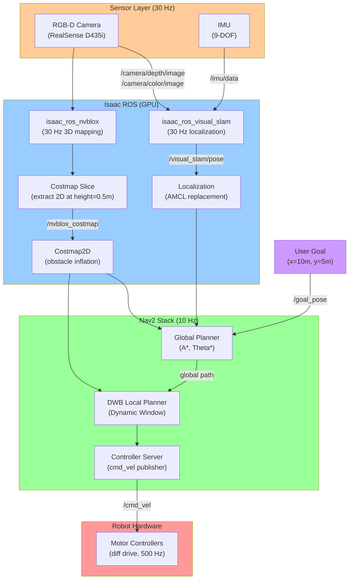

# Figure 3.3: Nav2 Integration with Isaac ROS

> **Chapter**: 3.3 - Navigation & Manipulation
> **Figure Type**: System Architecture Diagram
> **Format**: Mermaid

---

## Diagram



---

## Caption

**Figure 3.3**: Nav2 Integration with Isaac ROS for Autonomous Navigation. RGB-D camera + IMU feed isaac_ros_visual_slam (GPU-accelerated localization, 30 Hz) and isaac_ros_nvblox (3D voxel mapping, 30 Hz). Nvblox extracts 2D costmap slice at robot height. Nav2 uses VSLAM pose (replaces AMCL particle filter) and Nvblox costmap for planning. Global planner (A*) computes path; DWB local planner generates motor commands (cmd_vel) at 10 Hz. Result: Real-time obstacle avoidance with dynamic objects (people, forklifts) in warehouse environments.

---

## Code References

- **Nvblox launch**: `textbook/content/module3/chapter-3.3-navigation-manipulation.md:95-115` (ROS 2 launch configuration)
- **VSLAM integration**: `chapter-3.3-navigation-manipulation.md:135-150` (AMCL replacement)
- **Costmap config**: `chapter-3.3-navigation-manipulation.md:215-235` (inflation layer parameters)
- **DWB tuning**: `chapter-3.3-navigation-manipulation.md:240-255` (velocity limits, critics)
- **Full launch example**: `chapter-3.3-navigation-manipulation.md:275-295` (warehouse navigation)

---

## Usage Notes

**Teaching Context**:
- Use in **Week 9 Lecture 1** to show GPU-accelerated navigation stack
- Compare with **standard Nav2** (LiDAR + AMCL): 2D-only, can't handle overhangs
- Hands-on: Students tune DWB parameters, observe behavior changes

**Student Activities**:
- **Lab Exercise**: Build Nvblox map of classroom, send navigation goals
- **Discussion**: Why 30 Hz perception but 10 Hz planning? (Answer: Planning more computationally expensive, 10 Hz sufficient for robot dynamics)

---

## Error Scenarios

- **Issue**: Robot oscillates near obstacles
  - **Solution**: Increase `inflation_radius` (0.3m → 0.5m) in costmap config
  - **Reference**: `chapter-3.3-navigation-manipulation.md:340`

- **Issue**: VSLAM tracking lost in featureless corridor
  - **Solution**: Add AprilTag fiducials on walls for re-localization
  - **Reference**: `chapter-3.3-navigation-manipulation.md:345`

- **Issue**: Nvblox costmap has "holes" (missing obstacles)
  - **Solution**: Check camera field of view (D435i: 87° H × 58° V), ensure obstacles in view
  - **Note**: LiDAR (360°) better for omnidirectional sensing

- **Issue**: Nav2 plans path through dynamic obstacle (person)
  - **Solution**: Reduce `costmap_update_frequency` (1 Hz → 5 Hz) for faster obstacle updates
  - **Trade-off**: Higher CPU usage

---

## Notes for Instructors

**Diagram Pedagogy**:
- Walk through **data flow top-to-bottom**: Sensors → Isaac → Nav2 → Motors
- Highlight **frequency differences**:
  - Perception (30 Hz): Real-time sensor processing
  - Planning (10 Hz): Path computation (less time-critical)
  - Control (500 Hz): Motor PID loops (low latency required)
- Demo: Run `ros2 topic hz /cmd_vel` to show 10 Hz publishing

**Isaac ROS Advantages**:
1. **3D Mapping**: Handles overhangs, table legs (2D costmap misses these)
2. **GPU Speed**: 30 Hz (vs 5-10 Hz CPU)
3. **Dynamic Objects**: Nvblox updates map in real-time (moving people)

**Standard Nav2 Comparison**:
```
Standard: LiDAR → AMCL (particle filter, 10 Hz) → Costmap2D (CPU)
Isaac:    RGB-D → VSLAM (GPU, 30 Hz) → Nvblox 3D (GPU) → Costmap2D
```

**Extensions**:
- Add **multi-camera fusion**: Front + rear cameras for 180° coverage
- Show **behavior trees**: Complex navigation sequences (go to A, wait, go to B)
- Discuss **global costmap vs local costmap**: Global (static map), Local (sensor updates)

**Assessment**:
- Quiz: "Which component replaces AMCL? (Answer: isaac_ros_visual_slam)"
- Project: Deploy warehouse robot, measure navigation success rate (80%+ target)

**Common Student Struggles**:
- Confusing **map frame** vs **odom frame** vs **base_link frame**
  - Map: Fixed global frame (origin at map creation)
  - Odom: Drifts over time (wheel encoders, VSLAM)
  - Base_link: Robot center
- Not understanding **inflation layer**: Why robot stops 0.5m from wall?
  - Answer: `inflation_radius` creates safety margin (robot + sensor noise + dynamics)

**Timing Analysis** (for advanced students):
```
Sensor capture:        1ms   (camera driver)
Depth processing:      3ms   (GPU decompression)
VSLAM update:         10ms   (feature tracking + pose opt)
Nvblox integration:   20ms   (TSDF fusion)
Costmap slice:         2ms   (GPU → CPU transfer)
Global plan:          50ms   (A* search)
Local plan:           10ms   (DWB trajectory scoring)
Total latency:        96ms   (acceptable for 0.5 m/s robot)
```

---

**Diagram Metadata**:
- **Lines of Mermaid Code**: 55
- **Nodes**: 17
- **Complexity**: High (multi-layer architecture with frequency annotations)
