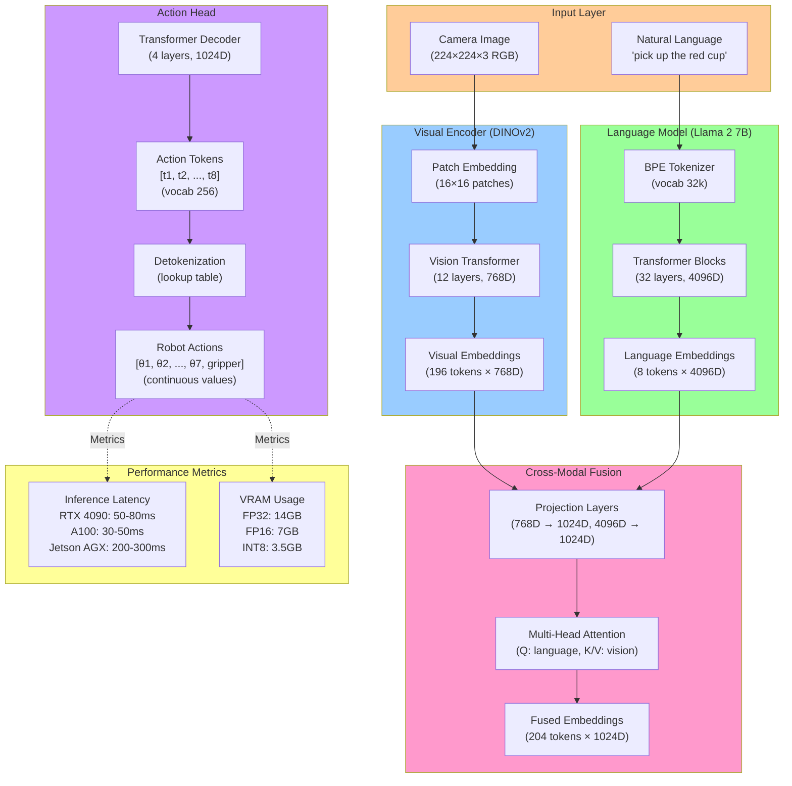

# Figure 4.1: VLA Architecture (OpenVLA Example)

> **Chapter**: 4.1 - VLA Concepts & Evolution
> **Figure Type**: System Architecture Diagram
> **Format**: Mermaid

---

## Diagram



---

## Caption

**Figure 4.1**: OpenVLA 7B Architecture. Input layer receives RGB image (224×224×3) and natural language instruction. Visual encoder (DINOv2 ViT) extracts spatial features as 196 patch embeddings (768D). Language model (Llama 2 7B) tokenizes instruction into 8 tokens (4096D). Cross-modal fusion projects both to shared 1024D space, then multi-head attention aligns language query ("what to do?") with vision key-values ("what do I see?"). Action head decoder outputs 8 action tokens (7 joints + gripper), detokenized to continuous robot commands. Inference: 50-80ms on RTX 4090, 7GB VRAM (FP16).

---

## Code References

- **OpenVLA architecture**: `textbook/content/module4/chapter-4.1-vla-concepts.md:265-310` (component breakdown)
- **Visual encoder (DINOv2)**: `chapter-4.1-vla-concepts.md:315-320` (ViT details)
- **Language model (Llama 2)**: `chapter-4.1-vla-concepts.md:322-325` (7B transformer)
- **Cross-modal fusion**: `chapter-4.1-vla-concepts.md:328-340` (attention mechanism with example)
- **Action tokenization**: `chapter-4.1-vla-concepts.md:343-355` (discrete action vocab, detokenization)
- **Inference code**: `chapter-4.1-vla-concepts.md:595-620` (Python OpenVLA forward pass)

---

## Usage Notes

**Teaching Context**:
- Use in **Week 11 Lecture 1** to introduce VLA end-to-end pipeline
- Compare with **Module 3 Isaac architecture** (perception → planning → control) to show single-model advantage
- Hands-on: Students trace data flow from image pixel (224,224,0) → action token → joint angle

**Student Activities**:
- **Lab Exercise**: Load OpenVLA in Python, print intermediate embeddings at each stage
- **Discussion**: Why project to shared 1024D space? (Answer: Alignment for attention, computational efficiency)

---

## Error Scenarios

- **Issue**: CUDA out of memory during inference
  - **Solution**: Use FP16 (`model.half()`) or INT8 quantization → 14GB → 7GB → 3.5GB VRAM
  - **Reference**: `chapter-4.1-vla-concepts.md:735-740` (troubleshooting section)

- **Issue**: Slow inference (200ms+ on RTX 4090)
  - **Solution**: Use TensorRT optimization → 80ms → 30ms (2.7× speedup)
  - **Reference**: `chapter-4.1-vla-concepts.md:742-745`

- **Issue**: Action detokenization returns out-of-range joint angles
  - **Solution**: Check `unnormalize=True` flag, verify joint limits in config file
  - **Reference**: `chapter-4.1-vla-concepts.md:615` (predict_action call)

- **Issue**: Model outputs incorrect actions for novel objects
  - **Solution**: Fine-tune with 500-1k demos from target environment using LoRA
  - **Reference**: `chapter-4.1-vla-concepts.md:747-750`

---

## Notes for Instructors

**Diagram Pedagogy**:
- Walk through **left-to-right, top-to-bottom**: Input → Vision → Language → Fusion → Action
- Emphasize **dimension changes**: 768D (vision) + 4096D (language) → 1024D (shared) → 256 vocab (actions) → 7 continuous (robot)
- Demo: Show `model.visual_encoder(image)` output shape (196, 768), then `model.action_head(fused)` output shape (8,)

**Key Insights for Students**:
1. **Why ViT (not CNN)?** → Transformers allow attention across image patches (e.g., focus on "red" in "red cup")
2. **Why Llama 2 (not BERT)?** → Decoder-only models better for generative tasks (action sequence generation)
3. **Why tokenize actions?** → Transformers designed for discrete sequences; continuous regression fails on high-dimensional action spaces

**Attention Mechanism Deep Dive** (for advanced students):
```
Query (Q): "What should I do?" (from language: "pick up the red cup")
Keys (K): "What's at each image location?" (from vision: 196 patch features)
Values (V): "Detailed features at each location"

Attention weights = softmax(Q @ K.T / sqrt(d_k))
→ High weights on patches containing red/cup
→ Low weights on background/irrelevant objects

Output = Attention weights @ V
→ Weighted sum of visual features, biased toward red cup
```

**Alternative Architectures** (compare in lecture):
- **RT-1**: EfficientNet (CNN) + smaller Transformer → Faster (30ms) but less semantic understanding
- **RT-2**: PaLM-E (562B) + frozen encoder → Better zero-shot but requires TPU (expensive)
- **π0**: Flow Matching (not tokenization) → 50 Hz inference but harder to train
- **GR00T**: Dual system (VLA + RL primitives) → Best for whole-body humanoid control

**Extensions**:
- Show **multi-camera VLA**: 3 cameras → 3× visual embeddings concatenated → Fusion
- Discuss **temporal VLA**: Stack 4 frames (t-3, t-2, t-1, t) → 196×4=784 tokens → Temporal attention
- Add **proprioception**: Joint angles (7D) → MLP → Embeddings → Concatenate with vision/language

**Assessment**:
- Quiz: "Why project vision 768D → 1024D instead of using 768D directly?" (Answer: Match language model dimensions for fusion)
- Project: Modify OpenVLA to add proprioceptive input (current joint angles)

**Common Student Mistakes**:
- Confusing **token** (discrete ID 0-255) with **embedding** (continuous vector 1024D)
- Thinking attention is "just matrix multiplication"—emphasize it's **learned** alignment (Q, K, V are learned linear projections)
- Not understanding **detokenization** is a simple lookup: `token_125 → 0.5 rad` (learned during training as binning)

**Performance Tuning Tips**:
| Optimization | Latency | VRAM | Accuracy |
|--------------|---------|------|----------|
| Baseline (FP32) | 150ms | 14GB | 100% |
| FP16 | 80ms | 7GB | 99.5% |
| INT8 | 50ms | 3.5GB | 97% |
| TensorRT (FP16) | 30ms | 7GB | 99.5% |
| Distillation (7B → 1.5B) | 20ms | 2GB | 92% |

**Hardware Requirements Table**:
| Hardware | Inference FPS | Batch Size | Cost |
|----------|---------------|------------|------|
| RTX 4090 | 12-20 Hz | 1-4 | $1,600 |
| A100 (40GB) | 20-33 Hz | 1-8 | $10k / $2/hr cloud |
| Jetson AGX Orin | 3-5 Hz | 1 | $2,000 |
| Jetson Orin Nano | 1-2 Hz | 1 | $499 |

---

**Diagram Metadata**:
- **Lines of Mermaid Code**: 65
- **Nodes**: 20
- **Complexity**: High (5 layers with detailed annotations, performance metrics)
