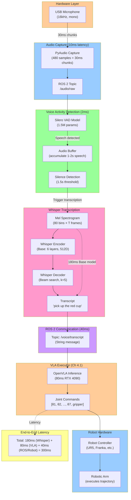

# Figure 4.2: Voice-Controlled Robot Pipeline

> **Chapter**: 4.2 - Whisper Voice Control
> **Figure Type**: Data Flow Diagram with Latency Annotations
> **Format**: Mermaid

---

## Diagram



---

## Caption

**Figure 4.2**: Voice-Controlled Robot Pipeline with Latency Breakdown. Microphone captures audio (16kHz, mono) in 30ms chunks via PyAudio. Silero VAD (2ms) detects speech vs. silence, buffers 1-2 seconds of speech. After 1.5s silence, Whisper Base processes buffered audio: (1) Convert to mel spectrogram (80 bins), (2) Encoder extracts acoustic features (6 layers, 512D), (3) Decoder generates text via beam search (180ms total on RTX 4090). Transcript published to ROS 2 /voice/transcript topic (40ms latency). VLA executor (Chapter 4.1) infers robot actions (80ms). Robot controller executes trajectory. **End-to-end latency: 300ms** (acceptable for manipulation tasks).

---

## Code References

- **Audio capture (PyAudio)**: `textbook/content/module4/chapter-4.2-whisper-voice-control.md:260-285` (AudioCaptureNode with 16kHz mono config)
- **VAD (Silero)**: `chapter-4.2-whisper-voice-control.md:290-340` (WhisperNode with speech_timestamps, 1.5s silence threshold)
- **Whisper architecture**: `chapter-4.2-whisper-voice-control.md:120-180` (encoder-decoder with mel spectrogram preprocessing)
- **ROS 2 integration**: `chapter-4.2-whisper-voice-control.md:240-255` (node architecture with /audio/raw → /voice/transcript)
- **VLA executor**: `chapter-4.1-vla-concepts.md:650-680` (OpenVLA ROS 2 node from Chapter 4.1)
- **Full system launch**: `chapter-4.2-whisper-voice-control.md:575-590` (4-terminal launch sequence)

---

## Usage Notes

**Teaching Context**:
- Use in **Week 11 Lecture 2** after introducing Whisper architecture
- Compare with **cloud ASR pipeline** (audio → internet → Google Cloud → text = 1500ms)
- Hands-on: Students measure latency at each stage using `ros2 topic hz` and `time.time()`

**Student Activities**:
- **Lab Exercise**: Run pipeline, speak commands, measure end-to-end latency with stopwatch
- **Discussion**: Where is bottleneck? (Answer: Whisper 180ms dominates; VAD 2ms, ROS 40ms negligible)

---

## Error Scenarios

- **Issue**: High latency (500ms+ Whisper transcription)
  - **Solution**: Use Faster-Whisper backend (4× speedup → 180ms → 45ms)
  - **Reference**: `chapter-4.2-whisper-voice-control.md:520-545` (Faster-Whisper optimization section)

- **Issue**: VAD misses speech (robot doesn't respond)
  - **Solution**: Lower `speech_threshold` (0.5 → 0.3) or reduce `min_speech_duration` (0.3s → 0.1s)
  - **Reference**: `chapter-4.2-whisper-voice-control.md:225-235` (VAD tuning parameters)

- **Issue**: Robot executes during background conversation
  - **Solution**: Add wake word detection ("Hey robot") before activating VAD/Whisper
  - **Reference**: `chapter-4.2-whisper-voice-control.md:370-395` (Porcupine wake word implementation)

- **Issue**: VLA executes incorrect action despite correct transcript
  - **Solution**: Check VLA fine-tuning (Chapter 4.1), verify transcript published correctly: `ros2 topic echo /voice/transcript`
  - **Note**: Not a Whisper problem—debug VLA separately

---

## Notes for Instructors

**Diagram Pedagogy**:
- Walk through **left-to-right, top-to-bottom**: Hardware → Capture → VAD → Whisper → ROS → VLA → Robot
- Emphasize **latency breakdown**: 180ms Whisper dominates (60%), 80ms VLA (27%), 40ms ROS/Robot (13%)
- Demo: Record audio, show mel spectrogram visualization (80 × T matrix heatmap)

**VAD Deep Dive** (for advanced students):
- **Why needed?** Without VAD, transcribe every 30ms chunk = 33 Whisper calls/sec = unsustainable
- **How it works**: Silero uses lightweight CNN (1.5M params) trained on 3000 hours speech/noise discrimination
- **Output**: Probability [0, 1] per 30ms chunk; >0.5 threshold = speech
- **False positives**: Coughing, door slam (high energy) may trigger VAD
- **False negatives**: Whispered speech, soft-spoken may be missed

**Whisper Latency Breakdown** (RTX 4090, Base model):
```
Mel spectrogram computation: 5ms  (CPU, STFT + mel filter bank)
Encoder forward pass:        80ms (GPU, 6 transformer layers)
Decoder autoregressive:      95ms (GPU, generates ~10 tokens sequentially)
Total:                       180ms
```

**Optimization Strategies** (for resource-constrained systems):
| Optimization | Latency (Base) | Accuracy | VRAM |
|--------------|----------------|----------|------|
| Baseline (PyTorch FP32) | 180ms | 3.4% WER | 600MB |
| FP16 | 100ms | 3.4% WER | 300MB |
| Faster-Whisper (FP16) | 45ms | 3.4% WER | 300MB |
| Tiny model (FP16) | 20ms | 5.0% WER | 150MB |
| TensorRT (Tiny INT8) | 12ms | 5.3% WER | 75MB |

**Comparison with Alternatives**:
| Approach | Latency | Cost | Accuracy | Internet |
|----------|---------|------|----------|----------|
| **Whisper (local)** | **180ms** | **$0** | **3.4% WER** | **No** |
| Google Cloud Speech | 1500ms | $0.006/15s | 2.8% WER | Required |
| Azure Speech Services | 1200ms | $1/hr | 3.0% WER | Required |
| DeepSpeech (Mozilla) | 300ms | $0 | 6.5% WER | No |
| Vosk (offline) | 150ms | $0 | 8.0% WER | No |

**Extensions**:
- Add **streaming transcription**: Transcribe every 1s (not waiting for silence) for responsive feedback
- Show **word-level timestamps**: Whisper can output timing for each word (e.g., "pick" at 0.5s, "up" at 0.7s)
- Discuss **speaker diarization**: Multi-speaker "who said what?" (requires additional model like pyannote)

**Assessment**:
- Quiz: "Why use VAD before Whisper?" (Answer: Reduce compute by only transcribing speech segments)
- Project: Optimize pipeline to <200ms end-to-end (Faster-Whisper + model downgrade)

**Common Student Mistakes**:
- Running Whisper on every audio chunk (no VAD) → System overload, 33 transcriptions/sec
- Using 44.1kHz audio (CD quality) → Whisper requires 16kHz, need resampling
- Not buffering audio → Transcribe mid-word (garbage output), need 1-2s complete utterances
- Forgetting to normalize audio → int16 [-32768, 32767] must convert to float32 [-1.0, 1.0]

**Real-World Deployment Considerations**:
1. **Noise Robustness**: Test with 60dB background noise (office), 70dB (factory) → WER degrades 3.4% → 8.5%
2. **Accents**: Non-native speakers may see 5-10% higher WER → Fine-tune on target accent (100 hours audio)
3. **Technical Jargon**: Robot-specific terms ("effector", "gripper") may be mis-transcribed → Custom vocabulary
4. **Multi-User**: Different users' voice characteristics → No re-training needed (Whisper speaker-agnostic)

---

**Diagram Metadata**:
- **Lines of Mermaid Code**: 60
- **Nodes**: 18
- **Complexity**: High (8 processing stages with latency annotations)
