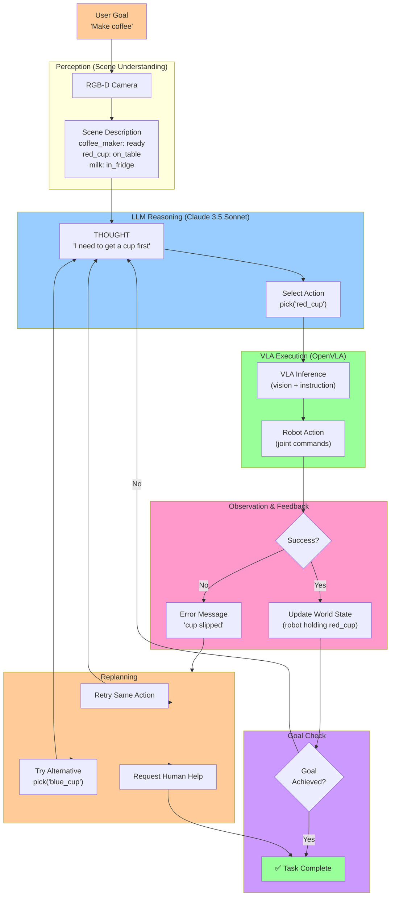

# Figure 4.3: LLM ReAct Loop for Robot Task Execution

> **Chapter**: 4.3 - LLM Task Planning
> **Figure Type**: Feedback Loop Diagram
> **Format**: Mermaid

---

## Diagram



---

## Caption

**Figure 4.3**: ReAct Loop for LLM-Guided Robot Task Execution. User provides high-level goal ("make coffee"). Perception generates scene description (object locations, states). LLM (Claude 3.5 Sonnet) reasons about next action (Thought: "I need a cup" → Action: pick("red_cup")). VLA (OpenVLA) executes action with vision-language grounding. Observation checks success—if Yes: update world state, check goal; if No: replan (retry, try alternative, or request human help). Loop continues until goal achieved or max attempts exceeded. This iterative feedback enables adaptive execution robust to failures and world changes.

---

## Code References

- **ReAct loop implementation**: `textbook/content/module4/chapter-4.3-llm-reasoning.md:310-355` (Python react_loop function with max_steps, history tracking)
- **LLM reasoning (THOUGHT)**: `chapter-4.3-llm-reasoning.md:140-180` (System prompt defining capabilities/constraints)
- **VLA execution**: `chapter-4.1-vla-concepts.md:650-680` (OpenVLA ROS 2 node from Chapter 4.1)
- **Error handling strategies**: `chapter-4.3-llm-reasoning.md:540-585` (Local replan, global replan, human-in-the-loop)
- **Goal checking**: `chapter-4.3-llm-reasoning.md:350` (is_goal_satisfied function)

---

## Usage Notes

**Teaching Context**:
- Use in **Week 12 Lecture 1** to explain ReAct pattern
- Compare with **open-loop planning** (generate full plan upfront = brittle) vs. **closed-loop ReAct** (adapt per step = robust)
- Hands-on: Students trace execution through diagram for "make coffee" task

**Student Activities**:
- **Lab Exercise**: Implement React loop in simulation, introduce random failures (30%), measure recovery rate
- **Discussion**: When does replanning fail? (Answer: Goal unachievable, e.g., missing required object)

---

## Error Scenarios & Handling

**Scenario 1: Perception Failure**
- **Error**: "Object 'red_cup' not found"
- **Replan**: Alternative action pick("blue_cup") OR query LLM: "What if red_cup moved?"
- **Trace in Diagram**: Robot → Success (No) → Error → Replan → Alternative → Think

**Scenario 2: Execution Failure**
- **Error**: "Grasp failed, cup slipped"
- **Replan**: Retry same action (up to 3 attempts) with adjusted gripper force
- **Trace in Diagram**: Robot → Success (No) → Error → Replan → Retry → Think

**Scenario 3: Precondition Failure**
- **Error**: "Cannot place without holding object"
- **Replan**: Global replan—regenerate entire plan from current state
- **Trace in Diagram**: Robot → Success (No) → Error → Replan → Alternative (new plan) → Think

**Scenario 4: Goal Unachievable**
- **Error**: "Coffee maker broken, cannot brew"
- **Replan**: Give up after 3 replan attempts → Request human help
- **Trace in Diagram**: Error → Replan → GiveUp → Complete (with failure flag)

---

## Notes for Instructors

**Diagram Pedagogy**:
- Walk through **one complete loop**: Start → Perception → Think → Plan → Execute → Success (Yes) → GoalCheck (No) → back to Think (show circular arrows)
- Emphasize **feedback**: Without observation, robot blindly executes plan (open-loop, brittle)
- Demo: Intentionally move object mid-execution—show how ReAct recovers, open-loop fails

**ReAct vs. Alternatives**:

| Approach | Feedback | Adaptivity | Failure Recovery |
|----------|----------|------------|------------------|
| **Open-Loop Planning** | None | None | Fails | None |
| **Hierarchical Planning** | After subtask | Partial | Replan subtask |
| **ReAct** | After every action | High | Replan per step |
| **Pure RL** | Continuous | High | Implicit (learned) |

**Latency Breakdown** (per loop iteration):
```
Perception (scene description):  100ms  (Isaac ROS, GPU)
LLM reasoning (Claude 3.5):      2,500ms (API call)
VLA execution (OpenVLA):         80ms   (inference)
Robot action (move joints):       3,000ms (physical motion)
Observation (success check):     50ms   (force sensor, vision)
------------------------------------------------------
Total per iteration:             5,730ms (~6 seconds)
```

For 10-step task: 10 × 6s = **60 seconds**

**Optimization Strategies**:
1. **Parallel Planning**: Generate next 2-3 actions while current action executes (overlap LLM latency with motion)
2. **Caching**: Cache LLM responses for common failure scenarios ("cup not found" → try alternative objects)
3. **Local Models**: Use on-device LLM (e.g., Llama 3.1 8B) for low-latency reasoning (500ms vs 2500ms cloud)

**Extensions**:
- Add **memory**: Store past experiences (object locations, action success rates) → improve future planning
- Show **hierarchical ReAct**: High-level LLM plans subtasks, low-level RL executes primitives
- Discuss **multi-agent**: Multiple robots coordinating via shared LLM planner

**Assessment**:
- Quiz: "Why check goal after EVERY action?" (Answer: Early termination if goal achieved partway, avoid unnecessary actions)
- Project: Implement ReAct for 3 tasks (cleaning, cooking, assembly), measure success rate vs. open-loop

**Common Student Mistakes**:
- Calling LLM for EVERY perception update (even when action in progress) → Wasteful, 2.5s latency per call
- Not updating world state after successful action → LLM plans with stale information
- Infinite replan loop (no max attempts) → Robot stuck replanning forever on unachievable goals
- Ignoring physical constraints (e.g., plan requires robot to teleport) → Need constraint checking in LLM output

**Real-World Deployment Considerations**:
- **Latency Tolerance**: ReAct (6s/step) acceptable for manipulation, NOT for reactive tasks (catching, balancing)
- **Cost**: 10-step task × 2.5s LLM = 25s API time → $0.02 per task (Claude Sonnet) = $17.28/day (1000 tasks/day)
- **Reliability**: LLM API failures (timeout, rate limit) → Need fallback (local model, hardcoded heuristics)
- **Safety**: Validate LLM actions before execution (check joint limits, collision-free, reachable workspace)

---

**Diagram Metadata**:
- **Lines of Mermaid Code**: 55
- **Nodes**: 16
- **Complexity**: High (feedback loop with branching error handling paths)
