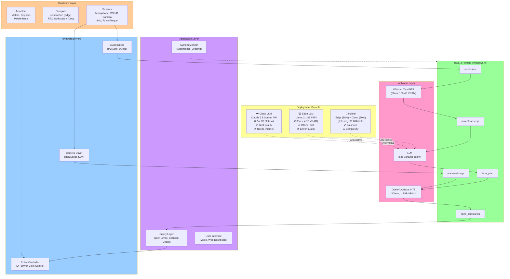

# Figure 4.4: Voice-Controlled Robot Deployment Stack

> **Chapter**: 4.4 - Integration & Deployment
> **Figure Type**: Layered Architecture Diagram with Deployment Variants
> **Format**: Mermaid

---

## Diagram



---

## Caption

**Figure 4.4**: Voice-Controlled Robot Deployment Stack. **Hardware layer** provides sensors (microphone, camera, IMU), compute (Jetson Orin edge / RTX workstation dev), and actuators (motors, grippers). **Firmware/Drivers** interface hardware with ROS 2. **ROS 2 middleware** routes messages between components via topics (/audio/raw, /voice/transcript, etc.). **AI Model layer** runs Whisper (speech-to-text), LLM (task planning), and VLA (action execution). **Application layer** enforces safety, monitors system health, and provides user interfaces. **Deployment Variants** offer trade-offs: (1) Cloud LLM (best quality, 2.5s, needs internet), (2) Edge LLM (offline, 800ms, lower quality), (3) Hybrid (80% edge + 20% cloud, balanced). Typical stack on Jetson Orin: Whisper Tiny INT8 (60ms) + Llama 8B INT4 (800ms) + OpenVLA Base INT8 (300ms) = 1.16s total AI latency + 3s physical motion.

---

## Code References

- **Hardware setup**: `textbook/content/module4/chapter-4.4-integration-deployment.md:610-625` (Fetch robot specs: Jetson AGX Orin 64GB, RealSense D435i, USB mic)
- **ROS 2 topology**: `chapter-4.4-integration-deployment.md:75-95` (node graph with topics)
- **AI model layer**: `chapter-4.4-integration-deployment.md:115-135` (latency breakdown Whisper+LLM+VLA)
- **Deployment variants comparison**: `chapter-4.4-integration-deployment.md:165-215` (Cloud vs Edge vs Hybrid table)
- **Jetson optimization**: `chapter-4.4-integration-deployment.md:245-285` (quantization FP16→INT8/INT4, power budget 10W)
- **Safety layer**: `chapter-4.4-integration-deployment.md:450-490` (constraint checking code)
- **Monitoring**: `chapter-4.4-integration-deployment.md:520-565` (ROS 2 diagnostics, Grafana dashboard)

---

## Usage Notes

**Teaching Context**:
- Use in **Week 13 Lecture 1** to show complete system architecture
- Compare with **traditional modular robotics** (sense-plan-act, 5+ separate systems) vs. **integrated VLA** (end-to-end)
- Hands-on: Students identify bottleneck layer (Answer: LLM 2.5s cloud, 0.8s edge)

**Student Activities**:
- **Lab Exercise**: Deploy full stack, measure latency at each layer using `ros2 topic hz` and `time.time()`
- **Discussion**: Which deployment variant for which use case? (Healthcare: Hybrid, Warehouse: Edge, Home: Cloud)

---

## Error Scenarios

- **Issue**: High end-to-end latency (>5s)
  - **Debug**: Measure per-layer—likely LLM (2.5s cloud) or network latency
  - **Solution**: Switch to edge LLM or hybrid deployment
  - **Reference**: `chapter-4.4-integration-deployment.md:165-215` (deployment strategies)

- **Issue**: Jetson overheating (throttling at 80°C)
  - **Debug**: Check power draw (`nvidia-smi`) → Likely >15W
  - **Solution**: Reduce model sizes (Whisper Base→Tiny, Llama 8B→3B) or add cooling
  - **Reference**: `chapter-4.4-integration-deployment.md:245-285` (Jetson optimization)

- **Issue**: Safety layer blocking all actions
  - **Debug**: Check joint limits in robot URDF, collision checker configuration
  - **Solution**: Relax constraints or fix URDF (incorrect link lengths common mistake)
  - **Reference**: `chapter-4.4-integration-deployment.md:450-490` (SafetyLayer class)

- **Issue**: ROS 2 messages delayed (>100ms per hop)
  - **Debug**: Check network (WiFi vs. wired), DDS QoS settings
  - **Solution**: Use wired Ethernet, set QoS to BEST_EFFORT for latency-critical topics
  - **Reference**: Module 1 (ROS 2 QoS settings)

---

## Notes for Instructors

**Diagram Pedagogy**:
- Walk through **bottom-up**: Hardware → Firmware → ROS 2 → AI Models → Application
- Emphasize **data flow**: Audio → /audio/raw → Whisper → /voice/transcript → LLM → /task_plan → VLA → /joint_commands → Robot
- Demo: Use `ros2 topic echo` to show live messages at each layer

**Deployment Variants Deep Dive**:

**Cloud LLM** (Typical: AWS/GCP/Azure):
- Pros: GPT-4/Claude Opus (best reasoning), no local compute cost
- Cons: 200-500ms network latency (WiFi/4G), $10-30 per 1M tokens, privacy concerns (audio sent to cloud)
- Use Case: Home robots (WiFi available), non-real-time tasks (cleaning schedule, meal prep)

**Edge LLM** (On Jetson):
- Pros: Zero latency overhead, zero API cost, works offline, private (data stays local)
- Cons: Lower quality (Llama 8B < GPT-4), 10-15W power (battery drain), 4GB VRAM (limits model size)
- Use Case: Warehouse (no WiFi), outdoor (construction), military (secure)

**Hybrid** (Intelligence at edge):
- Approach: Edge LLM with confidence scoring → If confidence <0.7, fallback to cloud
- Implementation: `if llm_edge_confidence(prompt) < 0.7: use_cloud_llm()`
- Savings: 80% tasks edge ($0) + 20% cloud ($0.02) = $0.004 avg/task vs. $0.02 full cloud
- Use Case: Service robots (hospital, hotel), delivery robots (urban)

**Power Budget Breakdown** (Jetson Orin Nano, 10W target):
```
Whisper Tiny INT8:     2W   (inference)
Llama 8B INT4:         6W   (inference)
OpenVLA Base INT8:     2W   (inference)
-----------------------------------------
Total AI:              10W
System (Ubuntu, ROS):   3W
Camera (RealSense):     2W
Motors (idle):         30W  (not counted in compute budget)
-----------------------------------------
Total (idle):          45W
Total (moving):        85W  (motors +55W under load)
```

**Extensions**:
- Add **model serving**: TensorRT-LLM server (multi-request batching) for shared Jetson across multiple robots
- Show **distributed deployment**: Fleet of 10 robots → 1 edge server (10× GPU) shared via ROS 2 network
- Discuss **model updates**: Over-the-air (OTA) updates for AI models (download new Whisper/VLA weights)

**Assessment**:
- Quiz: "Why not run GPT-4 on Jetson?" (Answer: 175B params need ~350GB VRAM, Jetson has 8-64GB)
- Project: Deploy voice robot, optimize for <10W and <1.5s latency

**Common Student Mistakes**:
- Running FP32 models on Jetson → Out of memory (need INT8/INT4 quantization)
- Not accounting for physical motion time (3s) when measuring "latency"
- Forgetting safety layer → Robot damages itself on first invalid LLM output
- Using cloud LLM in offline demo → Fails when WiFi drops

**Real-World Deployment Checklist**:
- [ ] Power budget: <15W for mobile robots (battery life >4 hours)
- [ ] Latency: <2s interactive (user speaks → robot responds)
- [ ] Reliability: 99%+ uptime, graceful degradation (fallback to hardcoded when AI fails)
- [ ] Safety: Constraint validation, emergency stop (hardware kill switch + software checks)
- [ ] Monitoring: Real-time dashboards (Grafana), alerts (PagerDuty/Slack), logs (Elasticsearch)
- [ ] Updates: OTA firmware, model weights, config (no physical access required)
- [ ] Cost: <$0.01/task (at scale, 1000+ tasks/day)

---

**Diagram Metadata**:
- **Lines of Mermaid Code**: 65
- **Nodes**: 20
- **Complexity**: High (5 layers + 3 deployment variants with trade-off annotations)
