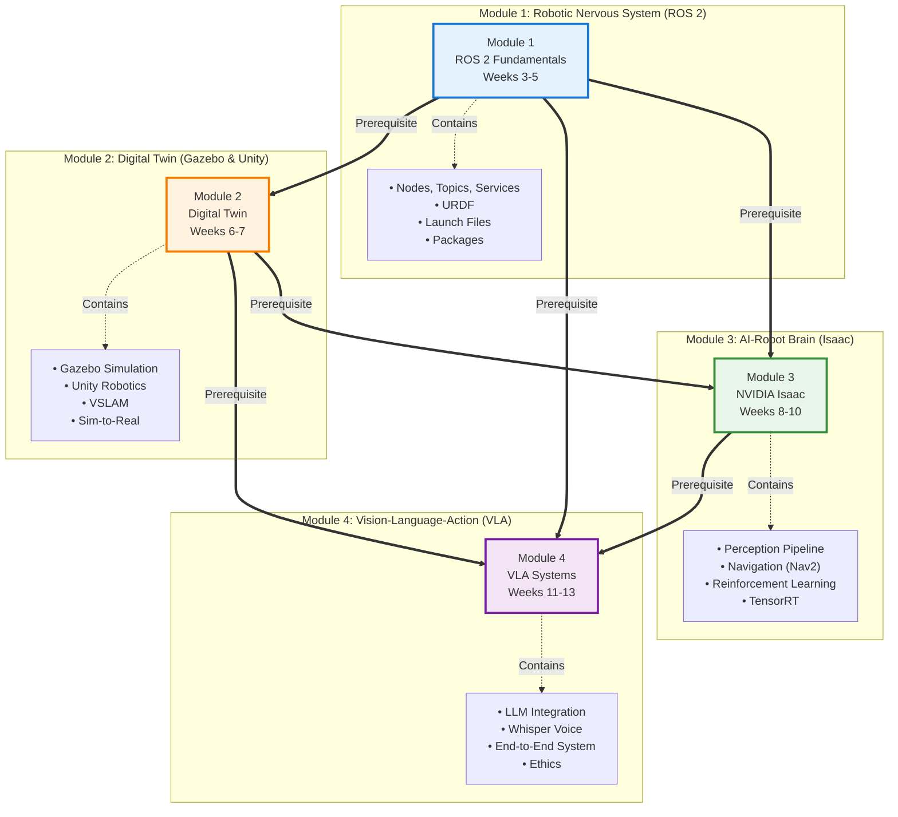

# Module Dependency Graph

**Purpose**: Visualize dependencies between the 4 modules in the Physical AI & Humanoid Robotics textbook.

**Usage**: Include in front matter ("How to Use This Book") and module introductions to help students understand prerequisites.

---

## Mermaid Diagram



---

## Dependency Table

| Module | Depends On | Rationale |
|--------|------------|-----------|
| **Module 1** (ROS 2) | None | Foundation layer - introduces robotic nervous system concept |
| **Module 2** (Digital Twin) | Module 1 | Requires understanding of ROS 2 nodes, topics, and URDF for simulation |
| **Module 3** (Isaac) | Modules 1 & 2 | Requires ROS 2 integration (Module 1) and simulation experience (Module 2) |
| **Module 4** (VLA) | Modules 1-3 | Integrates all concepts: ROS 2 communication, simulation environments, and Isaac perception |

---

## Detailed Dependency Explanation

### Module 2 → Module 1

**Why**: Digital twin simulations (Gazebo, Unity) require:
- **ROS 2 nodes** to control simulated robots
- **Topics** to publish sensor data (cameras, IMU, lidar)
- **URDF** to describe robot structure in simulation
- **Launch files** to start multiple simulation components

**Specific Concepts Needed from Module 1**:
- Chapter 1.1: Understanding computational graph
- Chapter 1.2: Topic communication for sensor data
- Chapter 1.3: Launch files for simulation startup
- Chapter 1.4: Building packages for custom robots

---

### Module 3 → Modules 1 & 2

**Why**: Isaac perception and navigation require:
- **ROS 2 integration** (Module 1) for Isaac ROS packages
- **Simulation** (Module 2) for testing before physical deployment
- **URDF models** (Modules 1 & 2) for robot representation in Isaac Sim

**Specific Concepts Needed**:
- **From Module 1**: ROS 2 nodes, topics, services (Chapter 1.1, 1.2)
- **From Module 2**: Gazebo simulation, URDF (Chapter 2.2), sensor simulation (Chapter 2.4)

---

### Module 4 → Modules 1-3

**Why**: VLA systems integrate all previous concepts:
- **ROS 2** (Module 1) for robot control interface
- **Simulation** (Module 2) for safe VLA testing
- **Isaac Perception** (Module 3) for visual understanding
- **Navigation** (Module 3) for robot movement

**Specific Concepts Needed**:
- **From Module 1**: ROS 2 action servers for robot commands (Chapter 1.2)
- **From Module 2**: Digital twin for VLA testing (Chapter 2.1), Unity visualization (Chapter 2.3)
- **From Module 3**: Object detection (Chapter 3.2), navigation (Chapter 3.3)

---

## Learning Path Recommendation

### Linear Path (Recommended for First-Time Learners)
```
Module 1 → Module 2 → Module 3 → Module 4
(Weeks 3-5) → (Weeks 6-7) → (Weeks 8-10) → (Weeks 11-13)
```

**Rationale**: Follows natural progression from foundational concepts to advanced integration.

---

### Accelerated Path (For Students with ROS 2 Experience)
```
Review Module 1 (1 week) → Module 2 (2 weeks) → Module 3 (3 weeks) → Module 4 (3 weeks)
```

**Prerequisites**: Prior ROS 2 experience (completed ROS 2 tutorials, built custom packages)

---

### Focus Tracks (For Specific Interests)

**Track A: Simulation & Digital Twins**
- Module 1 (ROS 2 basics)
- Module 2 (Deep dive into Gazebo/Unity)
- Module 3 Chapter 3.1-3.2 (Isaac Sim perception)

**Track B: AI & Perception**
- Module 1 (ROS 2 basics)
- Module 3 (Full Isaac ecosystem)
- Module 4 Chapters 4.1-4.2 (VLA concepts, LLM integration)

**Track C: Embodied AI End-to-End**
- Module 1 (ROS 2 basics)
- Module 2 Chapter 2.1-2.2 (Digital twin, Gazebo)
- Module 3 Chapter 3.2 (Perception)
- Module 4 (Full VLA system)

---

## Prerequisite Check Questions

Before starting each module, students should be able to answer:

### Before Module 2
- [ ] Can you create a ROS 2 publisher node in Python?
- [ ] Do you understand the difference between topics and services?
- [ ] Can you explain what a URDF file represents?

### Before Module 3
- [ ] Can you load a robot URDF into Gazebo?
- [ ] Do you understand how digital twins enable sim-to-real transfer?
- [ ] Can you subscribe to sensor topics (camera, IMU) in ROS 2?

### Before Module 4
- [ ] Can you run Isaac perception pipelines?
- [ ] Do you understand how Nav2 integrates with perception?
- [ ] Can you explain the difference between simulation and physical deployment?

---

## Common Pitfalls & Solutions

### Pitfall 1: Skipping Module 1

**Problem**: Students jump directly to Module 3 (Isaac) without ROS 2 knowledge.

**Consequence**: Cannot integrate Isaac ROS packages, don't understand topic communication.

**Solution**: Complete at minimum Chapters 1.1 and 1.2 before Module 3.

---

### Pitfall 2: No Simulation Experience Before Isaac

**Problem**: Students attempt Module 3 without Module 2 simulation experience.

**Consequence**: Struggle with Isaac Sim, don't understand sim-to-real concepts.

**Solution**: Complete at minimum Chapter 2.2 (Gazebo) before Module 3.

---

### Pitfall 3: Rushing to Module 4 Without Foundations

**Problem**: Students attempt VLA system without mastering previous modules.

**Consequence**: Cannot integrate components, VLA system fails to work.

**Solution**: Build strong foundation in Modules 1-3 before attempting Module 4 capstone.

---

## For Instructors

### Enforcing Prerequisites

**Week 5 Checkpoint**: Before starting Module 2, require students to:
- Submit working ROS 2 publisher-subscriber system
- Pass Module 1 quiz (10 questions on nodes, topics, services)

**Week 7 Checkpoint**: Before starting Module 3, require students to:
- Submit Gazebo simulation with custom URDF
- Demonstrate VSLAM working in simulation

**Week 10 Checkpoint**: Before starting Module 4, require students to:
- Submit Isaac perception demo (object detection)
- Demonstrate autonomous navigation

---

## Graphical Summary

```
Foundation (M1)
      ↓
Simulation (M2)
      ↓         ↘
AI Brain (M3)     ↘
      ↓           ↓
    VLA System (M4)
  (Integrates All)
```

---

**Filename**: `fig-master-module-dependencies.svg` (export from Mermaid)

**Caption**:
> **Figure: Module Dependency Graph**
>
> This diagram shows the prerequisite relationships between the four modules. Module 1 (ROS 2) is the foundation, Module 2 (Digital Twin) builds on ROS 2 concepts, Module 3 (Isaac) requires both ROS 2 and simulation knowledge, and Module 4 (VLA) integrates all previous modules into a complete embodied intelligence system. Follow the linear path (M1→M2→M3→M4) for optimal learning.

---

**Validation**: This dependency graph satisfies Spec FR-063 and SC-007 (module dependencies explicitly documented) ✓
