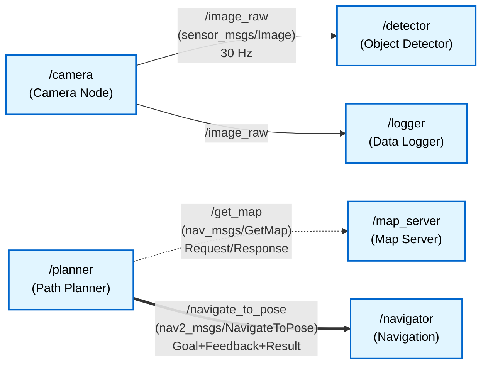

# Figure 1.1-1: ROS 2 Computational Graph

**Chapter**: 1.1 - ROS 2 Fundamentals
**Type**: Mermaid Architecture Diagram
**Purpose**: Illustrate nodes communicating via topics, services, and actions

---

## Diagram



---

## Description

This diagram shows a ROS 2 computational graph with six nodes communicating via three different patterns:

### Topic Communication (Blue Solid Arrows)
- `/camera` node publishes `sensor_msgs/Image` messages to topic `/image_raw` at 30 Hz
- `/detector` and `/logger` both subscribe to `/image_raw` independently
- **Key point**: One publisher, multiple subscribers (many-to-many)

### Service Communication (Green Dashed Arrow)
- `/planner` calls service `/get_map` on `/map_server`
- Synchronous request-response: planner waits for map before continuing
- **Key point**: One-to-one, blocking communication

### Action Communication (Orange Bold Arrow)
- `/planner` sends navigation goal to `/navigator` action server
- Receives periodic feedback ("50% complete") and final result
- Can cancel goal mid-execution if plans change
- **Key point**: Long-running task with progress updates

---

## Key Concepts Illustrated

1. **Loose Coupling**: Nodes only know topic/service/action names, not other nodes' existence
2. **Data Flow**: Topics enable continuous streaming (images), services enable queries (get map), actions enable tasks (navigate)
3. **Scalability**: Additional nodes can subscribe to `/image_raw` without modifying camera node
4. **Independence**: Each node runs as a separate process with its own failure isolation

---

## Usage in Chapter

Referenced in **Section 1** (The Computational Graph) to visualize how nodes interact through typed communication channels without direct dependencies.

Students should understand:
- Nodes are represented as boxes with their namespace/name
- Arrows represent communication channels (not function calls)
- Communication is typed (message/service/action types shown)
- Multiple subscribers to same topic is common and encouraged

---

## Alternative Visualization

For classroom demonstrations, instructors can generate this diagram dynamically using:

```bash
# Run nodes from the example
ros2 run demo_nodes_cpp talker &
ros2 run demo_nodes_cpp listener &

# Visualize live graph
rqt_graph
```

This shows students the *runtime* computational graph, reinforcing that ROS 2 graphs are dynamic (nodes can join/leave at any time).

---

**File**: `fig1.1-computational-graph.md` (Mermaid source)
**Export**: Can be rendered to SVG via Mermaid CLI or online editor
**Dimensions**: Recommended 800×600px for textbook inclusion
