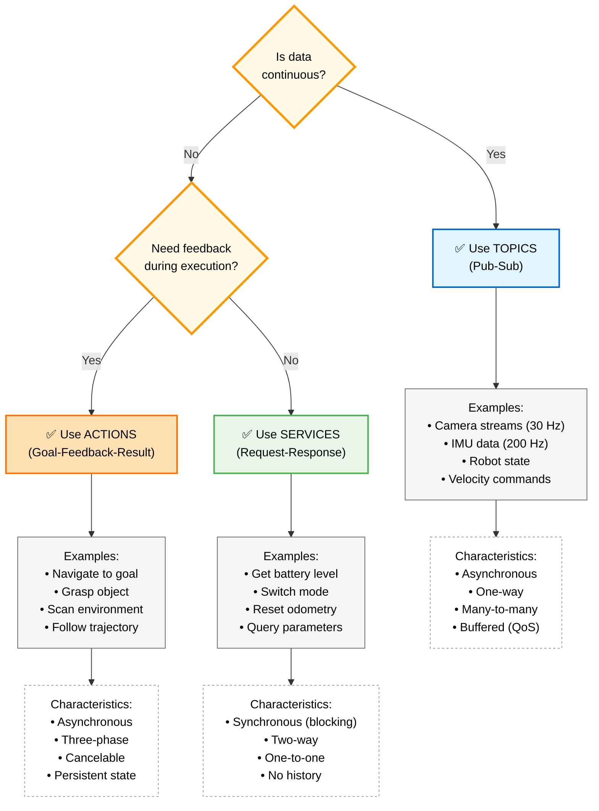

# Figure 1.1-2: Topics vs Services vs Actions Decision Tree

**Chapter**: 1.1 - ROS 2 Fundamentals
**Type**: Mermaid Decision Tree
**Purpose**: Guide selection of appropriate ROS 2 communication pattern

---

## Diagram



---

## Description

This decision tree provides a practical guide for choosing the correct ROS 2 communication pattern when designing robot systems.

### Decision Process

1. **First Question: Is data continuous?**
   - **Yes** → Use **Topics** (e.g., sensor streams, robot state updates)
   - **No** → Proceed to next question

2. **Second Question: Do you need feedback during execution?**
   - **Yes** → Use **Actions** (e.g., navigation, manipulation tasks)
   - **No** → Use **Services** (e.g., queries, mode switches)

### Pattern Characteristics

| Pattern | Sync | Direction | Cardinality | Use Case |
|---------|------|-----------|-------------|----------|
| **Topics** | Async | One-way | Many-to-many | Continuous data streams |
| **Services** | Sync | Two-way | One-to-one | Quick queries/commands |
| **Actions** | Async | Three-phase | One-to-one | Long-running tasks |

---

## Detailed Examples

### Topics (Continuous Data)
- **Camera images**: 1920×1080 RGB at 30 Hz
- **IMU readings**: Acceleration + gyro at 200 Hz
- **Robot joint states**: Position, velocity, effort at 100 Hz
- **Velocity commands**: Desired linear/angular velocity at 10 Hz

**When to use**: Data flows continuously, multiple consumers, fire-and-forget

---

### Services (Quick Requests)
- **Get battery level**: Query current charge percentage
- **Switch robot mode**: Change between autonomous/manual/estop
- **Reset odometry**: Zero out position estimate
- **Get/set parameters**: Configuration queries

**When to use**: Need immediate response, task completes quickly (<1 second), blocking is acceptable

---

### Actions (Long Tasks with Feedback)
- **Navigate to waypoint**: Takes 10-60 seconds, report ETA and distance remaining
- **Grasp object**: Approach, grasp, lift—need confirmation at each stage
- **Scan environment**: 360° rotation taking 30 seconds, report scan progress
- **Follow trajectory**: Execute multi-point path, report current waypoint

**When to use**: Task takes >1 second, benefit from progress updates, need cancellation capability

---

## Common Mistakes

❌ **Using services for continuous data**
```
Bad: Calling /get_camera_image service at 30 Hz
Good: Subscribing to /camera/image topic
```

❌ **Using topics for queries that need responses**
```
Bad: Publishing to /battery_query and subscribing to /battery_response
Good: Calling /get_battery_level service
```

❌ **Using services for long-running tasks**
```
Bad: Service call blocks for 60 seconds during navigation
Good: Action with feedback every 1 second
```

---

## Usage in Chapter

Referenced in **Sections 2-4** (Topics, Services, Actions) as a practical summary and decision aid for students designing their first ROS 2 systems.

**Pedagogical Note**: Instructors can use this tree in class by presenting robot scenarios and asking students to trace through the decision tree:
- "Robot needs to stream LiDAR data" → Continuous? Yes → Topics ✓
- "Robot needs to query current mode" → Continuous? No → Feedback? No → Services ✓
- "Robot needs to navigate to goal" → Continuous? No → Feedback? Yes → Actions ✓

---

## Extension: When to Break the Rules

Advanced students (Chapter 1.2+) will learn exceptions:

- **High-frequency services**: Can work for <10 Hz queries (though topics still preferred)
- **Stateless "actions"**: Some tasks use action interface even if they complete instantly (for consistency)
- **Bidirectional topics**: Two topics can simulate request-response (but services are cleaner)

The decision tree represents best practices for 95% of use cases. As students gain experience, they'll recognize when architectural constraints justify deviations.

---

**File**: `fig1.1-decision-tree.md` (Mermaid source)
**Export**: Can be rendered to SVG via Mermaid CLI or online editor
**Dimensions**: Recommended 1000×800px for textbook inclusion (taller to accommodate examples)
