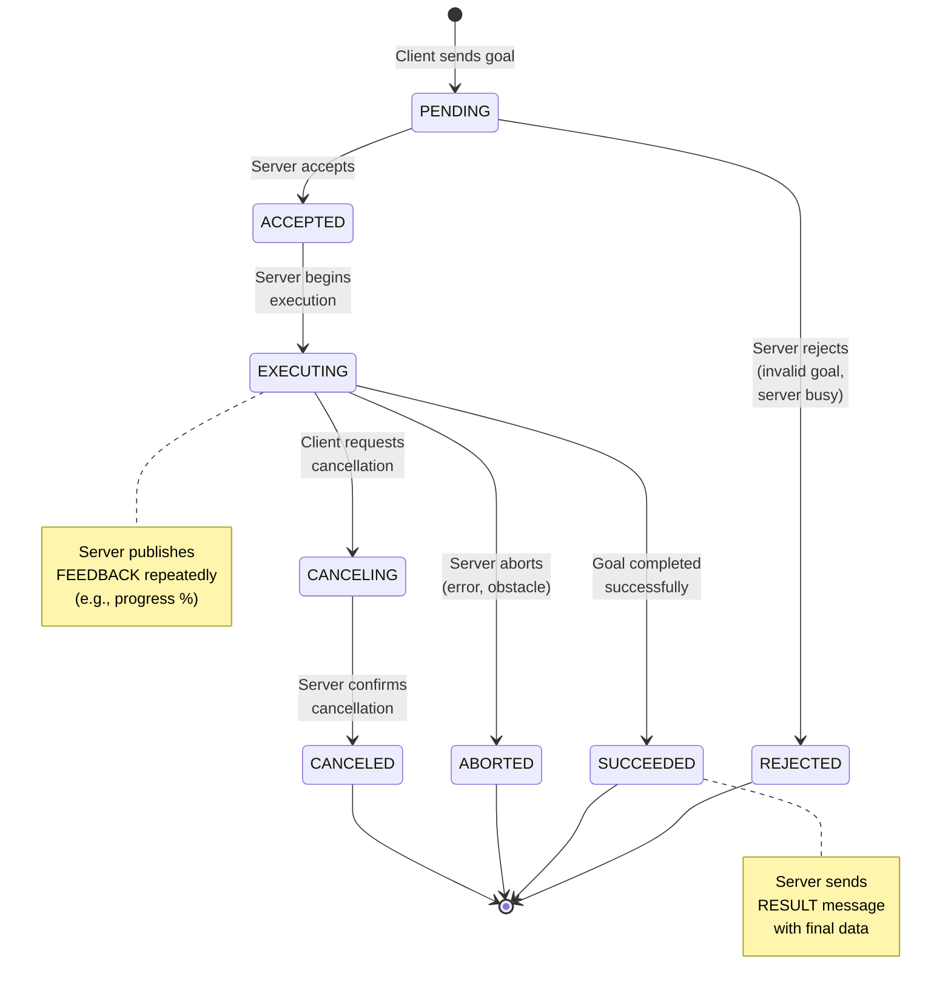

# Figure 1.2-2: Action Goal Lifecycle State Machine

**Chapter**: 1.2 - Nodes & Communication
**Type**: Mermaid State Diagram
**Purpose**: Illustrate action goal states and transitions

---

## Diagram



---

## Description

This state machine diagram shows the complete lifecycle of an action goal from submission to completion.

### Goal States

**Transient States** (goal is still active):
- **PENDING**: Goal received, server deciding whether to accept
- **ACCEPTED**: Goal accepted, server preparing to execute
- **EXECUTING**: Goal actively being processed, feedback being published
- **CANCELING**: Cancellation requested, server cleaning up

**Terminal States** (goal has ended):
- **SUCCEEDED**: Goal completed successfully, result available
- **ABORTED**: Goal failed (error, obstacle, timeout)
- **CANCELED**: Goal canceled per client request
- **REJECTED**: Goal not accepted (invalid, server busy)

---

## State Transitions

### Normal Execution Path

```
PENDING → ACCEPTED → EXECUTING → SUCCEEDED
```

Example: "Navigate to (5, 3)" goal progresses through all stages, robot reaches destination.

---

### Cancellation Path

```
EXECUTING → CANCELING → CANCELED
```

Example: Robot navigating, user presses emergency stop, goal canceled gracefully.

---

### Abort Path

```
EXECUTING → ABORTED
```

Example: Robot navigating, detects unrecoverable obstacle, aborts goal.

---

### Rejection Path

```
PENDING → REJECTED
```

Example: Client sends goal with invalid coordinates, server immediately rejects.

---

## Feedback and Result

### Feedback (During EXECUTING)

Published periodically (e.g., every 1 second) while goal is active:

```python
# Server code
feedback_msg = NavigateToPose.Feedback()
feedback_msg.current_pose = get_current_pose()
feedback_msg.distance_remaining = compute_distance()
feedback_msg.eta_seconds = estimate_time()
goal_handle.publish_feedback(feedback_msg)
```

Clients receive feedback via registered callback:

```python
# Client code
def feedback_callback(self, feedback_msg):
    progress = feedback_msg.feedback
    print(f"Progress: {progress.distance_remaining}m remaining")
```

---

### Result (At Terminal State)

Sent once when goal reaches terminal state:

```python
# Server code (success case)
goal_handle.succeed()
result = NavigateToPose.Result()
result.success = True
result.final_pose = get_current_pose()
result.total_distance = compute_traveled_distance()
return result

# Server code (abort case)
goal_handle.abort()
result = NavigateToPose.Result()
result.success = False
result.message = "Obstacle detected, path blocked"
return result
```

---

## Code Examples

### Checking Goal State (Client)

```python
# Send goal
goal_handle = await action_client.send_goal_async(goal_msg)

if not goal_handle.accepted:
    print("Goal REJECTED")
    return

print("Goal ACCEPTED, executing...")

# Wait for result
result = await goal_handle.get_result_async()

if result.status == GoalStatus.STATUS_SUCCEEDED:
    print(f"SUCCEEDED: {result.result.message}")
elif result.status == GoalStatus.STATUS_ABORTED:
    print(f"ABORTED: {result.result.message}")
elif result.status == GoalStatus.STATUS_CANCELED:
    print(f"CANCELED: {result.result.message}")
```

---

### Handling Cancellation (Server)

```python
def execute_callback(self, goal_handle):
    for i in range(100):
        # Check for cancellation request
        if goal_handle.is_cancel_requested:
            goal_handle.canceled()
            result = MyAction.Result()
            result.message = f"Canceled at iteration {i}"
            return result

        # Normal execution
        do_work()
        publish_feedback()
        time.sleep(0.1)

    # Success
    goal_handle.succeed()
    result = MyAction.Result()
    result.message = "Completed 100 iterations"
    return result
```

---

## Real-World Example: Navigation Action

**Goal**: Navigate robot to (x=10.0, y=5.0)

**Timeline**:
1. **T=0s**: Client sends goal → **PENDING**
2. **T=0.1s**: Server validates coordinates, accepts → **ACCEPTED**
3. **T=0.2s**: Server starts path planning → **EXECUTING**
4. **T=1s**: Feedback: "25% complete, 3.5m remaining, ETA 15s"
5. **T=2s**: Feedback: "50% complete, 2.0m remaining, ETA 10s"
6. **T=3s**: Feedback: "75% complete, 0.8m remaining, ETA 5s"
7. **T=4s**: Robot reaches goal → **SUCCEEDED**
8. Result: `{ success: true, final_pose: {x: 10.02, y: 5.01}, total_distance: 12.3m }`

**Alternative**: At T=2.5s, client requests cancellation:
- **T=2.5s**: Client calls `cancel_goal()` → **CANCELING**
- **T=2.6s**: Server stops motors, confirms → **CANCELED**
- Result: `{ success: false, message: "Canceled by user request" }`

---

## Common Patterns

### Retry on Abort

```python
MAX_RETRIES = 3
for attempt in range(MAX_RETRIES):
    result = await send_goal_and_wait()
    if result.status == STATUS_SUCCEEDED:
        break
    elif result.status == STATUS_ABORTED:
        print(f"Attempt {attempt+1} aborted, retrying...")
    else:
        break  # Canceled or rejected, don't retry
```

---

### Timeout with Cancellation

```python
# Send goal
goal_handle = await action_client.send_goal_async(goal)

# Wait with timeout
try:
    result = await asyncio.wait_for(
        goal_handle.get_result_async(),
        timeout=30.0
    )
except asyncio.TimeoutError:
    print("Goal taking too long, canceling...")
    await goal_handle.cancel_goal_async()
```

---

## Usage in Chapter

Referenced in **Section 4** (Actions: Goals, Feedback, and Results) and **Section 5** (Implementing Action Servers) to visualize goal state transitions and lifecycle management.

**Pedagogical Note**: Instructors can demonstrate state transitions live:
1. Start action server with `time.sleep(10)` in execute callback
2. Send goal from client (PENDING → ACCEPTED → EXECUTING)
3. Cancel with Ctrl+C (EXECUTING → CANCELING → CANCELED)
4. Observe state transitions in real time using `ros2 action send_goal --feedback`

---

**File**: `fig1.2-action-lifecycle.md` (Mermaid source)
**Export**: Render to SVG for textbook inclusion
**Dimensions**: Recommended 900×700px (taller to accommodate state notes)
