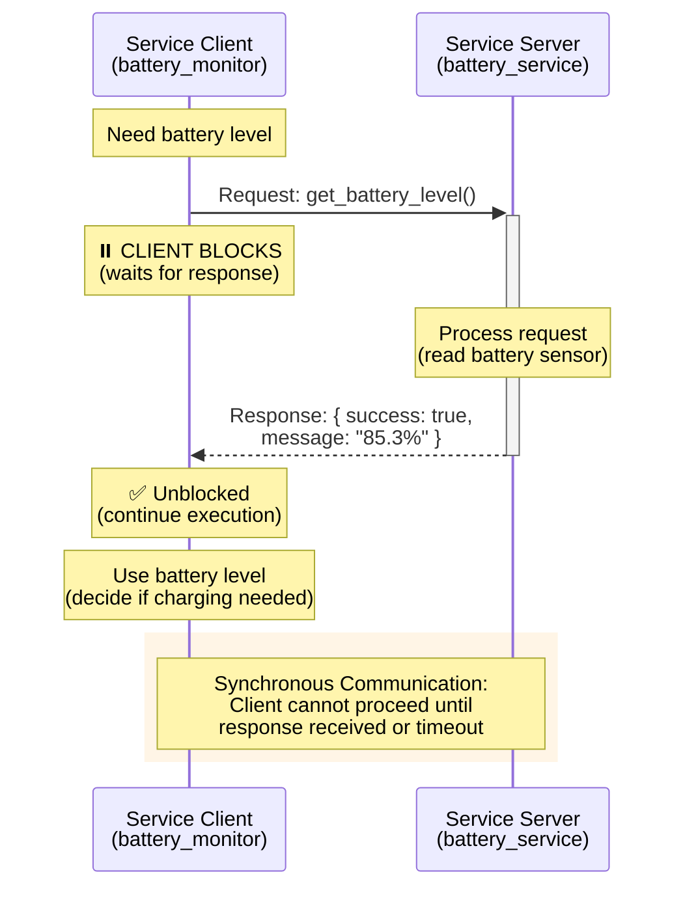
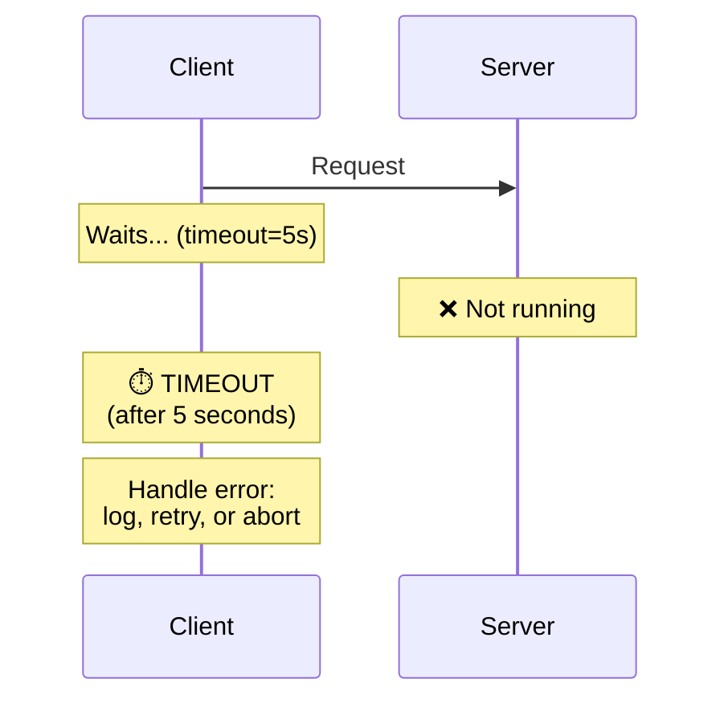
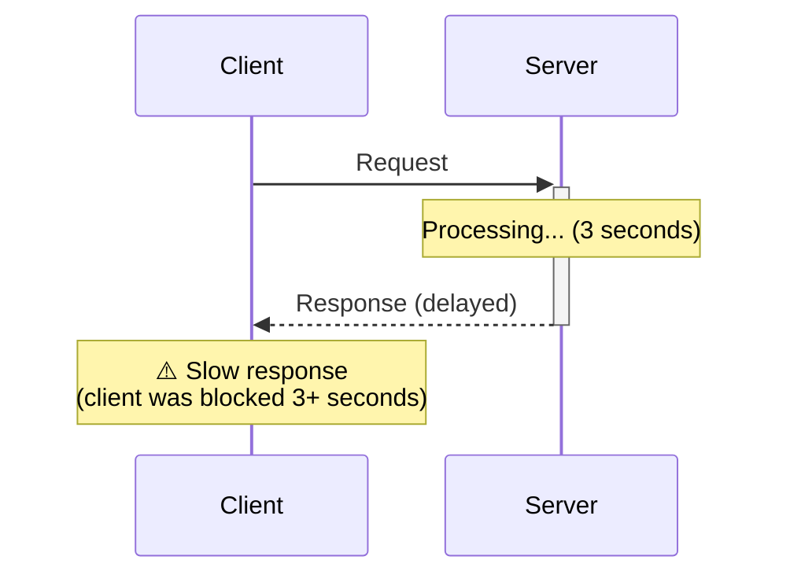

# Figure 1.2-1: Service Call Sequence Diagram

**Chapter**: 1.2 - Nodes & Communication
**Type**: Mermaid Sequence Diagram
**Purpose**: Illustrate synchronous service request-response interaction

---

## Diagram



---

## Description

This sequence diagram shows the synchronous nature of ROS 2 service communication:

### Timeline

1. **T0**: Client needs battery information, sends request to server
2. **T0-T1**: Client **blocks** (waits), cannot execute other code
3. **T1**: Server receives request, processes it (reads sensor, computes result)
4. **T2**: Server sends response back to client
5. **T3**: Client receives response, **unblocks**, continues execution

### Key Characteristics

**Synchronous Blocking**:
- The shaded "CLIENT BLOCKS" region shows where the client thread is frozen
- Duration depends on: network latency + server processing time + response transmission
- Client should set timeouts to avoid indefinite blocking

**Request-Response Pair**:
- Every request has exactly one response
- No intermediate updates (use actions for progress feedback)
- If server crashes mid-request, client gets timeout error

**Use Case Suitability**:
- ✅ Fast operations (<100ms): battery query, get mode, reset odometry
- ❌ Slow operations (>1 second): use actions instead

---

## Comparison: Service vs Topic

| Aspect | Service (This Diagram) | Topic (Chapter 1.1) |
|--------|------------------------|---------------------|
| Direction | Two-way (req + resp) | One-way (pub only) |
| Blocking | Yes (client waits) | No (fire-and-forget) |
| Cardinality | One-to-one | Many-to-many |
| History | None (stateless) | Buffered (QoS dependent) |

---

## Error Scenarios

**Scenario 1: Server Unavailable**


**Scenario 2: Server Slow Response**


---

## Code Reference

This diagram corresponds to the service client code in Chapter 1.2:

```python
# Client blocks here
future = self.client.call_async(request)
rclpy.spin_until_future_complete(self, future, timeout_sec=5.0)

# Execution resumes after response or timeout
if future.result() is not None:
    response = future.result()
    # Use response data
```

---

## Usage in Chapter

Referenced in **Section 2** (Implementing Service Servers) and **Section 3** (Implementing Service Clients) to visualize the blocking nature of service calls.

**Pedagogical Note**: Instructors can demonstrate blocking by adding `time.sleep(10)` in the server callback—students will observe the client frozen for 10 seconds, reinforcing that services are synchronous.

---

**File**: `fig1.2-service-sequence.md` (Mermaid source)
**Export**: Render to SVG for textbook inclusion
**Dimensions**: Recommended 800×600px
