# Figure 2.1-1: Digital Twin Architecture

**Chapter**: 2.1 - Digital Twin Concepts
**Type**: Architecture Diagram
**Purpose**: Show relationship between physical robot and digital twin

---

## Diagram

```mermaid
flowchart TB
    subgraph Physical["🤖 Physical Robot (Reality)"]
        RealSensors["📷 Real Sensors<br/>(Camera, LiDAR, IMU)<br/>• Noise<br/>• Latency<br/>• Artifacts"]
        RealActuators["⚙️ Real Actuators<br/>(Motors, Servos)<br/>• Backlash<br/>• Hysteresis<br/>• Thermal effects"]
        RealPhysics["🌍 Real Physics<br/>• Complex friction<br/>• Deformable objects<br/>• Environmental factors"]
    end

    subgraph Digital["💻 Digital Twin (Simulation)"]
        SimModel["📐 Robot Model<br/>(URDF/SDF)<br/>• Geometry (meshes)<br/>• Kinematics (joints)<br/>• Dynamics (mass, inertia)"]

        SimSensors["📷 Simulated Sensors<br/>(Camera, LiDAR, IMU)<br/>• Perfect (default)<br/>• Configurable noise<br/>• Ray tracing / GPU"]

        PhysicsEngine["⚡ Physics Engine<br/>(ODE, Bullet, DART)<br/>• Rigid body dynamics<br/>• Collision detection<br/>• Constraint solving"]

        SimActuators["⚙️ Simulated Actuators<br/>(Joint controllers)<br/>• Ideal torque output<br/>• Optional dynamics<br/>• Position/velocity control"]
    end

    subgraph Control["🎮 Control Interface (ROS 2)"]
        Topics["📡 Topics<br/>(sensor data, commands)"]
        Services["🔧 Services<br/>(queries, triggers)"]
        Actions["🎯 Actions<br/>(goals, feedback)"]
    end

    subgraph Gap["⚠️ Sim-to-Real Gap"]
        GapSources["Gap Sources:<br/>• Physics approximations<br/>• Sensor discrepancies<br/>• Unmodeled dynamics<br/>• Idealized control"]

        Mitigation["Mitigation Strategies:<br/>• System identification<br/>• Domain randomization<br/>• Transfer learning<br/>• Reality residuals"]
    end

    %% Relationships within Digital Twin
    SimModel -->|"Defines"| SimSensors
    SimModel -->|"Defines"| SimActuators
    SimModel -->|"Loaded by"| PhysicsEngine
    PhysicsEngine -->|"Updates"| SimSensors
    PhysicsEngine -->|"Receives commands"| SimActuators

    %% Control interface
    SimSensors -->|"Publishes"| Topics
    Topics -->|"Commands"| SimActuators
    Services -.->|"Query state"| SimModel
    Actions -.->|"Long-running tasks"| SimActuators

    %% Parallel structure in real robot
    RealSensors -->|"Publishes"| Topics
    Topics -->|"Commands"| RealActuators
    RealPhysics -->|"Affects"| RealSensors
    RealPhysics -->|"Affects"| RealActuators

    %% Gap connections
    Physical -.->|"Transfer"| Digital
    Digital -.->|"Deploy"| Physical
    GapSources -.->|"Causes discrepancies"| Physical
    GapSources -.->|"Causes discrepancies"| Digital
    Mitigation -.->|"Reduces"| GapSources

    %% Styling
    classDef physicalStyle fill:#ff9999,stroke:#cc0000,stroke-width:2px
    classDef digitalStyle fill:#99ccff,stroke:#0066cc,stroke-width:2px
    classDef controlStyle fill:#99ff99,stroke:#009900,stroke-width:2px
    classDef gapStyle fill:#ffcc99,stroke:#ff6600,stroke-width:2px

    class RealSensors,RealActuators,RealPhysics physicalStyle
    class SimModel,SimSensors,PhysicsEngine,SimActuators digitalStyle
    class Topics,Services,Actions controlStyle
    class GapSources,Mitigation gapStyle
```



---

## Diagram Components

### Physical Robot (Reality) - Red

**Real Sensors**:
- Cameras with lens distortion, motion blur, chromatic aberration
- LiDAR with range noise, dropout on dark/transparent surfaces
- IMU with bias drift, white noise

**Real Actuators**:
- Motors with backlash (mechanical slack in gears)
- Hysteresis (different behavior loading vs. unloading)
- Thermal effects (torque decreases as motor heats up)

**Real Physics**:
- Complex friction (stick-slip, material-dependent)
- Deformable objects (soft materials, cloth, liquids)
- Environmental factors (wind, temperature, vibrations)

---

### Digital Twin (Simulation) - Blue

**Robot Model (URDF/SDF)**:
- **Geometry**: Visual meshes (STL, DAE) and collision shapes (primitives or meshes)
- **Kinematics**: Joint tree (parent-child relationships, joint types)
- **Dynamics**: Mass properties (mass, inertia tensor, center of mass)

**Simulated Sensors**:
- Default: Perfect sensors (no noise, infinite precision)
- Configurable: Gaussian noise, dropout probability, update rate
- Rendering: Ray tracing (accurate, slow) or GPU rasterization (fast, approximate)

**Physics Engine**:
- **ODE**: Fast, moderate accuracy, default in Gazebo Classic
- **Bullet**: Fast, good for legged robots, GPU acceleration
- **DART**: Slower, high accuracy, differentiable physics
- **Simbody**: Slow, biomechanics focus, compliant contact

**Simulated Actuators**:
- Ideal torque/velocity controllers (no lag, perfect tracking)
- Optional: PID controllers with realistic gains
- Optional: Motor dynamics (rotor inertia, gear ratios)

---

### Control Interface (ROS 2) - Green

The **ROS 2 interface is identical** for both simulation and reality—this is the key advantage of digital twins!

**Topics**:
- `/camera/image_raw` (sensor data from simulated or real camera)
- `/cmd_vel` (velocity commands to simulated or real wheels)

**Services**:
- `/reset_simulation` (simulation-only, reset robot pose)
- `/get_model_state` (query current pose)

**Actions**:
- `/navigate_to_pose` (goal-oriented navigation task)

**Code Portability**: A node written for simulation works identically on the real robot (assuming topics/services match).

---

### Sim-to-Real Gap - Orange

**Gap Sources**:

1. **Physics Approximations**:
   - Simulation uses simplified contact models (single friction coefficient)
   - Reality has material-dependent friction, stick-slip transitions

2. **Sensor Discrepancies**:
   - Simulated cameras may lack lens distortion or motion blur
   - Real sensors have calibration errors, temperature drift

3. **Unmodeled Dynamics**:
   - Cable drag (power/data cables pulling on robot)
   - Actuator nonlinearities (backlash, cogging torque)

4. **Idealized Control**:
   - Simulation assumes commands execute instantly
   - Reality has motor bandwidth limits, communication latency

**Mitigation Strategies**:

1. **System Identification**:
   - Measure real robot parameters (friction, inertia, motor constants)
   - Update simulation model to match measurements

2. **Domain Randomization**:
   - Vary simulation parameters during training (mass ±20%, friction ±50%)
   - Forces policy to be robust to model uncertainty

3. **Transfer Learning**:
   - Pre-train in simulation (millions of samples)
   - Fine-tune with small amount of real data (hundreds of samples)

4. **Reality Residuals**:
   - Learn correction terms on real hardware
   - Add learned residuals to simulation-trained policy

---

## Data Flow

### Simulation Loop (Typical 1 kHz)

```
1. Physics engine computes next state (collision, dynamics)
   ↓
2. Simulated sensors generate measurements (ray tracing, noise)
   ↓
3. Measurements published to ROS 2 topics
   ↓
4. Control algorithm subscribes to topics, computes commands
   ↓
5. Commands published to actuator topics
   ↓
6. Simulated actuators apply forces/torques
   ↓
[Loop repeats]
```

### Reality Loop (Varies by hardware)

```
1. Real physics evolves continuously
   ↓
2. Real sensors sample at fixed rate (30 Hz camera, 100 Hz IMU)
   ↓
3. Sensor data published to ROS 2 topics (identical topic names as simulation)
   ↓
4. Control algorithm subscribes (same code as simulation)
   ↓
5. Commands published to actuator topics
   ↓
6. Real actuators execute commands (with lag, error)
   ↓
[Loop repeats]
```

**Key Insight**: The control algorithm is identical—only the sensors/actuators differ. This enables **develop in simulation, deploy to reality** workflow.

---

## Usage in Chapter

Referenced in **Section 1** (What is a Digital Twin) and **Section 2** (Sim-to-Real Gap) to provide a visual overview of the digital twin ecosystem.

**Pedagogical Notes**:

1. **Color Coding**:
   - Red (physical) vs. Blue (digital) highlights the parallel structure
   - Orange (gap) emphasizes that discrepancies are unavoidable but manageable

2. **ROS 2 Bridge**:
   - The green control layer shows how the same interface works for both
   - Students should understand that code is portable, but behavior may differ

3. **Mitigation Strategies**:
   - Not covered in depth in Chapter 2.1, but listed for awareness
   - Chapter 2.4 will expand on domain randomization and sim-to-real transfer

---

## Instructor Demo Ideas

**Demo 1: Identical Interface**
- Launch Gazebo with a robot, run `ros2 topic list`
- Connect to real robot, run `ros2 topic list` again
- Show that topics are identical—same control code works for both

**Demo 2: Gap Visualization**
- Run a simple navigation task in Gazebo (perfect execution)
- Run the same task on real robot (show wheel slip, overshoot)
- Discuss: "What caused the difference? How would you fix it?"

**Demo 3: Domain Randomization**
- Show training runs with fixed simulation parameters (overfits)
- Show training runs with randomized mass/friction (generalizes)
- Compare deployment success rates

---

## Extension: Quantifying the Gap

For advanced students, introduce **metrics** for measuring sim-to-real gap:

$$
\text{Position Error} = \| \mathbf{p}_{\text{real}}(t) - \mathbf{p}_{\text{sim}}(t) \|
$$

$$
\text{Success Rate Gap} = \eta_{\text{sim}} - \eta_{\text{real}}
$$

Where:
- $\mathbf{p}(t)$ is robot position at time $t$
- $\eta$ is task success rate (e.g., 95% in sim, 70% in reality → 25% gap)

**Goal**: Reduce position error to < 5 cm, success rate gap to < 10% for deployment-ready systems.

---

**File**: `fig2.1-digital-twin-architecture.md` (Mermaid flowchart)
**Format**: Mermaid diagram with color-coded subsystems
**Complexity**: High-level overview suitable for Chapter 2.1 introduction
