# Figure 2.3-1: Unity-ROS Integration Architecture

**Chapter**: 2.3 - Unity Robotics Hub
**Type**: System Architecture Diagram
**Purpose**: Show complete Unity ↔ ROS 2 communication pipeline

---

## Diagram

```mermaid
flowchart TB
    subgraph Unity["🎮 Unity Game Engine"]
        UnityScene["🌍 Unity Scene<br/>• GameObjects<br/>• Cameras<br/>• Lights<br/>• Robot models"]

        CSharpScripts["📝 C# Scripts<br/>• PositionPublisher.cs<br/>• VelocitySubscriber.cs<br/>• SensorPublisher.cs"]

        ROSConnector["📡 ROS-TCP-Connector<br/>(Unity Package)<br/>• ROSConnection singleton<br/>• Publisher&lt;T&gt; API<br/>• Subscriber API<br/>• Message serialization"]

        Rendering["🖼️ Rendering Pipeline<br/>• HDRP/URP<br/>• Ray tracing<br/>• Camera textures<br/>• Physics (PhysX)"]
    end

    subgraph Network["🌐 Network Layer (TCP/IP)"]
        TCPSocket["🔌 TCP Socket<br/>Port: 10000<br/>Protocol: Custom binary<br/>Latency: 5-15 ms"]
    end

    subgraph ROS["🤖 ROS 2 Ecosystem"]
        TCPEndpoint["🔗 ROS-TCP-Endpoint<br/>(Python Node)<br/>• TCP server (0.0.0.0:10000)<br/>• Message deserialization<br/>• Topic bridging<br/>• QoS configuration"]

        DDSMiddleware["⚡ DDS Middleware<br/>• Fast DDS / Cyclone DDS<br/>• Native pub/sub<br/>• QoS policies<br/>• Discovery"]

        ROSNodes["📦 ROS 2 Nodes<br/>• Navigation stack<br/>• Perception pipelines<br/>• Control algorithms<br/>• Teleoperation"]
    end

    subgraph Coordination["🔄 Coordinate Frames"]
        UnityCoords["Unity Coordinates<br/>• Y-up (vertical)<br/>• Left-handed<br/>• Origin: Scene center"]

        ROSCoords["ROS Coordinates<br/>• Z-up (vertical)<br/>• Right-handed<br/>• Origin: base_link"]

        Transform["⚙️ Transformation<br/>Unity (x, y, z)<br/>↓<br/>ROS (x, z, -y)"]
    end

    %% Unity internal flow
    UnityScene -->|"Executes"| CSharpScripts
    CSharpScripts -->|"Calls API"| ROSConnector
    Rendering -->|"Generates data"| CSharpScripts
    UnityScene -->|"Uses"| UnityCoords

    %% Network communication
    ROSConnector -->|"Publishes<br/>(serialized msgs)"| TCPSocket
    TCPSocket -->|"Subscribes<br/>(serialized msgs)"| ROSConnector

    %% ROS internal flow
    TCPSocket -->|"Deserializes"| TCPEndpoint
    TCPEndpoint -->|"Bridges to DDS"| DDSMiddleware
    DDSMiddleware -->|"Native topics"| ROSNodes
    ROSNodes -->|"Native topics"| DDSMiddleware
    DDSMiddleware -->|"Bridges to TCP"| TCPEndpoint
    ROSNodes -->|"Uses"| ROSCoords

    %% Coordinate transformation
    UnityCoords -.->|"Convert"| Transform
    Transform -.->|"Convert"| ROSCoords

    %% Styling
    classDef unityStyle fill:#99ff99,stroke:#00aa00,stroke-width:2px
    classDef networkStyle fill:#ffcc99,stroke:#ff6600,stroke-width:2px
    classDef rosStyle fill:#99ccff,stroke:#0066cc,stroke-width:2px
    classDef coordStyle fill:#ffccff,stroke:#aa00aa,stroke-width:2px

    class UnityScene,CSharpScripts,ROSConnector,Rendering unityStyle
    class TCPSocket networkStyle
    class TCPEndpoint,DDSMiddleware,ROSNodes rosStyle
    class UnityCoords,ROSCoords,Transform coordStyle
```



---

## Component Details

### Unity Side (Green)

**Unity Scene**:
- **GameObjects**: All entities in 3D world (robots, obstacles, cameras)
- **Hierarchy**: Parent-child relationships (e.g., camera attached to robot)
- **Components**: Scripts, renderers, colliders attached to GameObjects

**C# Scripts**:
- **Publishers**: Capture Unity data (positions, camera images), send to ROS
- **Subscribers**: Receive ROS commands, apply to Unity GameObjects
- **Update Loop**: Runs every frame (~60 Hz for 60 FPS)

**ROS-TCP-Connector**:
- **Installation**: Unity Package Manager (git URL)
- **API**: `ROSConnection.GetOrCreateInstance()`, `RegisterPublisher<T>()`, `Publish()`, `Subscribe()`
- **Message Types**: Auto-generated C# classes from ROS `.msg` files

**Rendering Pipeline**:
- **HDRP**: High Definition Render Pipeline (photorealistic)
- **URP**: Universal Render Pipeline (performance-focused)
- **Physics**: NVIDIA PhysX (game engine physics, not robotics-grade)

---

### Network Layer (Orange)

**TCP Socket**:
- **Port**: Default 10000 (configurable in Unity ROS Settings)
- **Protocol**: Custom binary format (not ROS 2 DDS wire protocol)
- **Latency**:
  - Same machine (localhost): 5-10 ms
  - Same LAN: 10-20 ms
  - WAN: 50-200 ms (not recommended)

**Limitations**:
- ❌ Higher latency than DDS (1-2 ms)
- ❌ Single TCP connection (no multi-threaded publishers)
- ❌ No DDS QoS per topic (global QoS only)

---

### ROS 2 Side (Blue)

**ROS-TCP-Endpoint**:
- **Language**: Python (single node)
- **Responsibilities**:
  1. Listen on TCP port 10000
  2. Accept Unity connection
  3. Deserialize Unity messages
  4. Publish to ROS 2 DDS topics
  5. Subscribe to ROS 2 topics, forward to Unity

**Launch**:
```bash
ros2 run ros_tcp_endpoint default_server_endpoint --ros-args -p ROS_IP:=0.0.0.0
```

**DDS Middleware**:
- **Default**: Fast DDS (eProsima)
- **Alternative**: Cyclone DDS (Eclipse)
- **Native ROS 2**: All non-Unity nodes use DDS directly (no TCP overhead)

**ROS 2 Nodes**:
- **Navigation**: Nav2 stack (path planning, obstacle avoidance)
- **Perception**: Object detection, SLAM, segmentation
- **Control**: Joint controllers, velocity controllers
- **Teleoperation**: `teleop_twist_keyboard`, VR controllers

---

### Coordinate Frame Transformation (Purple)

**Why Needed?**:
- Unity and ROS use different conventions—direct use causes robots to move incorrectly

**Unity Coordinates**:
- **Up Axis**: +Y (vertical)
- **Forward**: +Z
- **Right**: +X
- **Handedness**: Left-handed (cross product: X × Y = Z)

**ROS Coordinates** (REP 103 standard):
- **Up Axis**: +Z (vertical)
- **Forward**: +X
- **Right**: -Y
- **Handedness**: Right-handed (cross product: X × Y = Z)

**Transformation Formula**:

```csharp
// Unity → ROS (Position)
Vector3 unityPos = transform.position;
PointMsg rosPoint = new PointMsg(
    unityPos.x,   // X unchanged
    unityPos.z,   // Unity Z → ROS Y
    -unityPos.y   // Unity Y → ROS Z (negated)
);

// ROS → Unity (Position)
PointMsg rosPoint = receivedMessage;
Vector3 unityPos = new Vector3(
    rosPoint.x,   // X unchanged
    -rosPoint.z,  // ROS Z → Unity Y (negated)
    rosPoint.y    // ROS Y → Unity Z
);

// Unity → ROS (Quaternion rotation)
Quaternion unityRot = transform.rotation;
QuaternionMsg rosRot = new QuaternionMsg(
    -unityRot.x,
    -unityRot.z,
    unityRot.y,
    unityRot.w
);
```

**Common Mistake**: Forgetting transformation → robot moves in wrong direction or rotates incorrectly.

---

## Data Flow Examples

### Example 1: Unity Publishes Camera Image

```
1. Unity Camera renders scene (60 FPS)
   ↓
2. C# script captures RenderTexture pixels
   ↓
3. Convert to sensor_msgs/Image (RGB8 encoding)
   ↓
4. ROSConnection.Publish<ImageMsg>("/camera/image", msg)
   ↓
5. Serialize to binary, send via TCP socket
   ↓
6. ROS-TCP-Endpoint receives, deserializes
   ↓
7. Publishes to DDS topic "/camera/image"
   ↓
8. ROS 2 perception node (e.g., YOLOv8) subscribes
   ↓
9. Detects objects, publishes bounding boxes
```

**Latency Breakdown**:
- Unity rendering: 16 ms (60 FPS)
- Serialization: 2 ms
- TCP transfer: 5 ms (localhost)
- Deserialization: 1 ms
- **Total**: ~24 ms (41 Hz effective)

---

### Example 2: ROS Publishes Velocity Command

```
1. ROS 2 navigation node decides to move forward
   ↓
2. Publishes geometry_msgs/Twist to "/cmd_vel"
   ↓
3. ROS-TCP-Endpoint subscribes (DDS)
   ↓
4. Serializes Twist message, sends via TCP
   ↓
5. Unity ROSConnection receives, deserializes
   ↓
6. C# VelocitySubscriber.OnMessage() callback invoked
   ↓
7. Applies force to Unity ArticulationBody (robot wheels)
   ↓
8. PhysX physics updates robot position
   ↓
9. Next frame, Unity renders robot in new position
```

**Latency Breakdown**:
- ROS publish: < 1 ms (DDS)
- TCP transfer: 5 ms
- Unity frame time: 16 ms (60 FPS)
- **Total**: ~22 ms

**Implication**: Not suitable for 1 kHz control loops (e.g., torque control). Adequate for 10-50 Hz navigation/manipulation.

---

## Network Topology Options

### Option 1: All on Same Machine (Localhost)

```
┌──────────────────────────────────┐
│      Single Computer             │
│  ┌─────────────┐  ┌────────────┐│
│  │   Unity     │  │   ROS 2    ││
│  │ (127.0.0.1) │━━│ TCP Endpoint││
│  └─────────────┘  └────────────┘│
│         TCP Loopback: 5-10 ms   │
└──────────────────────────────────┘
```

**Pros**: Lowest latency, simple setup
**Cons**: Unity + ROS compete for CPU/GPU (may slow simulation)

---

### Option 2: Unity on Windows, ROS on Linux VM

```
┌──────────────────────────────────┐
│        Host (Windows)            │
│  ┌─────────────┐                 │
│  │   Unity     │                 │
│  └──────┬──────┘                 │
│         │ NAT (192.168.56.1)     │
│  ┌──────▼──────────────────────┐ │
│  │   VirtualBox (Ubuntu)       │ │
│  │   ROS 2 TCP Endpoint        │ │
│  │   (192.168.56.101)          │ │
│  └─────────────────────────────┘ │
└──────────────────────────────────┘
```

**Pros**: Isolates Unity from ROS, common development setup
**Cons**: Network latency +5 ms, requires NAT/bridge configuration

---

### Option 3: Unity on One Computer, ROS on Robot

```
┌─────────────┐         ┌──────────────┐
│ Unity PC    │  WiFi   │ Real Robot   │
│ (Graphics)  │◄───────►│ (ROS 2)      │
│             │ 20-50 ms│ TCP Endpoint │
└─────────────┘         └──────────────┘
```

**Pros**: Unity visualizes real robot in real-time
**Cons**: Higher latency (WiFi), not suitable for control (visualization only)

---

## Comparison with Native DDS

| Metric | Unity TCP Bridge | Native DDS (Gazebo) |
|--------|------------------|---------------------|
| **Latency** (localhost) | 5-15 ms | 0.5-2 ms |
| **Latency** (network) | 20-50 ms | 2-10 ms |
| **QoS Configuration** | Global only | Per-topic |
| **Discovery** | Manual IP config | Automatic |
| **Bandwidth** | TCP overhead | Efficient UDP |
| **Setup Complexity** | High (Unity + ROS) | Low (apt install) |
| **Graphics Quality** | ★★★★★ Photorealistic | ★★★☆☆ Basic |

**Decision**: Use TCP bridge when graphics/VR critical, use native DDS when latency/control critical.

---

## Troubleshooting Guide

### Problem 1: "Connection Refused" in Unity

**Symptoms**: Unity Console shows "Failed to connect to ROS"

**Causes**:
1. ROS-TCP-Endpoint not running
2. Wrong IP address in Unity ROS Settings
3. Firewall blocking port 10000

**Solutions**:
```bash
# Verify ROS-TCP-Endpoint running
ros2 node list | grep tcp

# Check port open
netstat -an | grep 10000

# Disable firewall temporarily
sudo ufw disable

# Unity ROS Settings: Set IP to 127.0.0.1 (localhost)
```

---

### Problem 2: Topics Not Appearing in `ros2 topic list`

**Symptoms**: Unity publishes, but topic not visible to ROS nodes

**Causes**:
1. Different ROS_DOMAIN_ID
2. ROS-TCP-Endpoint not sourced correctly
3. Topic name mismatch

**Solutions**:
```bash
# Check domain ID
echo $ROS_DOMAIN_ID  # Should match across all terminals

# Re-source ROS workspace
source ~/ros2_ws/install/setup.bash

# Verify topic in Unity script
Debug.Log($"Publishing to: {topicName}");
```

---

### Problem 3: Robot Moves in Wrong Direction

**Symptoms**: Sending (1, 0, 0) velocity, robot moves sideways or backwards

**Cause**: Missing coordinate transformation

**Solution**: Apply transformation in C# script:
```csharp
// Before publishing to ROS
Vector3 unityVel = GetComponent<Rigidbody>().velocity;
TwistMsg rosTwist = new TwistMsg(
    new Vector3Msg(unityVel.x, unityVel.z, -unityVel.y),  // Transform!
    new Vector3Msg(0, 0, 0)
);
```

---

### Problem 4: High Latency (> 50 ms)

**Symptoms**: Sluggish robot response, delayed sensor data

**Causes**:
1. Network congestion (WiFi)
2. Unity running too slow (< 30 FPS)
3. Large messages (high-res images)

**Solutions**:
- Use wired Ethernet instead of WiFi
- Reduce Unity graphics quality (Edit → Project Settings → Quality)
- Compress images before publishing (JPEG encoding)
- Lower publish frequency (30 Hz → 10 Hz)

---

## Usage in Chapter

Referenced in **Section 2** (Unity Robotics Hub Architecture) and **Section 3** (ROS-TCP-Connector Limitations) to visualize complete system architecture.

**Pedagogical Notes**:

1. **Color Coding**:
   - Green (Unity) vs. Blue (ROS) highlights the boundary between game engine and robotics
   - Orange (network) emphasizes latency source

2. **Coordinate Frames**:
   - Purple boxes show this is a persistent challenge—students must remember transformation

3. **Bidirectional Flow**:
   - Diagram shows both Unity → ROS (sensors) and ROS → Unity (commands)

---

## Instructor Demo Ideas

**Demo 1: Latency Measurement**
- Send timestamped message from Unity
- Measure time until echo received from ROS
- Compare TCP (Unity) vs. DDS (Gazebo) latencies
- Discuss when 10 ms latency is acceptable vs. problematic

**Demo 2: Coordinate Frame Bug**
- Intentionally skip transformation (Unity → ROS directly)
- Show robot moving in wrong direction
- Fix by applying transformation, verify correct motion
- Reinforces importance of coordinate conventions

**Demo 3: Hybrid Sim**
- Run Gazebo (physics) + Unity (graphics) simultaneously
- Show same robot in both windows
- Publish /joint_states from Gazebo, visualize in Unity
- Demonstrate separation of concerns (physics vs. rendering)

---

**File**: `fig2.3-unity-ros-integration.md` (Mermaid architecture diagram)
**Format**: System architecture with data flow, latency annotations, coordinate transformations
**Complexity**: Comprehensive reference for Unity-ROS integration pipeline
