# Figure 2.4-1: Visual SLAM Pipeline

**Chapter**: 2.4 - Sensor Simulation & VSLAM
**Type**: Process Flow Diagram
**Purpose**: Illustrate 6-stage VSLAM pipeline from image capture to map building

---

## Diagram

```mermaid
flowchart TD
    Start["📷 Camera Image<br/>(640×480 RGB)"]

    Stage1["🔍 Stage 1: Feature Detection<br/><br/>Extract keypoints:<br/>• ORB: 1000 features<br/>• SIFT/SURF alternatives<br/>• Output: (x,y) + descriptor"]

    Stage2["🔗 Stage 2: Feature Matching<br/><br/>Match to previous frame/map:<br/>• FLANN nearest neighbors<br/>• Ratio test (0.7 threshold)<br/>• Output: Correspondences"]

    Stage3["📐 Stage 3: Pose Estimation<br/><br/>Compute camera motion:<br/>• PnP (Perspective-n-Point)<br/>• RANSAC outlier rejection<br/>• Output: [R|t] (rotation + translation)"]

    Stage4["🌍 Stage 4: Triangulation<br/><br/>Estimate 3D positions:<br/>• Stereo: disparity → depth<br/>• Monocular: multi-view geometry<br/>• Output: 3D map points"]

    Stage5["⚙️ Stage 5: Local Mapping<br/><br/>Optimize recent poses:<br/>• Bundle Adjustment<br/>• Minimize reprojection error<br/>• Output: Refined keyframes + points"]

    Stage6["🔄 Stage 6: Loop Closure<br/><br/>Detect revisited locations:<br/>• Bag of Words (DBoW2)<br/>• Pose graph optimization<br/>• Output: Drift correction"]

    Map["🗺️ Global Map<br/><br/>• 3D landmarks<br/>• Keyframe poses<br/>• Covisibility graph"]

    Trajectory["📍 Robot Trajectory<br/><br/>• Pose history<br/>• Timestamp + [x,y,z,qx,qy,qz,qw]"]

    Output["✅ VSLAM Outputs<br/><br/>• Current pose (30 Hz)<br/>• 3D map (1000-5000 points)<br/>• Localization quality"]

    %% Main flow
    Start --> Stage1
    Stage1 --> Stage2
    Stage2 --> Stage3
    Stage3 --> Stage4
    Stage4 --> Stage5
    Stage5 --> Stage6

    %% Map and trajectory updates
    Stage4 -.->|"Add new points"| Map
    Stage5 -.->|"Refine"| Map
    Stage6 -.->|"Global optimization"| Map

    Stage3 -.->|"Update"| Trajectory
    Stage6 -.->|"Correct drift"| Trajectory

    Map --> Output
    Trajectory --> Output

    %% Feedback loops
    Map -.->|"Known landmarks"| Stage2
    Stage6 -.->|"Loop constraint"| Stage5

    %% Styling
    classDef stageStyle fill:#ccffcc,stroke:#00aa00,stroke-width:2px
    classDef dataStyle fill:#ccccff,stroke:#0000aa,stroke-width:2px
    classDef outputStyle fill:#ffcccc,stroke:#aa0000,stroke-width:2px

    class Stage1,Stage2,Stage3,Stage4,Stage5,Stage6 stageStyle
    class Map,Trajectory dataStyle
    class Start,Output outputStyle
```



---

## Detailed Stage Descriptions

### Stage 1: Feature Detection

**Purpose**: Extract distinctive keypoints robust to viewpoint/lighting changes

**ORB (Oriented FAST and Rotated BRIEF)**:
- **FAST Detector**: Corners detected by intensity circle test (16 pixels around candidate)
- **Orientation**: Compute intensity centroid for rotation invariance
- **BRIEF Descriptor**: Binary string (256 bits) from pairwise pixel comparisons
- **Speed**: ~1 ms for 1000 features (640×480 image on modern CPU)

**Alternative Algorithms**:
- **SIFT**: Scale-invariant, 128-float descriptor, slow (~50 ms)
- **SURF**: Faster than SIFT (~20 ms), less accurate
- **SuperPoint** (deep learning): Learned features, ~10 ms on GPU

**Output Example**:
```
Feature 1: pixel (320, 240), descriptor [01101001...], scale 1.2
Feature 2: pixel (150, 380), descriptor [11010011...], scale 1.0
...
```

---

### Stage 2: Feature Matching

**Purpose**: Find correspondences between current frame and map/previous frames

**Matching Strategies**:

**A. Tracking (frame-to-frame)**:
- Match current features to previous frame features
- Use motion model to predict feature locations (reduce search space)
- Typical: 200-500 matches per frame

**B. Relocalization (frame-to-map)**:
- Match current features to global map landmarks
- Used after tracking loss or at initialization
- Bag of Words accelerates search (O(log N) instead of O(N))

**FLANN Matcher**:
```python
# Pseudo-code
matches = flann.knnMatch(current_descriptors, map_descriptors, k=2)

# Lowe's ratio test (filter ambiguous matches)
good_matches = []
for m, n in matches:
    if m.distance < 0.7 * n.distance:  # 70% threshold
        good_matches.append(m)
```

**Output**: List of (current_feature_id, map_point_id) pairs

---

### Stage 3: Pose Estimation

**Purpose**: Compute camera pose from 2D-3D correspondences

**PnP (Perspective-n-Point) Problem**:
- **Input**: N pairs of (2D image point, 3D world point)
- **Output**: Camera pose [R|t] (3×3 rotation + 3×1 translation)
- **Minimum**: 3 points (P3P), but overdetermined system (N ≥ 4) more robust

**RANSAC Loop** (outlier rejection):
```
For 100 iterations:
    1. Sample 4 random correspondences
    2. Solve P4P (4-point perspective pose)
    3. Project all 3D points using computed pose
    4. Count inliers (reprojection error < 3 pixels)
    5. Keep pose with most inliers
Return best pose, refine with all inliers
```

**Reprojection Error**:
$$
e = \sqrt{(u - u')^2 + (v - v')^2}
$$
Where $(u, v)$ = observed pixel, $(u', v')$ = projected pixel from 3D point.

**Typical Performance**: 200 matches → 150 inliers after RANSAC (75% inlier rate)

---

### Stage 4: Triangulation

**Purpose**: Compute 3D position of new features seen in multiple views

**Stereo Triangulation**:
```
Disparity d = x_left - x_right  # Pixel offset between stereo images
Depth Z = (f * baseline) / d    # Focal length × baseline / disparity
X = (x_left - cx) * Z / f
Y = (y_left - cy) * Z / f
```

**Monocular Triangulation** (requires motion):
```
Given:
- Two camera poses: [R1|t1], [R2|t2]
- Same feature observed at pixels p1, p2

Solve:
- Minimize reprojection error in both frames
- Output: 3D point X in world frame
```

**Monocular Challenge**: Requires sufficient baseline (camera motion) for accurate depth. Triangulation fails if motion is too small (< 5 cm) or purely rotational.

**Output**: 3D map points added to global map

---

### Stage 5: Local Mapping

**Purpose**: Refine recent camera poses and map points jointly

**Bundle Adjustment**:
Optimize poses {T1, T2, ..., TN} and 3D points {X1, X2, ..., XM} to minimize:

$$
\min \sum_{i,j} \| p_{ij} - \pi(T_i, X_j) \|^2
$$

Where:
- $p_{ij}$ = observed pixel of point $j$ in frame $i$
- $\pi(T_i, X_j)$ = projection of 3D point $X_j$ using pose $T_i$

**Solver**: Levenberg-Marquardt (non-linear least squares)

**Keyframe Selection**:
- Only optimize keyframes (1 per 10-30 frames)
- Keyframe added if: (a) enough new features, or (b) large motion since last keyframe

**Computational Cost**:
- **Full BA**: O(N³) for N frames → too slow for real-time
- **Local BA**: Only optimize last 5-10 keyframes → O(1) per frame

**Output**: Refined poses and map points with lower reprojection error

---

### Stage 6: Loop Closure

**Purpose**: Detect when robot returns to previously visited area, correct accumulated drift

**Loop Detection** (DBoW2 Bag of Words):
1. Convert image to "visual word" histogram (quantized feature descriptors)
2. Compare current histogram to database of keyframes
3. If similarity score > threshold, candidate loop detected
4. Verify with geometric consistency (feature matching + pose estimation)

**Loop Correction** (Pose Graph Optimization):
```
Given:
- Odometry edges: T1 → T2 → T3 → ... → T100 (accumulated drift)
- Loop closure edge: T100 → T10 (detected revisit)

Optimize:
- Adjust all poses to satisfy both odometry and loop constraints
- Distribute correction across trajectory (smooth adjustment)
```

**Graph Structure**:
```
    T1 ─── T2 ─── T3 ─── ... ─── T100
     └──────────── LOOP ─────────┘
```

**Result**: Trajectory "snaps" to correct position when loop closed, map consistency improved.

**Example**: Robot explores 50m corridor, returns to start. Before loop closure: 2m position error. After loop closure: 0.1m error (20× improvement).

---

## VSLAM Modes

### Tracking Mode

**Active when**: Camera moving, features being matched

**Operations**:
- Stages 1-3 (detection → matching → pose estimation)
- Real-time: 30 Hz (33 ms per frame)

**Failure Conditions**:
- ❌ Too few features (< 20 matches)
- ❌ Motion too fast (motion blur)
- ❌ Low texture scene (blank walls)

**Recovery**: Relocalization (match to global map)

---

### Mapping Mode

**Active when**: New keyframe inserted

**Operations**:
- Stages 4-5 (triangulation → local BA)
- Runs in separate thread (doesn't block tracking)
- Frequency: 1-5 Hz (depends on motion)

**Output**: Updated global map with new landmarks

---

### Loop Closure Mode

**Active when**: Loop detected

**Operations**:
- Stage 6 (loop detection → pose graph optimization)
- Runs in separate thread (infrequent, ~1 per 100 frames)
- Can take 0.5-2 seconds (global optimization expensive)

**Effect**: All past keyframes adjusted, trajectory corrected

---

## Performance Characteristics

### Computational Cost (per frame, 640×480 image)

| Stage | CPU Time | GPU Time (CUDA) | Parallelizable? |
|-------|----------|-----------------|-----------------|
| **Feature Detection** | 1 ms | 0.3 ms | ✅ Yes |
| **Feature Matching** | 3 ms | 1 ms | ✅ Yes |
| **Pose Estimation** | 5 ms | N/A | ❌ No (RANSAC sequential) |
| **Triangulation** | 1 ms | 0.5 ms | ✅ Yes |
| **Local BA** | 10-50 ms | 5-20 ms | ⚠️ Partially |
| **Loop Closure** | 100-500 ms | 50-200 ms | ⚠️ Partially |

**Total** (tracking only): ~10 ms → 100 Hz possible (CPU-only)
**With mapping**: ~30 ms → 30 Hz typical

---

### Map Statistics (typical indoor environment)

| Scene | Trajectory Length | Map Points | Keyframes | Loop Closures |
|-------|-------------------|------------|-----------|---------------|
| **Small room** (5m × 5m) | 20 m | 500-1000 | 15-30 | 1-2 |
| **Apartment** (50 m path) | 50 m | 2000-4000 | 50-100 | 3-5 |
| **Office building** (200 m) | 200 m | 5000-10000 | 200-400 | 10-20 |

---

## Failure Modes & Mitigation

### Failure Mode 1: Tracking Loss

**Causes**:
- Fast motion (features not matched between frames)
- Low texture (featureless walls, blank surfaces)
- Dynamic objects (moving people blocking view)

**Mitigation**:
- Reduce velocity (drive slower)
- Add textured markers to environment (posters, QR codes)
- Use relocalization (match to global map)

---

### Failure Mode 2: Scale Drift (Monocular Only)

**Cause**: Monocular SLAM cannot determine absolute scale (distance)

**Effect**: Trajectory shape correct, but 1m forward might be interpreted as 0.8m or 1.2m

**Mitigation**:
- Fuse with IMU (Visual-Inertial Odometry)
- Fuse with wheel odometry
- Use stereo or RGB-D camera instead

---

### Failure Mode 3: No Loop Closures

**Cause**: Robot never revisits previous locations (e.g., long corridor exploration)

**Effect**: Drift accumulates unbounded (error grows with trajectory length)

**Mitigation**:
- Plan exploration to revisit known areas periodically
- Fuse VSLAM with other sensors (LiDAR SLAM, GPS in outdoor)

---

## Usage in Chapter

Referenced in **Section 4** (VSLAM Fundamentals) to visualize the complete 6-stage pipeline and data flow.

**Pedagogical Notes**:

1. **Color Coding**:
   - Green (processing stages): Active computation
   - Blue (data stores): Map and trajectory
   - Red (I/O): Input image and final output

2. **Feedback Loops**:
   - Map → Stage 2: Known landmarks used for matching
   - Stage 6 → Stage 5: Loop closure triggers re-optimization

3. **Real-Time vs. Offline**:
   - Stages 1-3: Real-time (< 33 ms per frame)
   - Stages 4-6: Background threads (don't block tracking)

---

## Instructor Demo Ideas

**Demo 1: Feature Detection**:
- Show ORB features on textured scene (1000 keypoints detected)
- Show ORB on blank wall (< 10 keypoints)
- Discuss: "Why does VSLAM fail in featureless environments?"

**Demo 2: Loop Closure**:
- Run ORB-SLAM3 in Gazebo maze
- Drive robot in loop (return to start)
- Show trajectory before loop closure (2m drift)
- Show trajectory after loop closure (0.1m error)
- Discuss: "How does loop closure know it's the same place?"

**Demo 3: Monocular Scale Ambiguity**:
- Run monocular SLAM, record trajectory
- Scale trajectory by 2× (multiply all positions)
- Show that trajectory shape unchanged (rotation same)
- Discuss: "Why can't monocular SLAM measure distance?"

---

**File**: `fig2.4-vslam-pipeline.md` (Mermaid flowchart)
**Format**: 6-stage pipeline with data flow, feedback loops, performance annotations
**Complexity**: Comprehensive visual representation of Visual SLAM algorithm
