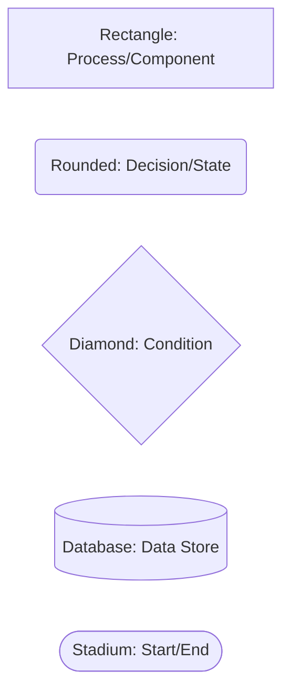
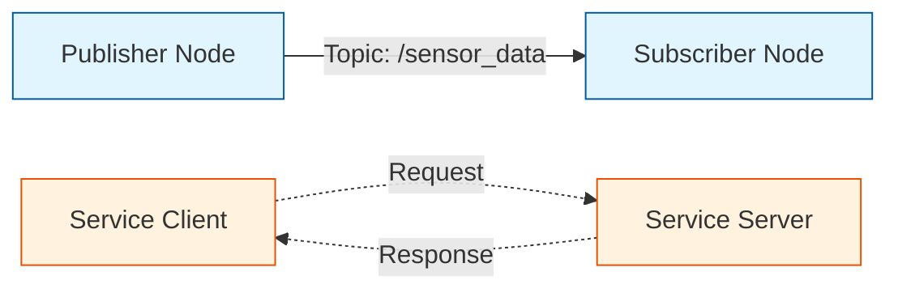
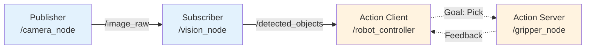

# Diagram Creation Guidelines

**Purpose**: Standardize all figures and diagrams in the Physical AI & Humanoid Robotics textbook to ensure consistency, clarity, and professional quality.

**Scope**: Covers Mermaid diagrams (flowcharts, architecture), Excalidraw diagrams (wiring, hardware), and general figure standards.

---

## 1. Diagram Type Selection

### When to Use Mermaid

Use **Mermaid** for:
- **Flowcharts**: ROS 2 computational graphs, VSLAM pipelines, VLA reasoning flows
- **Architecture Diagrams**: System components and relationships, module structures
- **Sequence Diagrams**: Service calls, API interactions
- **State Diagrams**: Robot states, task execution flows
- **Tree Structures**: URDF joint hierarchies, kinematic trees (if simple)

**Advantages**:
- Code-based (version-controllable, easy to update)
- Renders directly in Docusaurus
- Consistent styling across all diagrams
- Text searchable

**Export Format**: SVG (preferred) or PNG (fallback)

### When to Use Excalidraw

Use **Excalidraw** for:
- **Wiring Diagrams**: Jetson + RealSense connections, power circuits
- **Hardware Schematics**: Physical component layouts
- **Complex Kinematic Trees**: Bipedal locomotion with detailed joint angles
- **Annotated Photos**: Overlays on hardware images

**Advantages**:
- Freeform drawing (flexible for complex layouts)
- Hand-drawn aesthetic (approachable, educational feel)
- Better for physical/hardware representations

**Export Format**: SVG (preferred) or PNG (if SVG too large)

---

## 2. Naming Convention

All figure files MUST follow this naming pattern:

```
fig[MODULE].[CHAPTER]-[description].svg
```

### Examples

- `fig1.1-ros2-computational-graph.svg` - Module 1, Chapter 1
- `fig2.2-humanoid-urdf-tree.svg` - Module 2, Chapter 2
- `fig3.2-isaac-perception-pipeline.svg` - Module 3, Chapter 2
- `fig4.4-full-vla-system.svg` - Module 4, Chapter 4
- `fig-master-ros2-system-graph.svg` - Master diagram (no chapter-specific reference)

### Master Diagrams

For diagrams not tied to a specific chapter (e.g., module dependency graph, comprehensive system architectures):

```
fig-master-[description].svg
```

---

## 3. Mermaid Diagram Standards

### Graph Direction

- **Flowcharts/Pipelines**: Use `LR` (left-to-right) or `TB` (top-to-bottom) based on what's most natural
- **System Architecture**: Use `TB` for hierarchical structures
- **Sequence Diagrams**: Use default vertical layout

### Node Styling



### Color Palette (Optional, for clarity)

- **ROS 2 Nodes**: `fill:#e1f5ff,stroke:#01579b`
- **Data Flow**: `stroke:#4caf50,stroke-width:2px`
- **Error Paths**: `stroke:#f44336,stroke-width:2px,stroke-dasharray: 5 5`
- **External Systems**: `fill:#fff3e0,stroke:#e65100`

### Example: ROS 2 Computational Graph



### Mermaid Best Practices

1. **Keep it simple**: Max 10-12 nodes per diagram (split complex systems into multiple figures)
2. **Label edges**: Always label arrows with topic names, data types, or action descriptions
3. **Use consistent terminology**: Match node names to code examples
4. **Add legends**: If using colors or special symbols, include a legend
5. **Test rendering**: Preview in Docusaurus before finalizing

---

## 4. Excalidraw Diagram Standards

### Canvas Settings

- **Background**: White (`#FFFFFF`)
- **Grid**: Show grid during creation (helps alignment), hide for export
- **Canvas Size**: 1200px wide × 800px tall (standard), adjust for complex diagrams

### Line Styles

- **Power Connections**: Thick lines (3-4px), red or black
- **Data Connections**: Medium lines (2px), blue or green
- **Ground**: Dashed lines, black
- **Optional Connections**: Dotted lines

### Text Annotations

- **Font**: Virgil (default Excalidraw hand-drawn font)
- **Size**: 20px for labels, 16px for annotations
- **Color**: Dark gray (#343434) for primary text, red (#f44336) for warnings

### Component Representation

- **Microcontrollers/SBCs**: Rectangles with rounded corners, labeled with model (e.g., "Jetson Orin Nano")
- **Sensors**: Circles or ovals, labeled with model (e.g., "RealSense D435")
- **Connectors**: Small rectangles, labeled with port type (e.g., "USB 3.0", "GPIO 12")
- **Power Sources**: Battery symbol or rectangle labeled "Power Supply"

### Example: Jetson + RealSense Wiring

**Diagram should show**:
1. Jetson Orin Nano board (rectangle, labeled)
2. RealSense D435 sensor (oval, labeled)
3. USB 3.0 cable connection (thick line, labeled "USB 3.0")
4. Power supply (battery symbol, labeled "5V 4A")
5. Ground connections (dashed lines)
6. Pin labels (GPIO numbers if applicable)

### Excalidraw Export Settings

- **Format**: SVG (preferred) - scalable, smaller file size
- **Background**: Transparent (let Docusaurus control background)
- **Include deleted elements**: No
- **Embed scene**: No (reduce file size)

---

## 5. General Figure Standards

### Resolution & Quality

- **Raster Images (PNG)**: Minimum 1200px width, 300 DPI for print quality
- **Vector Images (SVG)**: Preferred for all diagrams (scalable, small file size)
- **Screenshots**: 1920×1080 or higher, crop to relevant area, compress without quality loss

### Captions

Every figure MUST have a caption following this format:

```markdown
**Figure [MODULE].[CHAPTER]-[NUMBER]: [Title]**

[Detailed caption explaining the diagram. Should describe key components, data flow, and significance. 2-4 sentences. Must be understandable standalone without reading chapter.]
```

**Example**:

```markdown
**Figure 1.1-1: ROS 2 Computational Graph**

This diagram illustrates a simple ROS 2 system with publisher and subscriber nodes communicating via a topic, and a service client-server interaction. Topics enable asynchronous many-to-many communication, while services provide synchronous request-response patterns. The DDS middleware layer (not shown) handles all network communication transparently.
```

### Accessibility

- **Alt Text**: Every image must have descriptive alt text for screen readers
- **High Contrast**: Ensure text is readable (minimum 4.5:1 contrast ratio)
- **No Color-Only Information**: Use patterns/shapes/labels in addition to color

---

## 6. File Organization

### Directory Structure

```
textbook/
├── diagrams/
│   ├── module1/
│   │   ├── fig1.1-ros2-computational-graph.svg
│   │   ├── fig1.2-service-call-sequence.svg
│   │   └── ...
│   ├── module2/
│   │   ├── fig2.1-digital-twin-architecture.svg
│   │   ├── fig2.2-humanoid-urdf-tree.svg
│   │   └── ...
│   ├── module3/
│   │   └── ...
│   ├── module4/
│   │   └── ...
│   └── master/
│       ├── fig-master-ros2-system-graph.svg
│       ├── fig-master-module-dependencies.svg
│       └── ...
```

### Source Files

- **Mermaid**: Keep source in `.mmd` files or directly in Markdown (Docusaurus renders them)
- **Excalidraw**: Save `.excalidraw` source files in `diagrams/source/` for future edits
- **Export**: Always export to SVG in `diagrams/module[X]/` for inclusion in chapters

---

## 7. Required Diagrams (Per Spec)

### Mandatory Figures

1. **fig1.1-ros2-computational-graph.svg** (Mermaid) - FR-038
2. **fig2.2-humanoid-urdf-tree.svg** (Mermaid) - FR-039
3. **fig2.1-digital-twin-architecture.svg** (Mermaid) - FR-040
4. **fig3.2-isaac-perception-pipeline.svg** (Mermaid) - FR-041
5. **fig4.2-vla-reasoning-pipeline.svg** (Mermaid) - FR-042
6. **fig-bipedal-kinematic-tree.svg** (Mermaid or Excalidraw) - FR-043
7. **fig-jetson-realsense-wiring.svg** (Excalidraw) - FR-044

### Total Requirement

- **Minimum**: 25 figures across all chapters (FR-046)
- **Distribution**: Aim for 2-3 figures per chapter (16 chapters × 2 = 32 figures target)

---

## 8. Validation Checklist

Before finalizing any diagram, verify:

- [ ] Follows naming convention: `fig[MODULE].[CHAPTER]-[description].svg`
- [ ] Saved in correct directory: `diagrams/module[X]/`
- [ ] Exported in SVG format (or PNG if necessary with justification)
- [ ] Has caption with format: **Figure X.Y-Z: Title** + detailed description
- [ ] Referenced in chapter text (e.g., "See Figure 1.1-1 for...")
- [ ] Readable at multiple sizes (test zoom in/out)
- [ ] Text labels clear and legible (minimum 12pt font in final render)
- [ ] Color contrast sufficient (if using colors)
- [ ] Alt text provided in Markdown: ``
- [ ] Source file saved (`.mmd` for Mermaid, `.excalidraw` for Excalidraw)

---

## 9. Tools & Resources

### Mermaid

- **Documentation**: https://mermaid.js.org/intro/
- **Live Editor**: https://mermaid.live/
- **Docusaurus Integration**: Built-in (no plugin needed)
- **Syntax Highlighter**: VS Code extension "Mermaid Preview"

### Excalidraw

- **Web App**: https://excalidraw.com/
- **Desktop App**: https://github.com/excalidraw/excalidraw-desktop
- **Export**: Use "Export image" → SVG → Transparent background
- **Libraries**: Can save common components (Jetson, RealSense) for reuse

### Image Optimization

- **SVG Optimization**: `svgo` (npm package) - reduces file size
- **PNG Compression**: TinyPNG, ImageOptim, or `optipng`
- **Validation**: Check rendering in Docusaurus with `npm start`

---

## 10. Examples

### Example 1: Simple Mermaid Flowchart

**File**: `diagrams/module1/fig1.1-ros2-computational-graph.svg`

**Source**:


**Caption**:
> **Figure 1.1-1: ROS 2 Computational Graph for Vision-Based Picking**
>
> This diagram shows a typical ROS 2 architecture where a camera publishes images to a vision node, which detects objects and sends pick commands to a robot controller. The controller uses an action interface to coordinate with the gripper, receiving feedback during execution.

---

### Example 2: Excalidraw Wiring Diagram

**File**: `diagrams/hardware/fig-jetson-realsense-wiring.svg`

**Components**:
- Jetson Orin Nano (rectangle, 80×50mm)
- RealSense D435 (oval, 90×25mm)
- USB 3.0 cable (thick blue line, labeled)
- Power supply (battery icon, labeled "5V 4A")
- USB port labels (text annotations)

**Caption**:
> **Figure A-1: Jetson Orin Nano and RealSense D435 Wiring**
>
> Connect the RealSense D435 to the Jetson Orin Nano via USB 3.0 for maximum bandwidth. Ensure the Jetson is powered by a 5V 4A supply before connecting peripherals. The RealSense draws power directly from the USB port.

---

## Summary

- **Mermaid**: Code-based diagrams for flowcharts, architecture, sequences
- **Excalidraw**: Freeform diagrams for wiring, hardware, complex layouts
- **Naming**: `fig[MODULE].[CHAPTER]-[description].svg`
- **Format**: SVG preferred, PNG fallback
- **Minimum**: 25 total figures, 7 mandatory specific diagrams
- **Quality**: Clear captions, accessible, version-controlled

Follow these guidelines for all figures to ensure consistency and professional quality across the entire textbook.
