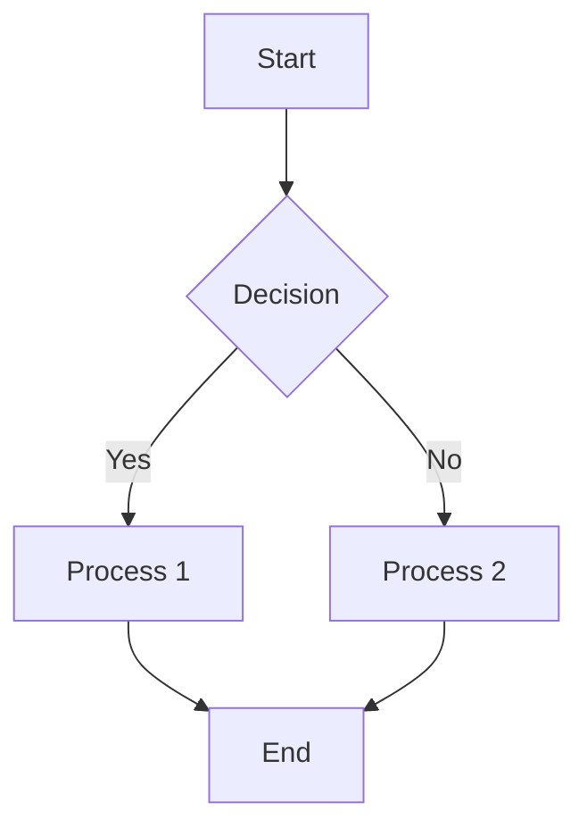
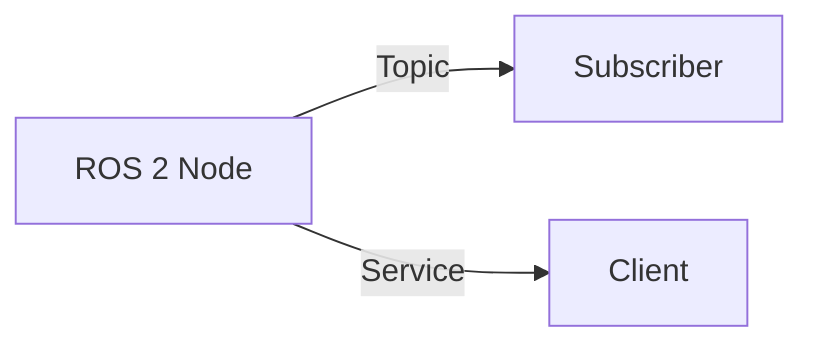
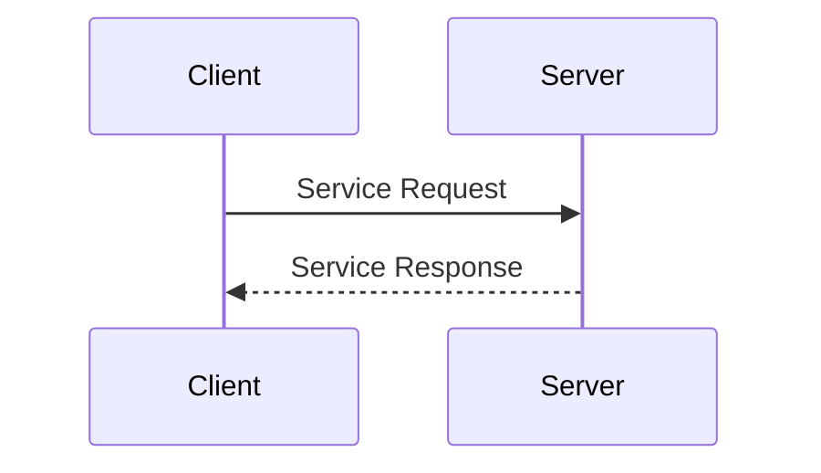
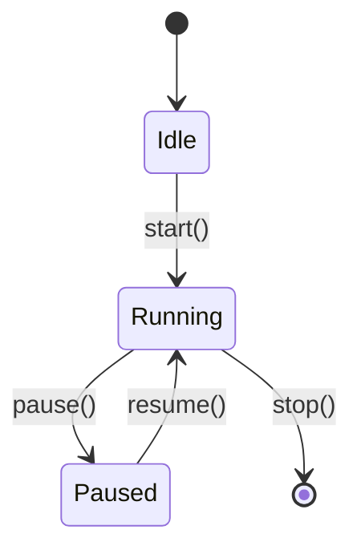
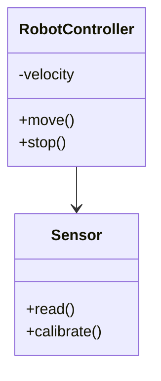
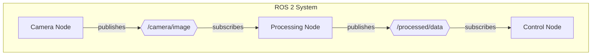
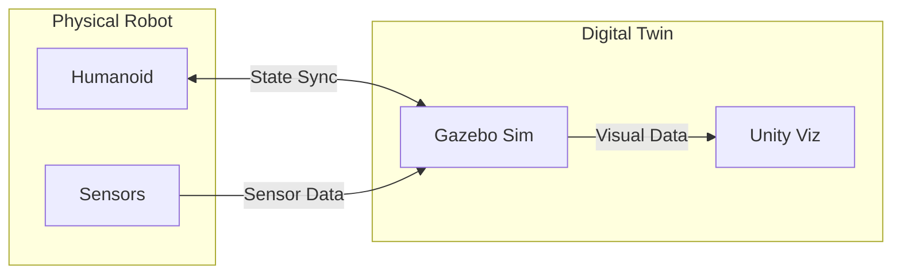
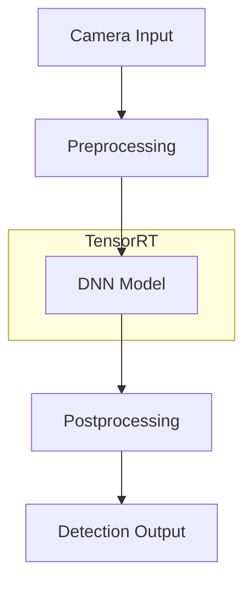
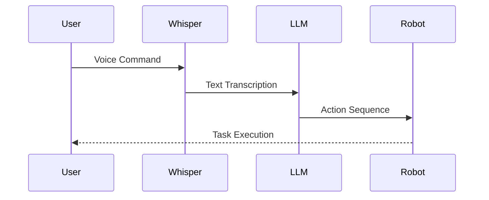

# Diagram Guidelines for Physical AI Textbook

**Purpose**: Standards for creating consistent, professional diagrams across all modules.

---

## Supported Diagram Formats

### 1. Mermaid Diagrams (Primary)

Use Mermaid for:
- Flowcharts and process flows
- Architecture diagrams
- State machines
- Sequence diagrams
- Class diagrams
- Graph structures (ROS 2 computational graphs)

**Advantages**:
- Native Docusaurus support
- Version-controllable (text-based)
- Easy to edit and maintain
- Renders inline in Markdown

**Example Mermaid Flowchart**:


### 2. Excalidraw (Secondary)

Use Excalidraw for:
- Hardware wiring diagrams
- Physical connections (Jetson + RealSense)
- Hand-drawn style technical illustrations
- Complex spatial relationships

**Export Format**: SVG with embedded source
**Location**: `static/diagrams/`

---

## Mermaid Diagram Types

### Graph/Flowchart Syntax



**Use for**:
- ROS 2 computational graphs
- Data flow diagrams
- System architecture

### Sequence Diagrams



**Use for**:
- Service call patterns
- Message exchanges
- Protocol flows

### State Diagrams



**Use for**:
- Robot state machines
- Behavior trees
- Lifecycle management

### Class Diagrams



**Use for**:
- Object-oriented design
- Component relationships
- URDF hierarchies

---

## Diagram Naming Convention

### File Naming Format
```
fig[Module].[Chapter]-[description].svg
```

**Examples**:
- `fig1.1-ros2-graph.svg` - Module 1, Chapter 1, ROS 2 Graph
- `fig2.2-humanoid-urdf.svg` - Module 2, Chapter 2, Humanoid URDF
- `fig3.2-perception-pipeline.svg` - Module 3, Chapter 2, Perception Pipeline
- `fig4.4-full-vla-system.svg` - Module 4, Chapter 4, Full VLA System

### Master Diagrams
```
fig-master-[description].svg
```

**Examples**:
- `fig-master-ros2-graph.svg` - Complete system ROS 2 graph
- `fig-master-system-architecture.svg` - Overall system architecture

---

## Diagram Style Guide

### Colors

**Module-Specific Color Schemes**:
- **Module 1 (ROS 2)**: Blue tones (`#1E88E5`, `#42A5F5`)
- **Module 2 (Digital Twin)**: Green tones (`#43A047`, `#66BB6A`)
- **Module 3 (Isaac)**: Purple tones (`#7E57C2`, `#9575CD`)
- **Module 4 (VLA)**: Orange tones (`#FF7043`, `#FF8A65`)

**Semantic Colors**:
- **Success/Active**: Green (`#4CAF50`)
- **Warning/Caution**: Yellow (`#FFC107`)
- **Error/Critical**: Red (`#F44336`)
- **Neutral/Inactive**: Gray (`#9E9E9E`)

### Typography

- **Font Family**: Sans-serif (default Mermaid font)
- **Node Labels**: Title Case for components, lowercase for functions
- **Edge Labels**: Brief, lowercase descriptions

### Node Shapes

- **Rectangle**: Standard process or component
- **Rounded Rectangle**: Start/End points, ROS 2 nodes
- **Diamond**: Decision points
- **Circle**: Events or states
- **Database**: Data stores or message queues
- **Cloud**: External services (LLM APIs, cloud GPU)

---

## Diagram Metadata

Each diagram must include:

### In Markdown File

```markdown
**Figure [Module].[Chapter]**: [Title]

[Diagram rendering]

- **Type**: [Flowchart/Sequence/Architecture/etc.]
- **Description**: [What the diagram shows]
- **Key Elements**:
  - Element 1: [Description]
  - Element 2: [Description]
- **Source**: [Link to Excalidraw file if applicable]
- **License**: [CC BY 4.0 or appropriate license]
- **Last Updated**: [YYYY-MM-DD]
```

---

## Example Diagrams by Module

### Module 1: ROS 2 Graph



### Module 2: Digital Twin Architecture



### Module 3: Isaac Perception Pipeline



### Module 4: VLA System



---

## Hardware Diagrams (Excalidraw)

### Jetson + RealSense Wiring

**Requirements**:
1. Show physical connections (USB, power, GPIO)
2. Label all ports and connectors
3. Use color coding for different signal types:
   - Red: Power (+5V, +12V)
   - Black: Ground
   - Blue: USB Data
   - Green: GPIO/Serial
4. Include pin numbers where applicable
5. Add annotations for voltage/current ratings

**Export Steps**:
1. Create in Excalidraw
2. Export as SVG with embedded source
3. Save to `static/diagrams/`
4. Include link to editable `.excalidraw` file in repo

---

## Diagram Checklist

Before finalizing a diagram, verify:

- [ ] Follows naming convention
- [ ] Uses appropriate diagram type
- [ ] Adheres to color scheme
- [ ] Labels are clear and concise
- [ ] All nodes/edges are properly connected
- [ ] Metadata is complete
- [ ] SVG renders correctly in Docusaurus
- [ ] Accessible alt text provided
- [ ] Source file preserved (for Excalidraw)
- [ ] Referenced in corresponding chapter text

---

## Accessibility Guidelines

### Alt Text

Provide descriptive alt text for all diagrams:

```markdown

```

**Alt Text Guidelines**:
- Describe the diagram's purpose
- Mention key elements and their relationships
- Keep it concise but informative (1-2 sentences)

**Example**:
```
"ROS 2 computational graph showing a camera node publishing to an image topic, which is subscribed by a processing node that outputs control commands."
```

---

## Tools and Resources

### Mermaid Resources
- **Official Docs**: https://mermaid.js.org/
- **Live Editor**: https://mermaid.live/
- **Docusaurus Integration**: Built-in, use triple backticks with `mermaid` language tag

### Excalidraw Resources
- **Web App**: https://excalidraw.com/
- **Export**: SVG with embedded source
- **Plugins**: VS Code extension available

### Validation
- Test all Mermaid diagrams in Docusaurus preview before committing
- Check SVG rendering in multiple browsers
- Verify mobile responsiveness

---

## Version Control

**Track Diagram Changes**:
- Mermaid: Version controlled automatically (text in Markdown)
- Excalidraw: Commit both `.excalidraw` source and `.svg` export
- Major revisions: Document in chapter's "Last Updated" section

---

**Questions?** See [Troubleshooting Appendix](/appendices/troubleshooting) for diagram rendering issues.
