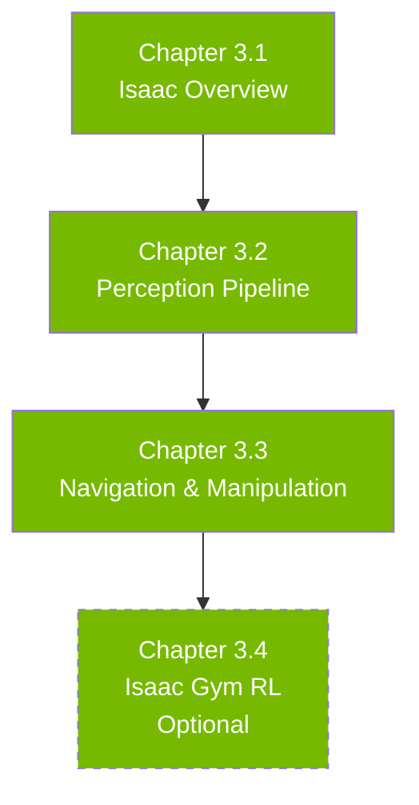

# Module 3: The AI-Robot Brain (NVIDIA Isaac)

## GPU-Accelerated Perception and Intelligence

---

## Welcome to Module 3

You've mastered ROS 2 (Module 1) and built digital twins (Module 2). Now it's time to add **intelligence**—real-time AI perception that enables robots to understand their environment with superhuman speed and accuracy.

**NVIDIA Isaac** is an ecosystem of tools for GPU-accelerated robotics:
- **Isaac Sim**: High-fidelity simulation with RTX ray tracing
- **Isaac ROS**: GPU-accelerated ROS 2 nodes for perception
- **Isaac SDK**: Development framework for AI robotics
- **Isaac Gym**: RL training with massive parallelism

---

## Why GPU Acceleration Matters

### Performance Requirements
- **Object detection**: 30+ FPS for real-time control
- **SLAM**: Process millions of points per second
- **Planning**: Evaluate thousands of trajectories instantly
- **RL training**: Simulate thousands of robots in parallel

### CPU vs. GPU Performance
- **CPU**: YOLOv8 at 5-10 FPS (Intel i7)
- **GPU (TensorRT)**: YOLOv8 at 60+ FPS (RTX 4070 Ti)
- **10x speedup** enables real-time decision making

### Edge Deployment
- **Jetson Orin**: 275 TOPS in a compact form factor
- Run full perception stacks on-robot
- No cloud latency, reduced bandwidth

---

## What You'll Learn

By the end of Module 3, you'll be able to:

### Week 9 (Chapter 3.1): NVIDIA Isaac Overview
- ✅ Understand Isaac SDK, Isaac Sim, Isaac ROS architecture
- ✅ Install Isaac packages on Ubuntu 22.04
- ✅ Run first GPU-accelerated perception node

### Week 10 (Chapter 3.2): Isaac Perception Pipeline
- ✅ Deploy TensorRT-optimized DNNs (YOLO, EfficientDet)
- ✅ Run object detection at 30+ FPS
- ✅ Integrate with ROS 2 perception stack

### Week 11 (Chapter 3.3): Navigation and Manipulation
- ✅ Use Isaac Visual SLAM with Nav2
- ✅ GPU-accelerated motion planning (cuMotion)
- ✅ Implement autonomous navigation

### Week 12 (Optional - Chapter 3.4): Isaac Gym RL
- ✅ Train RL policies with massive parallelism
- ✅ Transfer policies to Isaac Sim and real hardware

---

## Prerequisites

### Required
- **Modules 1 & 2 Complete**: ROS 2 + simulation skills
- **Hardware**: NVIDIA GPU (RTX 4070 Ti or better, 16GB+ VRAM)
- **Software**: CUDA 12.x, cuDNN, TensorRT

### Recommended
- Understanding of deep learning basics (CNNs, training/inference)
- Familiarity with Python machine learning libraries (PyTorch, TensorFlow)

---

## Module Structure

---

## Key Concepts Overview

### TensorRT Optimization
- Fuses layers for reduced memory transfers
- INT8 quantization for 4x speedup
- Dynamic batching for throughput

### Isaac ROS Packages
- **isaac_ros_dnn_inference**: GPU-accelerated inference
- **isaac_ros_visual_slam**: Real-time VSLAM
- **isaac_ros_object_detection**: Bounding box detection
- **isaac_ros_pose_estimation**: 6-DOF object poses

### Deployment Targets
- **Desktop/Server**: RTX 4000 series, A100, H100
- **Edge**: Jetson Orin (AGX, NX, Nano)
- **Cloud**: AWS EC2 G5, Azure NCv3

---

## Connections to Other Modules

### Module 3 → Module 1 (ROS 2)
- Isaac ROS nodes communicate via standard ROS 2 topics
- Integrates seamlessly with existing ROS 2 systems

### Module 3 → Module 2 (Digital Twin)
- Isaac Sim is NVIDIA's digital twin platform
- Generate synthetic training data for perception models

### Module 3 → Module 4 (VLA)
- Isaac perception provides visual grounding for VLA models
- GPU acceleration enables real-time multimodal inference

---

## Learning Approach

### Cloud vs. Local Development
If you don't have an NVIDIA GPU:
- Use AWS EC2 G5 instances (~$1-2/hour)
- NVIDIA NGC cloud containers
- Focus on architecture understanding, test later on hardware

### Incremental Optimization
1. Start with CPU inference (slow but works)
2. Add GPU inference (10x faster)
3. Optimize with TensorRT (2-4x additional speedup)
4. Deploy to Jetson edge device

---

## Tips for Success

### Do's ✅
- Profile performance (use `ros2 topic hz` to measure FPS)
- Test on CPU first, then GPU (easier debugging)
- Use pre-trained models before training custom ones
- Monitor GPU memory (nvidia-smi)

### Don'ts ❌
- Don't assume GPU is faster (small models may benefit from CPU)
- Don't skip TensorRT optimization (huge performance gains)
- Don't ignore latency (throughput ≠ latency)
- Don't forget power limits (Jetson thermal throttles)

---

## Hardware Requirements

### Desktop Development
- **GPU**: NVIDIA RTX 4070 Ti or better (12GB+ VRAM)
- **CPU**: 8+ cores
- **RAM**: 32GB
- **Storage**: 100GB+ (Isaac Sim requires significant space)

### Edge Deployment
- **Jetson Orin AGX**: 275 TOPS, 64GB RAM (high-end)
- **Jetson Orin NX**: 100 TOPS, 16GB RAM (mid-range)
- **Jetson Orin Nano**: 40 TOPS, 8GB RAM (entry-level)

---

## Getting Help

### Official Resources
- **Isaac ROS Documentation**: https://nvidia-isaac-ros.github.io/
- **Isaac Sim Documentation**: https://docs.omniverse.nvidia.com/isaacsim/
- **NVIDIA Developer Forums**: https://forums.developer.nvidia.com/

### Community
- **Isaac ROS GitHub**: Report issues, contribute
- **NVIDIA Omniverse Discord**: Active community for Isaac Sim

---

## Let's Begin!

GPU acceleration transforms robotics from "it works in the lab" to "it works in the real world." By the end of this module, you'll run perception pipelines that were impossible on CPUs just a few years ago.

**Ready?** Start with **[Chapter 3.1: NVIDIA Isaac Overview](./chapter3-1-isaac-overview)**

---

**Time to accelerate! 🚀**
