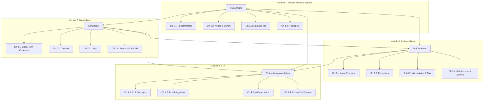

# Implementation Plan: Physical AI & Humanoid Robotics Textbook

**Branch**: `007-unified-textbook-spec`
**Date**: 2025-12-11
**Spec**: [spec.md](./spec.md)

**Input**: Unified specification from `/specs/007-unified-textbook-spec/spec.md`

**Primary Requirement**: Create a comprehensive Physical AI & Humanoid Robotics textbook using Claude Code + Spec-Kit Plus + Docusaurus, covering 4 modules (ROS 2, Digital Twin, Isaac, VLA) with ≥40 glossary terms, ≥20 references, ≥25 figures, and deployment to GitHub Pages.

---

## 1. Architecture Overview

### Full Pipeline

```
Research → Content Generation → Asset Creation → Integration → Validation → Publishing
    ↓              ↓                   ↓              ↓              ↓            ↓
Official      Module/Chapter      Diagrams      Docusaurus    Quality      GitHub
  Docs          Writing           (Mermaid)      Assembly      Gates        Pages
```

### Technology Stack

- **Content Generation**: Claude Code + Spec-Kit Plus
- **Static Site Generator**: Docusaurus v3
- **Diagram Tools**: Mermaid (flowcharts, architecture), Excalidraw (wiring diagrams)
- **Version Control**: Git + GitHub
- **Deployment**: GitHub Pages (gh-pages branch)
- **Automation**: GitHub Actions for CI/CD
- **Package Manager**: npm/yarn for Docusaurus dependencies

### Module-Level Architecture



### Cross-Module Dependency Graph

| Module | Depends On | Rationale |
|--------|------------|-----------|
| Module 1 (ROS 2) | None | Foundation layer |
| Module 2 (Digital Twin) | Module 1 | Requires ROS 2 nodes, topics, URDF |
| Module 3 (Isaac) | Modules 1 & 2 | Requires ROS 2 + simulation knowledge |
| Module 4 (VLA) | Modules 1-3 | Integrates all previous concepts |

### Workflow Architecture

**Figures & Diagrams Workflow**:
```
Spec Requirements → Mermaid/Excalidraw Source → SVG/PNG Export → Docusaurus static/img/ → Chapter References
```

**Glossary Workflow**:
```
Chapter Writing → Term Extraction → Definition Writing → Alphabetical Sorting → Glossary Page Generation
```

**References Workflow**:
```
Research Phase → Citation Collection → APA 7 Formatting → Alphabetical Ordering → References Page Generation
```

**Chapter Pipeline**:
```
Template → Research → Draft Core Concepts → Add Code Examples → Create Exercises → Link Figures → Add Glossary Terms → Peer Review
```

---

## 2. Implementation Phases

### Phase 1: Foundation & Research (Weeks 1-2)

**Goal**: Set up infrastructure and gather all required knowledge for accurate content creation.

**Activities**:
1. Initialize Docusaurus v3 project with custom configuration
2. Set up directory structure (`docs/`, `static/img/`, `static/diagrams/`)
3. Configure sidebar navigation for 4 modules
4. Create chapter template with required sections (summary, objectives, key terms, concepts, examples, exercises)
5. Create diagram template (Mermaid/Excalidraw standards)
6. Research Phase (parallel tracks):
   - **ROS 2 Track**: Official ROS 2 Humble documentation, core concepts
   - **Simulation Track**: Gazebo 11, Unity Robotics Hub documentation
   - **Isaac Track**: NVIDIA Isaac SDK, Isaac Sim, Isaac ROS documentation
   - **VLA Track**: RT-1, RT-2, OpenVLA papers; OpenAI/Anthropic API docs
   - **Hardware Track**: Jetson Orin Nano, RealSense D435/D455 specs
7. Create research notes for each track (markdown files)
8. Set up reference tracking system (APA 7 template)
9. Set up glossary tracking spreadsheet

**Outputs**:
- Functional Docusaurus project (`npm start` runs without errors)
- Research notes for all 4 modules
- Chapter/diagram templates ready
- Reference and glossary tracking systems operational

**Dependencies**: None (starting point)

**Success Criteria**:
- Docusaurus builds locally
- All research tracks have documented notes with official source citations
- Templates validated against spec requirements

---

### Phase 2: Front Matter & Module Foundations (Week 3)

**Goal**: Create front matter and establish structural foundations for all 4 modules.

**Activities**:
1. Write front matter:
   - Title page
   - Copyright page (with placeholder ISBN)
   - Dedication
   - Preface (500-800 words explaining textbook purpose, audience, approach)
   - "How to Use This Book" guide (weekly topics, prerequisites, exercises)
2. Create course mapping table (13 weeks → chapters)
3. Create module navigation diagram (Mermaid flowchart)
4. Write Module 1 introduction (ROS 2 nervous system metaphor, learning outcomes)
5. Write Module 2 introduction (Digital twin concept, sim-to-real importance)
6. Write Module 3 introduction (Isaac as AI brain, GPU requirements)
7. Write Module 4 introduction (VLA capstone, integration of all modules)
8. Create module dependency diagram

**Outputs**:
- Complete front matter (5 sections)
- 4 module introduction pages
- Course mapping table
- Module navigation and dependency diagrams

**Dependencies**: Phase 1 (research, templates)

**Success Criteria**:
- Front matter meets spec requirements (FR-001)
- Each module introduction explains learning outcomes and dependencies
- Course mapping covers all 13 weeks

---

### Phase 3: Module 1 - ROS 2 Content (Week 4)

**Goal**: Create all Module 1 chapters on Robotic Nervous System (ROS 2).

**Activities**:
1. **Chapter 1.1: ROS 2 Fundamentals**
   - Summary (1-2 sentences)
   - Learning objectives (3-5)
   - Key terms (nodes, topics, services, actions, DDS, middleware)
   - Core concepts (1500-2000 words): computational graph, publish-subscribe pattern
   - Code example: Simple Python publisher-subscriber
   - Exercise: Create a node that publishes sensor data
2. **Chapter 1.2: Nodes & Communication**
   - Topics, services, actions deep dive
   - Service call diagram (Mermaid)
   - Code example: Service client-server
3. **Chapter 1.3: Launch Files & Configuration**
   - Launch file syntax, parameters, YAML configs
   - Code example: Annotated launch file
4. **Chapter 1.4: Building Packages & Workspaces**
   - colcon build, package.xml, CMakeLists.txt
   - Workspace structure diagram (ASCII tree)
5. Create ROS 2 computational graph diagram (Mermaid)
6. Add cross-references between Module 1 chapters
7. Collect Module 1 glossary terms (≥10)
8. Collect Module 1 references (≥5 sources, APA format)

**Outputs**:
- 4 complete Module 1 chapters (each 1500-2500 words)
- 2 Mermaid diagrams (ROS 2 graph, service call)
- Module 1 glossary terms
- Module 1 references

**Dependencies**: Phase 2 (module introduction), Phase 1 (ROS 2 research)

**Success Criteria**:
- All chapters follow template structure (FR-031 to FR-037)
- Code examples specify Python 3.10+ and dependencies
- Diagrams referenced in chapter text

---

### Phase 4: Module 2 - Digital Twin Content (Week 5)

**Goal**: Create all Module 2 chapters on simulation and digital twins.

**Activities**:
1. **Chapter 2.1: Digital Twin Concepts**
   - Digital twin definition, benefits, architectures
   - Digital twin architecture diagram (Mermaid): physical robot ↔ simulation data flow
2. **Chapter 2.2: Gazebo Fundamentals**
   - Gazebo setup, world files, physics engines, URDF loading
   - Humanoid URDF tree diagram (Mermaid)
   - Gazebo screenshot (humanoid in environment)
3. **Chapter 2.3: Unity for Robotics**
   - Unity Robotics Hub, ROS-TCP-Connector
   - Unity-ROS integration diagram (Mermaid)
   - Unity screenshot (humanoid visualization)
4. **Chapter 2.4: Sensors & VSLAM**
   - RealSense simulation, ORB-SLAM3 integration
   - VSLAM pipeline diagram (Mermaid): camera → features → mapping → localization
5. Write sim-to-real transfer section (domain randomization, reality gap)
6. Add Module 2 cross-references (to Module 1 URDF concepts)
7. Collect Module 2 glossary terms (≥10)
8. Collect Module 2 references (≥5 sources)

**Outputs**:
- 4 complete Module 2 chapters
- 4 Mermaid diagrams + 2 screenshots
- Module 2 glossary terms
- Module 2 references

**Dependencies**: Module 1 complete (URDF concepts required)

**Success Criteria**:
- Chapters explain sim-to-real challenges (FR-016)
- Screenshots show professional simulation environments
- Cross-references to Module 1 URDF are accurate

---

### Phase 5: Module 3 - Isaac Content (Week 6)

**Goal**: Create all Module 3 chapters on NVIDIA Isaac AI brain.

**Activities**:
1. **Chapter 3.1: Isaac Overview**
   - Isaac SDK, Isaac Sim, Isaac ROS ecosystem
   - Isaac architecture diagram (Mermaid): SDK + Sim + ROS relationships
2. **Chapter 3.2: Isaac Perception Pipeline**
   - Object detection, depth estimation, segmentation
   - DNN models, TensorRT optimization
   - Perception pipeline diagram (Mermaid): camera → DNN → perception output
   - Isaac Sim screenshot (perception overlay with bounding boxes)
3. **Chapter 3.3: Isaac Manipulation & Navigation**
   - Motion planning, grasp detection, Nav2 integration
   - Nav2 + Isaac diagram (Mermaid): costmaps, planner, controller
4. **Chapter 3.4: Reinforcement Learning with Isaac**
   - Isaac Gym, PPO algorithm, task definition
   - RL training loop diagram (Mermaid): agent → environment → reward → policy update
5. Add Jetson Orin Nano edge deployment notes
6. Add GPU requirements notes (RTX 4070 Ti+ or cloud)
7. Add Module 3 cross-references (to Module 1 ROS 2, Module 2 simulation)
8. Collect Module 3 glossary terms (≥10)
9. Collect Module 3 references (≥5 sources)

**Outputs**:
- 4 complete Module 3 chapters
- 4 Mermaid diagrams + 1 screenshot
- Module 3 glossary terms
- Module 3 references

**Dependencies**: Modules 1 & 2 complete (ROS 2 + simulation knowledge required)

**Success Criteria**:
- GPU requirements documented consistently (FR-022)
- Jetson edge deployment notes present (FR-023)
- All Isaac components (SDK, Sim, ROS) explained

---

### Phase 6: Module 4 - VLA Content (Week 7)

**Goal**: Create all Module 4 chapters on Vision-Language-Action systems.

**Activities**:
1. **Chapter 4.1: VLA Concepts**
   - VLA definition, embodied intelligence, RT-1/RT-2/OpenVLA architectures
   - VLA architecture diagram (Mermaid): vision → encoder → LLM → robot action
2. **Chapter 4.2: LLM Integration for Robotics**
   - OpenAI API, Anthropic API, prompt engineering for task planning
   - LLM reasoning diagram (Mermaid): user command → LLM → robot primitives
   - Code example: Call LLM API from ROS 2 node, parse task plan
3. **Chapter 4.3: Whisper for Voice Commands**
   - Whisper API, audio capture, command parsing
   - Voice pipeline diagram (Mermaid): audio → Whisper → text → LLM → action
4. **Chapter 4.4: End-to-End VLA System**
   - Full system integration: ROS 2 + Gazebo + Isaac + LLM + Whisper
   - Full VLA system diagram (Mermaid): comprehensive architecture
   - Code example: "Pick up the red cup" from voice to execution
5. Write ethical considerations section (safety, privacy, bias in LLMs)
6. Write future directions section (emerging VLA research)
7. Add Module 4 cross-references (to all previous modules)
8. Collect Module 4 glossary terms (≥10)
9. Collect Module 4 references (≥5 sources, including RT-1, RT-2, OpenVLA papers)

**Outputs**:
- 4 complete Module 4 chapters
- 4 Mermaid diagrams
- Full VLA demo code
- Module 4 glossary terms
- Module 4 references

**Dependencies**: Modules 1-3 complete (VLA integrates all concepts)

**Success Criteria**:
- End-to-end VLA system example demonstrates full pipeline (FR-027)
- Ethical considerations addressed (FR-030)
- Cross-references to all previous modules present

---

### Phase 7: Back Matter & Supplementary Assets (Week 8)

**Goal**: Create glossary, references, appendices, and additional diagrams.

**Activities**:
1. **Glossary**:
   - Merge glossary terms from all 4 modules
   - Write clear definitions for each term (≥40 total)
   - Add chapter references where terms are introduced
   - Alphabetically sort
2. **References**:
   - Merge references from all 4 modules
   - Verify APA 7th edition formatting
   - Alphabetically sort by author last name (≥20 total)
3. **Master Diagrams**:
   - ROS 2 master node graph (comprehensive system architecture)
   - Bipedal locomotion kinematic tree (Mermaid)
   - Jetson + RealSense wiring diagram (Excalidraw)
4. **Appendices**:
   - **Appendix A**: Hardware Setup Guide (Jetson Orin, RealSense, humanoid robots)
   - **Appendix B**: Software Installation Guide (ROS 2, Gazebo, Unity, Isaac on Ubuntu 22.04)
   - **Appendix C**: Sample ROS Launch Files (sensor bringup, simulation, VLA system)
   - **Appendix D**: Sim-to-Real Transfer Best Practices (domain randomization, calibration)
   - **Appendix E**: Cloud vs On-Premise GPU Comparison (cost analysis, latency, performance)
   - **Appendix F**: Troubleshooting Guide (installation, simulation, hardware, API issues)
   - **Appendix G**: Additional Resources (ROS forums, Isaac Discord, GitHub repos)
5. Create figure metadata file (captions, sources, licenses)
6. Validate figure coverage (≥25 total)

**Outputs**:
- Complete glossary (≥40 terms)
- Complete references (≥20 sources, APA 7)
- 3 master diagrams
- 7 appendices
- Figure metadata file

**Dependencies**: All module chapters complete

**Success Criteria**:
- Glossary threshold met (FR-047, SC-002)
- References threshold met (FR-051, SC-003)
- All 7 appendices present (FR-055 to FR-061)
- Figure coverage ≥25 (FR-046, SC-004)

---

### Phase 8: Integration & Validation (Week 9)

**Goal**: Integrate all content into Docusaurus, run quality gates, validate against spec.

**Activities**:
1. **Content Integration**:
   - Place all markdown files in `/docs` folder
   - Place all figures in `/static/img` folder
   - Update `sidebars.js` with all module/chapter entries
   - Update `docusaurus.config.js` with metadata
2. **Validation Checks** (run sequentially):
   - Module completeness check (all 4 modules, 16 chapters present)
   - Chapter structure validation (each has summary, objectives, key terms, concepts, example, exercise)
   - Diagram coverage check (≥25 figures referenced in text)
   - Glossary count check (≥40 terms)
   - References count check (≥20 sources, APA 7 format)
   - Weekly mapping validation (13 weeks → chapters)
   - Cross-module dependency check (Module 2→1, Module 3→1-2, Module 4→1-3)
   - Hardware consistency check (GPU, Jetson, RealSense mentioned consistently)
   - Code example validation (all specify language, version, dependencies)
   - Diagram format validation (Mermaid or Excalidraw only)
3. **Constitution Compliance Check**:
   - **Accuracy**: Verify all technical claims against official documentation
   - **Clarity**: Verify content is understandable to target audience
   - **Reproducibility**: Verify all code examples are runnable
   - **Transparency**: Verify assumptions and dependencies documented
   - **Rigor**: Verify consistent structure across all chapters
4. **Build Testing**:
   - Run `npm run build` (must complete without errors)
   - Test local site with `npm start`
   - Check all pages load correctly
   - Verify all figures display
   - Test navigation between modules/chapters
   - Check for broken links
5. **Content Review Pass**:
   - Spell check all content
   - Grammar check with Vale or Grammarly
   - Technical accuracy review (spot check against official docs)
   - Consistency review (terminology, formatting)

**Outputs**:
- Fully integrated Docusaurus site
- 11 validation reports (one per check)
- Constitution compliance report
- Build test results
- Content review report

**Dependencies**: All previous phases complete

**Success Criteria**:
- All validation checks pass
- Docusaurus builds without errors (SC-021)
- Constitution compliance verified
- No broken links or missing figures

---

### Phase 9: Publishing & Deployment (Week 10)

**Goal**: Deploy textbook to GitHub Pages and verify public accessibility.

**Activities**:
1. **GitHub Pages Configuration**:
   - Update `docusaurus.config.js` with GitHub Pages settings
   - Set `baseUrl`, `organizationName`, `projectName`
2. **GitHub Actions Setup**:
   - Create `.github/workflows/deploy.yml` for automated deployment
   - Configure workflow to build and deploy to `gh-pages` branch on push to `main`
3. **Local Deployment Test**:
   - Run `npm run build`
   - Verify `/build` folder generated successfully
4. **GitHub Pages Deployment**:
   - Commit all changes to `main` branch
   - Push to GitHub (triggers GitHub Actions)
   - Verify deployment succeeds
5. **Post-Deployment Verification**:
   - Access GitHub Pages URL
   - Verify site loads in <3 seconds (SC-022)
   - Test all pages accessible
   - Test all figures display correctly
   - Test navigation functional
   - Test mobile responsiveness
6. **Create Project Completion Report**:
   - Document all 158 tasks completed
   - Document all metrics met (glossary ≥40, references ≥20, figures ≥25, etc.)
   - Document constitution compliance
   - Document lessons learned

**Outputs**:
- Live GitHub Pages site
- GitHub Actions workflow configured
- Post-deployment verification report
- Project completion report

**Dependencies**: Phase 8 (validation passed)

**Success Criteria**:
- GitHub Pages site is publicly accessible
- Site loads in <3 seconds (SC-022)
- All content functional
- Project completion report confirms all metrics met

---

## 3. Component Breakdown

### Chapter Pipeline (Per Chapter)

```
1. Load Template → 2. Research → 3. Draft Summary → 4. Write Learning Objectives → 5. Identify Key Terms
       ↓
6. Write Core Concepts (1500-3000 words) → 7. Add Code Example → 8. Create Exercise
       ↓
9. Link Figures → 10. Add Glossary References → 11. Peer Review → 12. Finalize
```

**Time Estimate**: 2-3 hours per chapter (with AI assistance)

**Quality Checks** (per chapter):
- [ ] Summary is 1-2 sentences
- [ ] 3-5 learning objectives present
- [ ] 5-8 key terms identified
- [ ] Core concepts 1500-3000 words
- [ ] At least 1 code example with explanation
- [ ] At least 1 exercise with expected outcome
- [ ] At least 1 figure referenced
- [ ] Cross-references to other chapters where applicable

### Diagram Generation Workflow

**Mermaid Flowcharts/Architecture**:
```
1. Identify diagram need in spec → 2. Draft Mermaid syntax → 3. Render preview → 4. Refine
   ↓
5. Export SVG → 6. Place in static/img/ → 7. Reference in chapter markdown
```

**Excalidraw Wiring Diagrams**:
```
1. Identify wiring diagram need → 2. Create in Excalidraw web app → 3. Export SVG/PNG
   ↓
4. Place in static/diagrams/ → 5. Reference in chapter markdown
```

**Diagram Naming Convention**:
- Format: `fig[module].[chapter]-[description].svg`
- Example: `fig1.1-ros2-graph.svg`, `fig3.2-isaac-perception-pipeline.svg`

### References Management

**Citation Collection**:
1. During research phase, collect source information:
   - Author(s)
   - Year
   - Title
   - Publication venue (journal, conference, website)
   - DOI or URL
2. Format each citation in APA 7th edition:
   - Author, A. A., & Author, B. B. (Year). Title of work. *Publication*. https://doi.org/xxx
3. Track in `references-tracker.md` during content creation
4. Merge and alphabetize in Phase 7

**Required Reference Categories**:
- Official documentation (ROS 2, Gazebo, Unity, Isaac, OpenAI, Anthropic)
- Academic papers (VLA models: RT-1, RT-2, OpenVLA)
- VSLAM algorithms (ORB-SLAM3, Cartographer)
- Bipedal locomotion research
- Sim-to-real transfer papers

### Glossary Creation Rules

**Term Extraction**:
1. As each chapter is written, identify technical terms that:
   - Are domain-specific (not general English)
   - Require explanation for target audience
   - Appear in multiple chapters
2. Add to `glossary-tracker.md` with:
   - Term name
   - Placeholder for definition
   - Chapter(s) where term is introduced

**Definition Writing** (Phase 7):
1. Write clear, concise definition (1-3 sentences)
2. Avoid circular definitions (don't define term using itself)
3. Add chapter reference(s) where term is first used
4. Example: **Node**: A process in the ROS 2 computational graph that performs computation. Nodes communicate with each other via topics, services, and actions. (See Chapter 1.1)

**Alphabetization**:
- Sort all terms alphabetically (case-insensitive)
- Use consistent formatting for all entries

### Hardware/Software Accuracy Validation

**Official Documentation Sources**:
- **ROS 2**: https://docs.ros.org/en/humble/
- **Gazebo**: https://classic.gazebosim.org/tutorials
- **Unity Robotics**: https://github.com/Unity-Technologies/Unity-Robotics-Hub
- **Isaac SDK**: https://developer.nvidia.com/isaac-sdk
- **Jetson**: https://developer.nvidia.com/embedded/jetson-orin-nano
- **RealSense**: https://www.intelrealsense.com/developers/
- **OpenAI API**: https://platform.openai.com/docs/
- **Anthropic API**: https://docs.anthropic.com/

**Verification Process**:
1. For each technical claim, identify the authoritative source
2. Cross-reference claim against latest official documentation
3. Document source in references section
4. If official docs are ambiguous, note this in content with "as of [date]"

**Version Pinning**:
- ROS 2 Humble Hawksbill (LTS)
- Ubuntu 22.04 LTS
- Gazebo 11
- Unity 2022.3 LTS
- Python 3.10+
- Isaac SDK 2023.1+ (or latest stable)

---

## 4. Dependencies

### Sequential Dependencies (Critical Path)

```
Phase 1 (Foundation & Research)
    ↓
Phase 2 (Front Matter & Module Foundations)
    ↓
Phase 3 (Module 1) ────────────────┐
    ↓                               ↓
Phase 4 (Module 2) ────────┐       ↓
    ↓                       ↓       ↓
Phase 5 (Module 3) ────┐   ↓       ↓
    ↓                   ↓   ↓       ↓
Phase 6 (Module 4) ←───┴───┴───────┘
    ↓
Phase 7 (Back Matter & Assets)
    ↓
Phase 8 (Integration & Validation)
    ↓
Phase 9 (Publishing & Deployment)
```

### Detailed Dependency Matrix

| Phase/Component | Depends On | Reason |
|-----------------|------------|--------|
| Module 1 (ROS 2) | Phase 1 research | Requires ROS 2 official docs understanding |
| Module 2 (Digital Twin) | Module 1 complete | URDF, nodes, topics concepts required |
| Module 3 (Isaac) | Modules 1 & 2 complete | Requires ROS 2 + simulation knowledge |
| Module 4 (VLA) | Modules 1-3 complete | Integrates all previous concepts |
| Glossary | All modules complete | Terms extracted from all chapters |
| References | All modules complete | Citations collected from all chapters |
| Appendix C (Launch Files) | Module 1 complete | Requires launch file concepts |
| Appendix D (Sim-to-Real) | Module 2 complete | Requires digital twin concepts |
| Validation | All content complete | Cannot validate incomplete content |
| Publishing | Validation passed | Cannot deploy invalid content |

### Parallel Opportunities

**Within Phase 1 (Research)**:
- All 5 research tracks can run in parallel:
  - ROS 2 Track
  - Simulation Track
  - Isaac Track
  - VLA Track
  - Hardware Track

**Within Phase 3-6 (Chapter Writing)**:
- Chapters within a module can be written in parallel if different authors
- Diagrams can be created in parallel with chapter writing
- Glossary term extraction can happen during chapter writing

**Within Phase 7 (Back Matter)**:
- All 7 appendices can be written in parallel
- Glossary and references can be merged in parallel
- Master diagrams can be created in parallel

---

## 5. Key Architectural Decisions

### Decision 1: Research-First vs Research-Concurrent

**Options**:
- **A. Research-First**: Complete all research (Phase 1) before any content writing
- **B. Research-Concurrent**: Research each module just-in-time before writing

**Decision**: **Research-First (Option A)**

**Rationale**:
- Ensures all content is based on verified, official sources before writing begins
- Prevents content rewrites due to discovering new information mid-writing
- Enables parallel chapter writing once research is complete
- Aligns with Constitution's Accuracy principle (verify before writing)
- Enables early identification of knowledge gaps or conflicts

**Trade-offs**:
- Higher upfront time investment
- Potential for some research to be unused if scope changes
- But: Higher quality, fewer rewrites, faster content generation phase

---

### Decision 2: Chapter Depth (3-6 Chapters Per Module)

**Options**:
- **A. 3 chapters per module** (minimal, fast)
- **B. 4 chapters per module** (balanced)
- **C. 5-6 chapters per module** (comprehensive, slow)

**Decision**: **4 chapters per module (Option B)**

**Rationale**:
- Aligns with 13-week course structure (Weeks 1-2: intro, Weeks 3-13: 11 weeks ÷ 4 modules ≈ 2.75 weeks/module)
- 4 chapters = ~1 chapter every 3.5 days of course content (reasonable pace)
- Enables focused topics without excessive repetition
- Total 16 chapters (4 modules × 4 chapters) is manageable for hackathon timeline
- Provides sufficient depth for graduate-level content

**Trade-offs**:
- More comprehensive than 3 chapters (better coverage)
- Less overwhelming than 5-6 chapters (faster generation)
- Requires careful scoping of each chapter to avoid redundancy

---

### Decision 3: Diagram Types & Tools

**Options**:
- **A. Mermaid only** (consistent, simple, but limited)
- **B. Excalidraw only** (flexible, but lacks code-based generation)
- **C. Mermaid + Excalidraw** (best of both, but multiple tools)

**Decision**: **Mermaid + Excalidraw (Option C)**

**Rationale**:
- **Mermaid** for: Flowcharts, architecture diagrams, computational graphs, pipelines
  - Advantages: Code-based, version-controllable, built into Docusaurus, easy to update
  - Use cases: ROS 2 graph, VSLAM pipeline, VLA reasoning flow, Nav2 architecture
- **Excalidraw** for: Wiring diagrams, hardware schematics, complex physical layouts
  - Advantages: Freeform drawing, better for hardware representations
  - Use cases: Jetson + RealSense wiring, kinematic trees (if too complex for Mermaid)
- Both tools are open-source and export to SVG (scalable, web-friendly)

**Trade-offs**:
- Requires learning two tools
- But: Each tool is best-in-class for its use case, resulting in higher-quality figures

---

### Decision 4: Citation Method (APA vs IEEE)

**Options**:
- **A. APA 7th edition** (standard for social sciences, education)
- **B. IEEE** (standard for engineering, computer science)

**Decision**: **APA 7th edition (Option A)**

**Rationale**:
- Textbook is an educational resource (aligns with APA's focus on pedagogy)
- Target audience includes educators/instructors (APA more familiar in education contexts)
- APA emphasizes author names and dates (helps readers identify source recency)
- Spec explicitly requires APA 7 format (FR-051, FR-054)

**Trade-offs**:
- Engineering students may be more familiar with IEEE
- But: APA is more appropriate for textbook format, and spec mandates it

---

### Decision 5: Cloud vs On-Premise GPU Approach

**Options**:
- **A. Cloud-only** (AWS/GCP/Azure GPU instances)
- **B. On-premise only** (RTX 4070 Ti+ workstation)
- **C. Hybrid** (document both, let students choose)

**Decision**: **Hybrid (Option C)**

**Rationale**:
- **Primary documentation**: Local RTX 4070 Ti+ workstation (most students have or can access)
- **Alternative**: Cloud GPU instances with cost analysis (Appendix E)
- Enables all students to follow along regardless of hardware access
- Appendix E provides cost comparison, latency analysis, performance benchmarks
- Aligns with Constitution's Transparency principle (document alternatives)

**Trade-offs**:
- More documentation work (two paths)
- But: Greater accessibility, more students can complete exercises

---

## 6. Testing Strategy / Quality Gates

### Per-Phase Quality Gates

| Phase | Quality Gate | Pass Criteria |
|-------|--------------|---------------|
| Phase 1 | Research Completeness | All 5 research tracks have documented notes with official source citations |
| Phase 2 | Front Matter Validation | All 5 front matter sections + 4 module intros complete and formatted |
| Phase 3 | Module 1 Validation | 4 chapters complete, ≥10 glossary terms, ≥5 references, ≥2 diagrams |
| Phase 4 | Module 2 Validation | 4 chapters complete, ≥10 glossary terms, ≥5 references, ≥4 diagrams |
| Phase 5 | Module 3 Validation | 4 chapters complete, ≥10 glossary terms, ≥5 references, ≥4 diagrams |
| Phase 6 | Module 4 Validation | 4 chapters complete, ≥10 glossary terms, ≥5 references, ≥4 diagrams |
| Phase 7 | Back Matter Validation | Glossary ≥40 terms, references ≥20 sources, all 7 appendices complete, figures ≥25 |
| Phase 8 | Integration Validation | All 11 validation checks pass, constitution compliance confirmed, build succeeds |
| Phase 9 | Deployment Validation | GitHub Pages live, site loads <3s, all content accessible |

### Constitution Compliance Validation

**Accuracy**:
- [ ] All technical claims verified against official documentation
- [ ] All code examples tested on Ubuntu 22.04 with documented dependencies
- [ ] Hardware specifications match official datasheets (Jetson, RealSense)
- [ ] Software versions pinned to specific releases (ROS 2 Humble, Gazebo 11, etc.)

**Clarity**:
- [ ] Content understandable to intermediate-to-advanced readers
- [ ] Technical jargon explained in glossary
- [ ] Examples include sufficient context and explanation
- [ ] Figures have clear captions

**Reproducibility**:
- [ ] All code examples include language version and dependencies
- [ ] Setup instructions in Appendix B enable reproducible environment
- [ ] Hardware setup in Appendix A provides step-by-step guidance
- [ ] Launch files in Appendix C are tested and runnable

**Transparency**:
- [ ] All assumptions documented (target audience, hardware, software versions)
- [ ] Cross-module dependencies explicitly stated
- [ ] Out-of-scope topics clearly listed
- [ ] Limitations noted where applicable (e.g., API rate limits, hardware requirements)

**Rigor**:
- [ ] All chapters follow consistent template structure
- [ ] All chapters meet word count targets (1500-3000 words)
- [ ] All chapters include required elements (summary, objectives, key terms, concepts, example, exercise)
- [ ] Terminology consistent across all modules

### Spec Requirements Validation (Checklist)

**Book Structure** (FR-001 to FR-005):
- [ ] Front matter includes title, copyright, dedication, preface, how-to-use
- [ ] 4 modules present (ROS 2, Digital Twin, Isaac, VLA)
- [ ] Back matter includes glossary, references, 7 appendices
- [ ] Each module has 4 chapters (16 total)
- [ ] Course mapping table covers 13 weeks

**Chapter Structure** (FR-031 to FR-037):
- [ ] Each chapter has 1-2 sentence summary
- [ ] Each chapter has 3-5 learning objectives
- [ ] Each chapter has 5-8 key terms
- [ ] Each chapter has 1500-3000 words of core concepts
- [ ] Each chapter has ≥1 code example
- [ ] Each chapter references relevant figures
- [ ] Each chapter has end-of-chapter exercise

**Figures & Diagrams** (FR-038 to FR-046):
- [ ] ROS 2 computational graph (Mermaid)
- [ ] Humanoid URDF joint hierarchy (Mermaid)
- [ ] Digital twin architecture (Mermaid)
- [ ] Isaac perception pipeline (Mermaid)
- [ ] VLA reasoning pipeline (Mermaid)
- [ ] Bipedal locomotion kinematic tree (Mermaid)
- [ ] Jetson + RealSense wiring (Excalidraw)
- [ ] All figures have captions
- [ ] Total figures ≥25

**Glossary** (FR-047 to FR-050):
- [ ] ≥40 technical terms
- [ ] Each term has clear definition
- [ ] Each term has chapter reference(s)
- [ ] Glossary alphabetically ordered

**References** (FR-051 to FR-054):
- [ ] ≥20 authoritative sources
- [ ] Official docs included (ROS 2, Gazebo, Unity, Isaac, OpenAI, Anthropic)
- [ ] Academic papers included (RT-1, RT-2, OpenVLA, VSLAM, bipedal, sim-to-real)
- [ ] References in APA 7th edition format
- [ ] References alphabetically ordered

**Appendices** (FR-055 to FR-061):
- [ ] Appendix A: Hardware Setup Guide
- [ ] Appendix B: Software Installation Guide
- [ ] Appendix C: Sample ROS Launch Files
- [ ] Appendix D: Sim-to-Real Transfer Best Practices
- [ ] Appendix E: Cloud vs On-Premise GPU Comparison
- [ ] Appendix F: Troubleshooting Guide
- [ ] Appendix G: Additional Resources

**Validation & Consistency** (FR-062 to FR-066):
- [ ] Weekly course flow preserved (Weeks 1-13)
- [ ] Module dependencies documented (M2→M1, M3→M1&2, M4→M1-3)
- [ ] Hardware requirements consistent (GPU: RTX 4070 Ti+, Edge: Jetson Orin Nano, Sensors: RealSense D435/D455)
- [ ] Code examples specify language and dependencies
- [ ] Diagrams use approved formats (Mermaid or Excalidraw)

---

## 7. Success Criteria

### Project-Level Success Criteria

**From Spec (SC-001 to SC-022)**:

**Structural Completeness**:
- [ ] SC-001: Textbook contains front matter (5 sections) + 4 modules (16 chapters) + back matter (glossary + references + 7 appendices)
- [ ] SC-002: Glossary contains ≥40 unique terms with definitions and chapter references
- [ ] SC-003: References contain ≥20 sources in APA 7th edition
- [ ] SC-004: Textbook includes ≥25 figures/diagrams referenced in text
- [ ] SC-005: Each of 16 chapters includes summary, objectives (3-5), key terms (5-8), core concepts (1500-3000 words), example, exercise
- [ ] SC-006: Course mapping table shows week-to-chapter assignments for 13 weeks
- [ ] SC-007: Module dependencies explicitly documented (M2→M1, M3→M1&2, M4→M1-3)
- [ ] SC-008: All 7 appendices complete with actionable guidance
- [ ] SC-009: Hardware requirements consistently documented (GPU, Jetson, RealSense)
- [ ] SC-010: All code examples specify language version and are executable

**User-Facing Outcomes**:
- [ ] SC-011: Students completing Module 1 can create and run ROS 2 publisher-subscriber systems
- [ ] SC-012: Students completing Module 2 can simulate humanoid robots in Gazebo with sensor integration
- [ ] SC-013: Students completing Module 3 can deploy Isaac perception pipelines in simulation or on Jetson
- [ ] SC-014: Students completing Module 4 can build end-to-end voice-to-action robot systems
- [ ] SC-015: Instructors can deliver 13-week course using textbook as primary resource
- [ ] SC-016: 90% of students can find term explanations in glossary without external research
- [ ] SC-017: Students can resolve common issues using troubleshooting appendix

**Quality Outcomes**:
- [ ] SC-018: All technical claims verified against official documentation
- [ ] SC-019: All code examples tested and execute successfully on Ubuntu 22.04
- [ ] SC-020: All diagrams render correctly in Docusaurus
- [ ] SC-021: Textbook builds successfully in Docusaurus v3 without errors
- [ ] SC-022: Deployed textbook on GitHub Pages loads in <3 seconds

### Implementation-Specific Success Criteria

**Plan Adequacy**:
- [ ] Plan fully supports generating a publishable textbook
- [ ] Plan maintains consistency across all modules
- [ ] Plan enables reproducible content generation using Claude Code + Spec-Kit Plus
- [ ] Plan respects all Constitution principles (Accuracy, Clarity, Reproducibility, Transparency, Rigor)

**Resource Efficiency**:
- [ ] Chapter content detail minimal for fast hackathon generation (1500-3000 words, not 5000+)
- [ ] Diagram generation workflow efficient (Mermaid code-based, Excalidraw for complex only)
- [ ] Validation automated where possible (word count, glossary count, reference count, diagram count)

**Timeline Feasibility**:
- [ ] 10-week timeline realistic for single author + AI assistance
- [ ] Critical path identified and dependencies managed
- [ ] Parallel work opportunities maximized

---

## 8. Risk Mitigation

### Identified Risks & Mitigations

| Risk | Impact | Mitigation |
|------|--------|------------|
| **Research gaps** (official docs incomplete) | High | Use multiple authoritative sources, document limitations explicitly |
| **Diagram complexity** (too complex for Mermaid) | Medium | Use Excalidraw for complex wiring/hardware diagrams |
| **Content consistency** (16 chapters, terminology drift) | Medium | Use glossary as single source of truth, run consistency validation |
| **Build failures** (Docusaurus configuration errors) | High | Test build frequently (after each module), validate configuration early |
| **Dependency violations** (Module 3 written before Module 1) | High | Enforce sequential module writing, use dependency checklist |
| **Glossary/reference count miss** (≥40 terms, ≥20 refs) | Medium | Track continuously during writing, validate after each module |
| **Timeline overrun** (10 weeks → 15 weeks) | High | Prioritize P1 content (Modules 1 & 4), use minimal chapter depth (1500-2000 words) |

---

## 9. Tooling

### Required Tools

- **Node.js**: v18+ for Docusaurus
- **npm/yarn**: Package management
- **Git**: Version control
- **GitHub**: Repository hosting + Pages
- **Claude Code**: AI-assisted content generation
- **Spec-Kit Plus**: Spec-driven workflow management
- **Mermaid**: Diagram generation (built into Docusaurus)
- **Excalidraw**: Complex diagram creation (web app)
- **VS Code**: Text editor with Markdown preview

### Optional Tools

- **Grammarly**: Writing quality (grammar, clarity)
- **Vale**: Prose linting (technical writing style)
- **markdownlint**: Markdown validation
- **Lighthouse**: Site performance testing (post-deployment)

---

## 10. Timeline Estimate

| Phase | Duration | Complexity | Blocker |
|-------|----------|------------|---------|
| Phase 1: Foundation & Research | 2 weeks | High | None (starting point) |
| Phase 2: Front Matter & Foundations | 1 week | Low | Phase 1 |
| Phase 3: Module 1 (ROS 2) | 1 week | High | Phase 2 |
| Phase 4: Module 2 (Digital Twin) | 1 week | High | Phase 3 |
| Phase 5: Module 3 (Isaac) | 1 week | High | Phases 3 & 4 |
| Phase 6: Module 4 (VLA) | 1 week | High | Phases 3-5 |
| Phase 7: Back Matter & Assets | 1 week | Medium | Phases 3-6 |
| Phase 8: Integration & Validation | 1 week | Medium | Phase 7 |
| Phase 9: Publishing & Deployment | 1 week | Low | Phase 8 |
| **Total** | **10 weeks** | **High** | Sequential phases |

**Assumptions**:
- Full-time work by single author with Claude Code assistance
- Research efficiency improved by AI-assisted documentation review
- Chapter writing accelerated by template reuse and AI drafting
- Validation partially automated (word counts, glossary/reference counts, diagram counts)

**Parallel Opportunities** (can reduce timeline if multiple authors):
- Research tracks (Phase 1): All 5 can run in parallel
- Chapter writing (Phases 3-6): Chapters within a module can be written in parallel
- Appendices (Phase 7): All 7 can be written in parallel

---

## 11. Constitution Alignment

This implementation plan adheres to all Constitution principles:

**Accuracy**:
- Phase 1 Research-First approach ensures all content verified before writing
- Official documentation required for all technical claims
- Hardware/software accuracy validation process defined

**Clarity**:
- Chapter template ensures consistent structure for readability
- Glossary provides definitions for all technical terms
- Target audience explicitly defined (graduate students, early-career engineers)

**Reproducibility**:
- All code examples specify language version and dependencies
- Appendix B provides reproducible software installation steps
- Appendix A provides reproducible hardware setup steps
- All diagrams exportable to SVG (version-controllable)

**Transparency**:
- All assumptions documented (target audience, hardware, software versions)
- Cross-module dependencies explicitly mapped
- Out-of-scope topics clearly listed
- Architectural decisions documented with rationale

**Rigor**:
- Consistent chapter structure enforced via template
- Validation checks ensure all requirements met
- Quality gates at each phase prevent defects from propagating
- Constitution compliance validation before publishing

---

**Plan Status**: ✅ Ready for Implementation

**Next Step**: Begin Phase 1 (Foundation & Research) by initializing Docusaurus project and starting research tracks.
