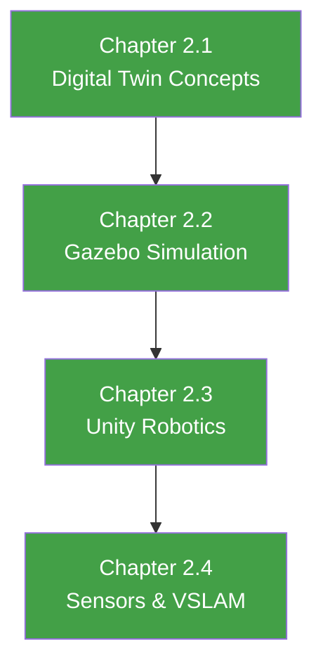

import UrduTranslateButton from '@site/src/components/UrduTranslateButton';

# Module 2: The Digital Twin (Gazebo & Unity)

<UrduTranslateButton />

## Simulation as the Foundation of Robot Development

---

## Welcome to Module 2

In Module 1, you mastered ROS 2—the nervous system that enables robots to sense, think, and act. Now, in Module 2, you'll learn how to **test and validate** your robot systems before deploying to expensive, fragile hardware.

**Digital twins** are high-fidelity simulations that mirror real-world robot behavior. They enable:
- Rapid prototyping without physical robots
- Safe testing of dangerous scenarios
- Automated testing at scale
- Sim-to-real transfer for efficient learning

---

## Why Digital Twins Matter

### Cost Reduction
- Physical humanoid robots cost $50,000-$500,000
- Simulation enables unlimited testing at near-zero marginal cost
- Failures in simulation don't damage expensive hardware

### Safety
- Test collision avoidance without risking injury
- Simulate emergency scenarios (power loss, sensor failure)
- Validate safety-critical systems before deployment

### Scalability
- Train thousands of parallel agents in simulation
- Test edge cases that are rare in the real world
- Generate synthetic training data for perception models

---

## What You'll Learn

By the end of Module 2, you'll be able to:

### Week 5 (Chapter 2.1): Digital Twin Concepts
- ✅ Understand digital twin architecture and use cases
- ✅ Plan sim-to-real transfer strategies
- ✅ Identify when simulation is appropriate

### Week 6 (Chapter 2.2): Gazebo Fundamentals
- ✅ Import URDF models into Gazebo
- ✅ Configure physics engines (DART, ODE, Bullet)
- ✅ Simulate sensors (camera, IMU, LiDAR)
- ✅ Integrate with ROS 2

### Week 7 (Chapter 2.3): Unity for Robotics
- ✅ Set up Unity-ROS 2 bridge
- ✅ Visualize robot state in Unity
- ✅ Use Unity for photorealistic rendering

### Week 8 (Chapter 2.4): Sensor Simulation and VSLAM
- ✅ Simulate depth cameras (RealSense)
- ✅ Implement Visual SLAM (ORB-SLAM3)
- ✅ Generate 3D maps autonomously

---

## Prerequisites

### Required
- **Module 1 Complete**: ROS 2 nodes, topics, services, launch files
- **Software**: Gazebo Harmonic or Isaac Sim installed
- **Hardware**: 16GB RAM, GPU recommended

### Recommended
- Basic understanding of 3D geometry and transformations
- Familiarity with URDF (we'll review in Chapter 2.2)

---

## Module Structure

---

## Key Concepts Overview

### Simulation Fidelity
- **Kinematic**: Position/velocity only, no forces
- **Rigid Body Dynamics**: Forces, torques, collisions
- **Deformable**: Soft bodies, fluids (advanced)

### Physics Engines
- **DART**: Default in Gazebo, good for manipulation
- **ODE**: Fast, suitable for mobile robots
- **Bullet**: High-fidelity collisions

### Sensor Simulation
- **Camera**: RGB images, depth, segmentation masks
- **IMU**: Accelerometer and gyroscope data
- **LiDAR**: 3D point clouds

---

## Connections to Other Modules

### Module 2 → Module 3 (Isaac)
- Isaac Sim is NVIDIA's digital twin platform
- Uses same URDF models as Gazebo
- Adds GPU-accelerated rendering and physics

### Module 2 → Module 4 (VLA)
- Simulations generate training data for VLA models
- Sim-to-real techniques enable transfer to physical robots
- Digital twins validate end-to-end VLA systems

---

## Learning Approach

### Incremental Complexity
- Start with simple mobile robot in Gazebo
- Add sensors (camera, IMU)
- Progress to humanoid with complex kinematics
- End with autonomous navigation using VSLAM

### Two Simulation Platforms
- **Gazebo**: Open-source, ROS 2 native
- **Unity**: Photorealistic, better visualization

You'll learn both, then choose based on your needs.

---

## Tips for Success

### Do's ✅
- Test simulation incrementally (add one feature at a time)
- Visualize sensor data with RViz2
- Use version control for URDF/SDF files
- Compare simulation to real-world data

### Don'ts ❌
- Don't trust simulation blindly (always validate on hardware)
- Don't skip physics tuning (default settings may not match reality)
- Don't ignore warnings (they indicate model issues)

---

## Getting Help

### Official Documentation
- **Gazebo**: https://gazebosim.org/docs
- **Unity Robotics Hub**: https://github.com/Unity-Technologies/Unity-Robotics-Hub
- **URDF Tutorials**: http://wiki.ros.org/urdf/Tutorials

### Community
- **Gazebo Community**: https://community.gazebosim.org/
- **Unity Robotics Discord**: Active community for Unity-ROS integration

---

## Let's Begin!

Digital twins are your safe space to experiment, break things, and learn. By the end of this module, you'll have a fully simulated robot that moves, senses, and navigates autonomously.

**Ready?** Start with **[Chapter 2.1: Introduction to Digital Twins](./chapter2-1-digital-twin-intro)**

---

**Time to simulate! 🤖**
