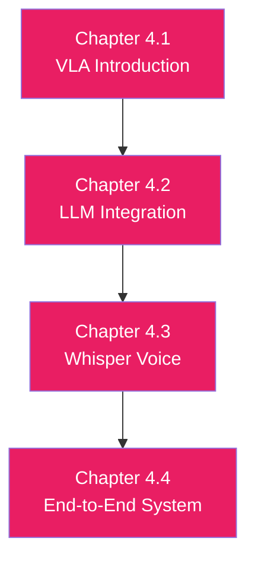

# Module 4: Vision-Language-Action (VLA)

## The Future of Embodied Intelligence

---

## Welcome to Module 4

You've built the foundation (ROS 2), simulated robots (Digital Twin), and added GPU-accelerated perception (Isaac). Now, in the final module, you'll integrate **foundation models**—LLMs and VLAs that bring world knowledge, reasoning, and natural language understanding to physical robots.

**Vision-Language-Action (VLA)** models are transformer-based networks that:
- Accept visual observations (camera images)
- Understand natural language instructions ("Pick up the red cup")
- Output low-level robot actions (joint positions, gripper commands)

This is the **convergence** of large language models (GPT-4, Claude) and robotics.

---

## Why VLA Matters

### The Traditional Approach (Pre-2023)
- Manual feature engineering for each task
- Behavior trees or finite state machines for task sequencing
- Limited generalization to new objects or environments

### The VLA Approach (2023+)
- **End-to-end learning**: Vision → Language → Action
- **Transfer learning**: Pre-trained on web data, fine-tuned for robotics
- **Generalization**: "Pick up the object" works on unseen objects

### Real-World Impact
- **RT-1 (2022)**: Google's first VLA, 97% success on 700+ tasks
- **RT-2 (2023)**: Integrates PaLM-E vision-language model, even better generalization
- **OpenVLA (2024)**: Open-source VLA with 7B parameters

---

## What You'll Learn

By the end of Module 4, you'll be able to:

### Week 12 (Chapters 4.1-4.3): VLA Foundations
- ✅ Understand VLA architectures (RT-1, RT-2, OpenVLA)
- ✅ Integrate LLMs (GPT-4, Claude) with ROS 2 for task planning
- ✅ Use Whisper for speech-to-text voice commands

### Week 13 (Chapter 4.4): End-to-End VLA System
- ✅ Build complete voice-controlled robot system
- ✅ Deploy VLA pipeline: Voice → LLM → Perception → Action
- ✅ Demonstrate final project with all modules integrated

---

## Prerequisites

### Required
- **All Previous Modules**: ROS 2, simulation, Isaac perception
- **API Keys**: OpenAI or Anthropic (for LLM integration)
- **Understanding**: Basic transformer architecture knowledge helpful

### Hardware
- Same as Module 3 (NVIDIA GPU for perception)
- Microphone for voice input (optional but recommended)

---

## Module Structure



---

## Key Concepts Overview

### VLA Architecture
```
Vision Encoder → Transformer Backbone → Action Decoder
    (ViT)          (GPT-style)           (MLP)
```

### Integration Pipeline
```
Voice (Whisper) → LLM Planning (GPT-4) → Perception (Isaac) → Action (ROS 2)
```

### Deployment Options
- **Cloud LLM**: OpenAI API, Anthropic Claude (high quality, latency)
- **Local LLM**: LLaMA 3, Mistral (lower latency, requires GPU)
- **VLA Model**: RT-2, OpenVLA (end-to-end, specialized for robotics)

---

## Connections to All Modules

### Module 4 → Module 1 (ROS 2)
- LLM outputs are published as ROS 2 action goals
- Voice commands trigger ROS 2 service calls

### Module 4 → Module 2 (Digital Twin)
- Test VLA systems safely in simulation first
- Generate training data for VLA fine-tuning

### Module 4 → Module 3 (Isaac)
- Isaac perception provides visual grounding for VLA
- GPU enables real-time multimodal inference

**Module 4 is the capstone**—everything comes together here.

---

## Learning Approach

### Incremental Integration
1. **Week 12 Day 1**: LLM task planning (text-only)
2. **Week 12 Day 2**: Add voice input (Whisper)
3. **Week 12 Day 3**: Integrate perception (Isaac detections)
4. **Week 13 Day 1-3**: Build end-to-end system
5. **Week 13 Day 4-5**: Test, debug, demonstrate

### Final Project
You'll build a **voice-controlled robot** that:
1. Listens: "Pick up the red cup and place it on the blue table"
2. Plans: GPT-4 breaks into sub-tasks
3. Perceives: Isaac detects red cup and blue table
4. Acts: ROS 2 controls robot to execute

**This is production-level integration.**

---

## Tips for Success

### Do's ✅
- Start simple (LLM text planning before adding voice/vision)
- Test each component independently before integration
- Use prompt engineering to improve LLM reliability
- Log all failures for debugging (LLM outputs, perception, actions)

### Don'ts ❌
- Don't trust LLM outputs blindly (validate before executing)
- Don't ignore latency (voice → action should be &lt;5 seconds)
- Don't skip error handling (LLM may output invalid plans)
- Don't forget safety (add e-stops, collision checking)

---

## Ethical Considerations

### Safety
- Always have emergency stop accessible
- Test in simulation before hardware
- Validate LLM commands before execution

### Privacy
- Voice data may be sent to cloud APIs
- Consider local models for sensitive applications

### Bias
- LLMs inherit biases from training data
- Test on diverse objects and scenarios

---

## Getting Help

### Official Resources
- **OpenVLA**: https://github.com/openvla/openvla
- **RT-2 Paper**: https://robotics-transformer2.github.io/
- **Whisper Documentation**: https://github.com/openai/whisper

### Community
- **Physical AI Discord/Forums**: Emerging community
- **ROS Discourse**: VLA integration discussions
- **Hugging Face**: Pre-trained VLA models

---

## Let's Begin!

This is the cutting edge of robotics research. You're building systems that didn't exist two years ago. The techniques you learn here will define the next decade of physical AI.

**Ready?** Start with **[Chapter 4.1: Introduction to VLA](./chapter4-1-vla-intro)**

---

**Time to build the future! 🤖🧠**
