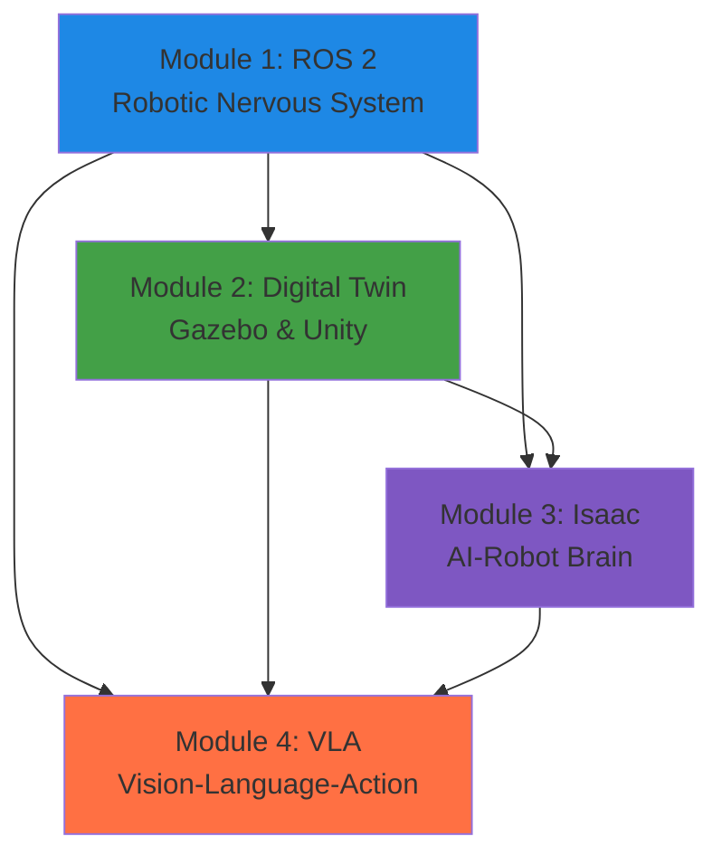

# Module Dependencies & Cross-References

**Task**: 024
**Purpose**: Define prerequisite relationships between modules and chapters.

---

## Module Dependency Graph

---

## Dependency Rules

### Module 2 depends on Module 1
**Reason**: Digital twin systems require ROS 2 for robot communication.

**Specific Dependencies**:
- Gazebo uses ROS 2 topics for sensor data → Requires understanding of topics (Chapter 1.1)
- Unity-ROS 2 bridge publishes/subscribes → Requires pub/sub knowledge (Chapter 1.2)
- Launch files start simulations → Requires launch file knowledge (Chapter 1.3)

### Module 3 depends on Modules 1 & 2
**Reason**: Isaac builds on ROS 2 and uses digital twin concepts.

**Specific Dependencies**:
- Isaac ROS packages are ROS 2 nodes → Requires Module 1
- Isaac Sim is a simulator like Gazebo → Requires Module 2 understanding
- Isaac perception uses camera topics → Requires ROS 2 topic knowledge

### Module 4 depends on Modules 1, 2, & 3
**Reason**: VLA is the culmination of all previous modules.

**Specific Dependencies**:
- VLA commands sent via ROS 2 → Requires Module 1
- VLA trained in simulation → Requires Module 2
- VLA uses Isaac perception → Requires Module 3
- End-to-end system integrates everything

---

## Chapter-Level Dependencies

### Module 1 (Sequential)
- **1.1 → 1.2**: Topics must be understood before services/actions
- **1.2 → 1.3**: Communication patterns before configuration
- **1.3 → 1.4**: Launch files before package building

### Module 2 (Mostly Sequential)
- **2.1 → 2.2**: Digital twin concept before Gazebo implementation
- **2.2 ‖ 2.3**: Gazebo and Unity can be learned in parallel
- **2.4 requires 2.2 or 2.3**: VSLAM needs a simulator

### Module 3 (Sequential)
- **3.1 → 3.2**: Isaac overview before perception
- **3.2 → 3.3**: Perception before manipulation/navigation
- **3.3 → 3.4**: Navigation before RL (builds on control)

### Module 4 (Sequential)
- **4.1 → 4.2**: VLA concept before LLM integration
- **4.2 → 4.3**: LLM before adding voice (Whisper)
- **4.3 → 4.4**: All components before end-to-end system

---

## Cross-Module Chapter References

### Chapter 1.1 (ROS 2 Fundamentals)
**Referenced by**:
- 2.2 (Gazebo): ROS 2 topics for sensor data
- 2.3 (Unity): ROS-TCP-Connector uses pub/sub
- 3.1 (Isaac): Isaac ROS nodes
- 4.4 (VLA System): ROS 2 as integration layer

### Chapter 1.2 (Nodes & Communication)
**Referenced by**:
- 2.4 (VSLAM): SLAM nodes communicate via topics
- 3.2 (Isaac Perception): Perception nodes
- 4.2 (LLM Integration): LLM as ROS 2 service

### Chapter 2.1 (Digital Twin)
**Referenced by**:
- 3.1 (Isaac Overview): Isaac Sim as digital twin
- 4.4 (VLA System): Digital twin for testing

### Chapter 2.2 (Gazebo)
**Referenced by**:
- 2.4 (VSLAM): SLAM in Gazebo
- 3.1 (Isaac): Comparison with Isaac Sim

### Chapter 2.4 (VSLAM)
**Referenced by**:
- 3.2 (Isaac Visual SLAM): GPU-accelerated VSLAM
- 3.3 (Isaac Navigation): SLAM for localization

### Chapter 3.2 (Isaac Perception)
**Referenced by**:
- 4.1 (VLA Intro): Perception as input to VLA
- 4.4 (VLA System): Isaac perception in VLA pipeline

### Chapter 3.3 (Isaac Navigation)
**Referenced by**:
- 4.4 (VLA System): Navigation for VLA actions

---

## Prerequisite Matrix

| Chapter | Prerequisites | Recommended Background |
|---------|---------------|------------------------|
| 1.1 | None | Linux basics, Python |
| 1.2 | 1.1 | Object-oriented programming |
| 1.3 | 1.1, 1.2 | YAML syntax |
| 1.4 | 1.1, 1.2, 1.3 | CMake, build systems |
| 2.1 | 1.1 | Simulation concepts |
| 2.2 | 1.1, 2.1 | XML (URDF), physics |
| 2.3 | 1.1, 2.1 | Unity basics (optional) |
| 2.4 | 1.1, 2.2 or 2.3 | Computer vision basics |
| 3.1 | 1.1, 2.1 | GPU computing basics |
| 3.2 | 1.1, 3.1 | Deep learning, CNNs |
| 3.3 | 1.1, 3.1, 3.2 | Path planning algorithms |
| 3.4 | 1.1, 3.1-3.3 | Reinforcement learning |
| 4.1 | 1.1, 3.2 | Transformers, multimodal AI |
| 4.2 | 1.1, 4.1 | LLM API usage |
| 4.3 | 1.1, 4.1, 4.2 | Audio processing |
| 4.4 | All previous | Full-stack robotics |

---

## Skill Progression

### Beginner (Weeks 1-4)
- ROS 2 basics
- Pub/sub communication
- Simple node creation

### Intermediate (Weeks 5-8)
- Simulation setup
- Sensor integration
- SLAM concepts

### Advanced (Weeks 9-11)
- GPU-accelerated perception
- Motion planning
- RL basics

### Expert (Weeks 12-13)
- Multimodal AI
- LLM integration
- End-to-end systems

---

**Status**: ✅ Dependencies mapped. Ready for cross-referencing in chapters.
