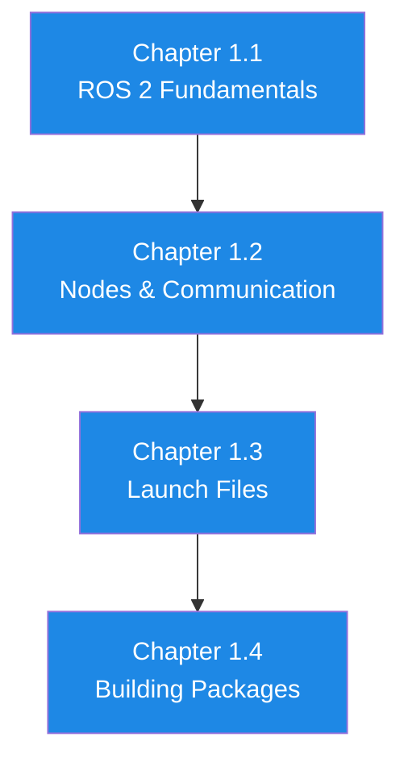

# Module 1: The Robotic Nervous System (ROS 2)

## Understanding the Communication Backbone of Modern Robotics

---

## Welcome to Module 1

Welcome to the foundation of modern robotics software. In this module, you'll master **ROS 2 (Robot Operating System 2)**, the industry-standard middleware that powers robots from research labs to production factories.

Think of ROS 2 as the **nervous system** of a robot—just as your nervous system enables communication between your brain, sensors (eyes, ears, touch), and actuators (muscles), ROS 2 enables seamless communication between software components in complex robotic systems.

---

## Why ROS 2 Matters

### Industry Standard
- Used by **Boston Dynamics, NASA, BMW, Amazon Robotics**, and thousands of companies
- Powers autonomous vehicles, industrial manipulators, drones, and humanoid robots
- Over **3,000 ROS 2 packages** available open-source

### Real-Time Capable
Unlike ROS 1, ROS 2 supports:
- **Hard real-time** control for safety-critical systems
- **Deterministic** communication with configurable QoS
- **Low-latency** messaging for high-frequency control loops

### Modern Architecture
- **Decentralized**: No single point of failure (no roscore)
- **DDS middleware**: Industry-standard communication protocol
- **Cross-platform**: Linux, Windows, macOS, RTOS
- **Secure**: Built-in security with DDS-Security

---

## What You'll Learn

By the end of Module 1, you'll be able to:

### Week 1 (Chapter 1.1): ROS 2 Fundamentals
- ✅ Understand ROS 2 architecture and computational graph
- ✅ Create publishers and subscribers for asynchronous communication
- ✅ Configure Quality of Service (QoS) policies
- ✅ Use ROS 2 command-line tools (`ros2 topic`, `ros2 node`, etc.)

### Week 2 (Chapter 1.2): Nodes and Communication
- ✅ Implement services for request-response patterns
- ✅ Create action servers for long-running tasks with feedback
- ✅ Manage node lifecycle (configure, activate, shutdown)
- ✅ Build multi-node distributed systems

### Week 3 (Chapter 1.3): Launch Files and Configuration
- ✅ Write Python launch files to start complex systems
- ✅ Configure parameters with YAML files
- ✅ Use namespaces for multi-robot systems
- ✅ Implement node composition for efficiency

### Week 4 (Chapter 1.4): Building ROS 2 Packages
- ✅ Create custom ROS 2 packages (C++ and Python)
- ✅ Write package.xml manifests and CMakeLists.txt
- ✅ Build with colcon and manage dependencies
- ✅ Organize code for maintainability and reuse

---

## Module Structure



---

## Prerequisites

### Required Knowledge
- **Programming**: Python or C++ (basic to intermediate)
- **Linux**: Command-line basics (cd, ls, apt, nano/vim)
- **Version Control**: Git fundamentals

### Required Software
- **OS**: Ubuntu 22.04 LTS (native installation, not VM)
- **ROS 2**: Humble Hawksbill (LTS release)
- **Python**: 3.10+
- **Build Tools**: colcon, pip

**Installation Guide**: See [Appendix B](../appendices/software-installation)

### Recommended Hardware
- **CPU**: 4+ cores (Intel i5/i7 or AMD Ryzen 5/7)
- **RAM**: 8GB minimum, 16GB recommended
- **Storage**: 20GB free space

---

## Learning Approach

### Hands-On Philosophy
- **Theory → Practice → Mastery**: Every concept is reinforced with code
- **No copy-paste**: Type out examples to build muscle memory
- **Fail fast**: Errors are learning opportunities

### Progressive Complexity
- **Chapter 1.1**: Simple pub/sub (10 lines of code)
- **Chapter 1.2**: Multi-node systems (50+ lines)
- **Chapter 1.3**: Configured systems (100+ lines, multiple files)
- **Chapter 1.4**: Full package (200+ lines, professional structure)

### Real-World Relevance
All examples are based on **real robotics scenarios**:
- Sensor data publishing (cameras, LiDAR, IMU)
- Robot control commands (velocity, position, trajectory)
- System health monitoring (services for diagnostics)
- Long-running tasks (navigation, manipulation actions)

---

## Key Concepts Overview

### Computational Graph
```
Nodes: Independent processes performing computation
Topics: Named buses for asynchronous message passing
Services: Request-response communication
Actions: Long-running tasks with feedback and cancellation
Parameters: Runtime configuration values
```

### Communication Patterns

**Publish-Subscribe (Topics)**:
- Many-to-many communication
- Asynchronous (fire-and-forget)
- Best for: Sensor data, robot state, commands

**Client-Server (Services)**:
- One-to-one communication
- Synchronous (wait for response)
- Best for: Configuration, queries, short operations

**Goal-Feedback-Result (Actions)**:
- One-to-one with feedback
- Asynchronous with cancellation
- Best for: Navigation, manipulation, long tasks

---

## Tools You'll Use

### Command-Line Tools
```bash
ros2 node list              # List all running nodes
ros2 topic list             # List all topics
ros2 topic echo /topic      # Display messages
ros2 service call /service  # Call a service
ros2 run package node       # Run a node
ros2 launch package file    # Launch a system
```

### GUI Tools
- **rqt_graph**: Visualize computational graph
- **rqt_plot**: Plot topic data in real-time
- **rqt_console**: View log messages
- **rviz2**: 3D visualization of robot and sensors

---

## Common Use Cases

### Sensor Integration
```python
# Publish camera images at 30 Hz
publisher = node.create_publisher(Image, '/camera/image', 10)
```

### Robot Control
```python
# Send velocity commands to mobile robot
publisher = node.create_publisher(Twist, '/cmd_vel', 10)
```

### System Monitoring
```python
# Service to check battery status
service = node.create_service(GetBatteryStatus, '/battery_status', callback)
```

### Navigation
```python
# Action to navigate to goal
client = ActionClient(node, NavigateToPose, '/navigate_to_pose')
```

---

## Success Criteria

By the end of Module 1, you should be able to:

**Build**: Multi-node ROS 2 system with custom messages and services
**Debug**: Use ROS 2 tools to troubleshoot communication issues
**Configure**: Write launch files and parameter files for complex systems
**Package**: Create professional ROS 2 packages ready for deployment

---

## Connections to Other Modules

### Module 1 → Module 2 (Digital Twin)
- Gazebo and Unity use ROS 2 topics to publish sensor data
- Launch files start simulation + ROS 2 nodes together

### Module 1 → Module 3 (Isaac)
- Isaac ROS packages are ROS 2 nodes
- GPU-accelerated perception publishes to ROS 2 topics

### Module 1 → Module 4 (VLA)
- LLMs integrated as ROS 2 services
- Voice commands trigger ROS 2 actions
- End-to-end system orchestrated via ROS 2

**Module 1 is the foundation**—everything else builds on it.

---

## Tips for Success

### Do's ✅
- Complete every lab exercise (practice builds mastery)
- Run examples on your own machine (don't just read)
- Experiment with modifications (break things and fix them)
- Use ROS 2 documentation when stuck

### Don'ts ❌
- Skip fundamentals (they're used constantly later)
- Ignore error messages (read them carefully)
- Copy-paste without understanding (type code yourself)
- Work alone (join ROS community, ask questions)

---

## Getting Help

### Official Resources
- **ROS 2 Documentation**: https://docs.ros.org/en/humble/
- **ROS 2 Tutorials**: Step-by-step guides for beginners
- **API Reference**: Detailed documentation for rclpy/rclcpp

### Community Support
- **ROS Discourse**: https://discourse.ros.org/ (most active forum)
- **ROS Answers**: Q&A site for specific questions
- **Stack Overflow**: Tag questions with `ros2`

### Textbook Resources
- **Code Examples**: All examples in GitHub repository
- **Troubleshooting**: Appendix F for common errors
- **Office Hours**: Weekly sessions for students

---

## Let's Begin!

ROS 2 is the foundation of everything you'll build in this course. Master it now, and Modules 2-4 will flow naturally.

**Ready?** Start with **[Chapter 1.1: ROS 2 Fundamentals](./chapter1-1-ros2-fundamentals)**

---

**Time to dive in! 🚀**
